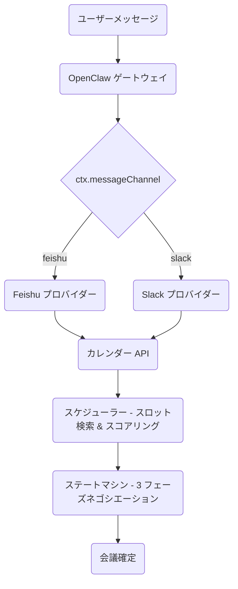
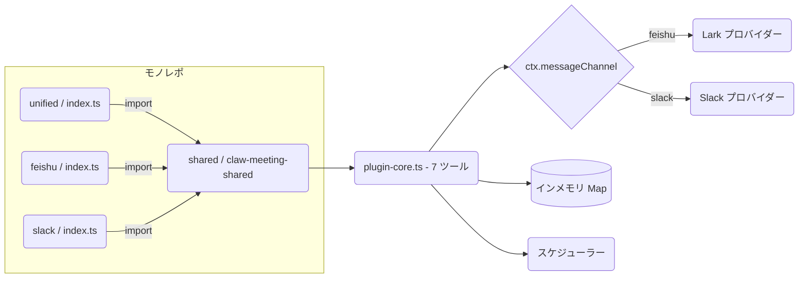
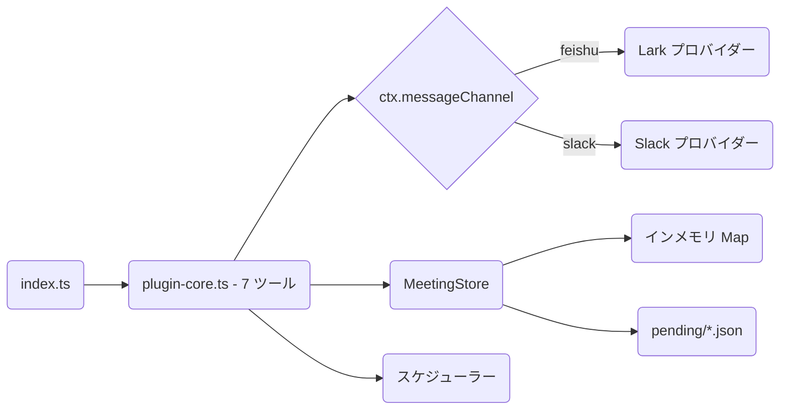
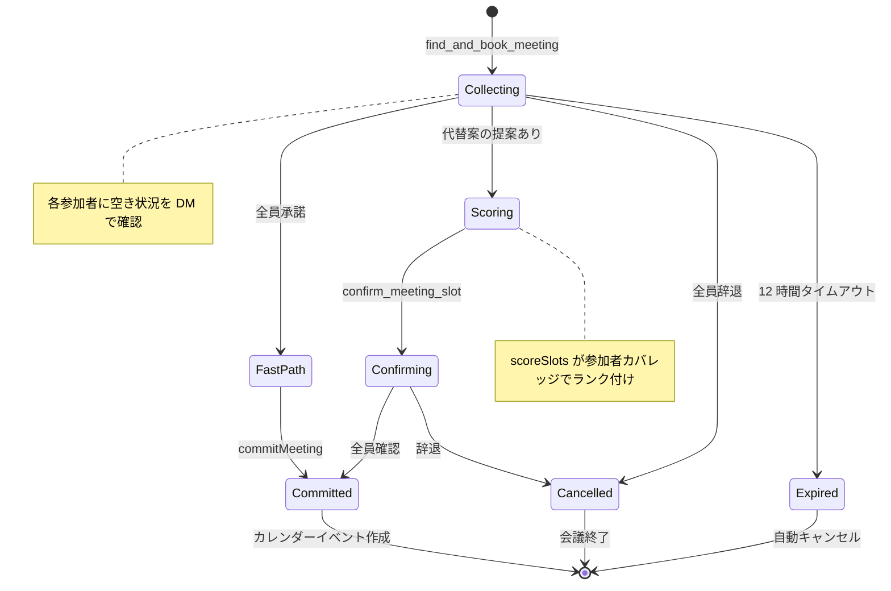
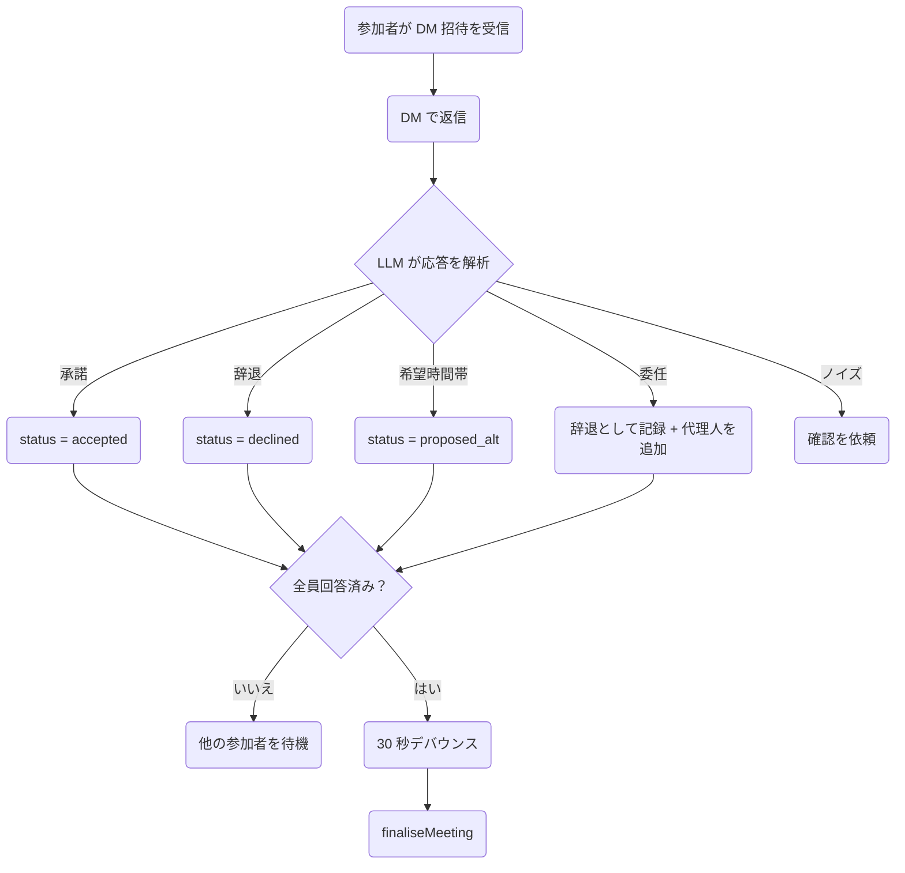
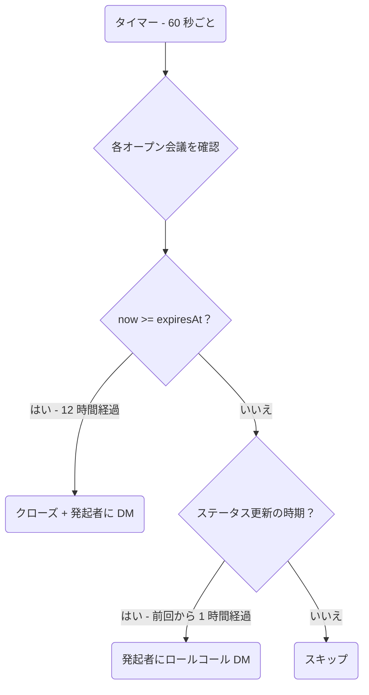
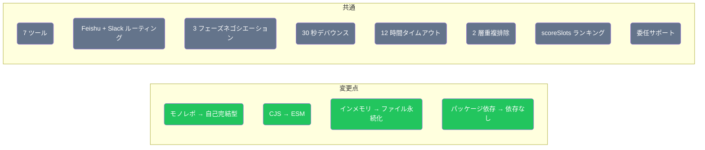

# ClawMeeting - マルチプラットフォーム会議スケジューラー


[English](./README.md) | [简体中文](./README.zh-CN.md) | [繁體中文](./README.zh-TW.md) | **日本語** | [한국어](./README.ko.md)

---

## 概要

ClawMeeting は、OpenClaw 向けの AI 駆動型会議スケジューリングシステムです。Feishu と Slack をまたいで複数参加者の会議を調整し、インテリジェントなタイムスロットスコアリング、自動委任、デバウンス制御によるファイナライズを備えた 3 フェーズネゴシエーションプロトコルで動作します。

本番環境向けに 2 つのバージョンを提供しています：
- **プラグイン版 (v1.0)** — CommonJS モノレポ構成。`claw-meeting-shared` パッケージに依存。実行にはモノレポ構成が必要です。
- **スキル版 (v2.0)** — ESM 自己完結型。クローンしてすぐ実行可能。ファイルベースの永続化。`openclaw skills add` による簡単インストール。

---

## アーキテクチャ



---

## プラグイン版 (v1.0)

初期の本番実装です。コアスケジューリングロジック、ステートマシン、ツール定義を含む共有 npm パッケージ `claw-meeting-shared` を持つモノレポ構成を採用しています。各プラットフォームに専用のエントリーポイントがあり、`unified/` エントリーが両プラットフォームをルーティングします。

**主な特徴：**
- モノレポ構成：`shared/`（コア）+ `unified/`（マルチプラットフォーム）+ `feishu/` + `slack/`（単一プラットフォーム）
- `claw-meeting-shared` npm パッケージ（`shared/` ディレクトリ）に依存
- 7 ツール、Feishu + Slack デュアルプラットフォームルーティング（`ctx.messageChannel` 経由）
- インメモリ状態のみ — ゲートウェイ再起動で消失
- CommonJS モジュールシステム

### プラグイン構成



---

## スキル版 (v2.0)

ESM モジュールを使用した自己完結型の再実装です。外部パッケージ依存なし — すべてのコードが 1 つのディレクトリに収まっています。状態は `pending/*.json` ファイルに永続化され、ゲートウェイの再起動後も保持されます。`openclaw skills add` による簡単インストールのための `SKILL.md` を含みます。

**主な特徴：**
- 自己完結型：クローン、`npm install`、`npm run build` で完了
- モノレポ不要、`claw-meeting-shared` 依存なし
- 7 ツール、Feishu + Slack デュアルプラットフォームルーティング（`ctx.messageChannel` 経由）
- ファイル永続化状態（`pending/` 内の JSON）— 再起動後も保持
- ESM モジュールシステム（Node16）
- LLM 動作指示用の `SKILL.md`

### スキル構成



---

## 会議ライフサイクル



---

## 参加者の応答フロー



---

## バックグラウンド処理



---

## ツール一覧

| # | ツール | 説明 |
|---|--------|------|
| 1 | `find_and_book_meeting` | 保留中の会議を作成、参加者名を解決、DM 招待を送信 |
| 2 | `list_my_pending_invitations` | 現在の送信者の保留中の招待を一覧表示 |
| 3 | `record_attendee_response` | 承諾 / 辞退 / 代替案の提案 / 委任を記録 |
| 4 | `confirm_meeting_slot` | スコアリング結果に基づき発起者がタイムスロットを選択 |
| 5 | `list_upcoming_meetings` | 今後のカレンダーイベントを一覧表示 |
| 6 | `cancel_meeting` | イベント ID で会議をキャンセル |
| 7 | `debug_list_directory` | テナントディレクトリのユーザーを一覧表示（診断用） |

---

## ファイル構成

```
plugin_version/                      モノレポ（claw-meeting-shared が必要）
├── shared/                          コアロジックパッケージ
│   └── src/
│       ├── plugin-core.ts           7 ツール、ルーティング、ステートマシン（1131 行）
│       ├── scheduler.ts             スロット検索 + スコアリング
│       ├── load-env.ts              .env ローダー
│       └── providers/types.ts       CalendarProvider インターフェース
├── unified/                         マルチプラットフォームエントリー（Feishu + Slack）
│   └── src/
│       ├── index.ts                 プラットフォーム設定
│       └── providers/
│           ├── lark.ts              Feishu バックエンド
│           └── slack.ts             Slack バックエンド
├── feishu/                          Feishu 専用エントリー
│   └── src/
│       ├── index.ts                 単一プラットフォーム設定
│       └── providers/lark.ts        Feishu バックエンド
└── slack/                           Slack 専用エントリー
    └── src/
        ├── index.ts                 単一プラットフォーム設定
        └── providers/slack.ts       Slack バックエンド

skill_version/                       自己完結型（クローンして実行）
├── SKILL.md                         LLM 指示書
├── src/
│   ├── index.ts                     エントリーポイント（プラットフォーム設定）
│   ├── plugin-core.ts               7 ツール、ルーティング、ステートマシン（1176 行）
│   ├── meeting-store.ts             永続化状態レイヤー（222 行）
│   ├── scheduler.ts                 スロット検索 + スコアリング
│   ├── load-env.ts                  .env ローダー（ESM）
│   └── providers/
│       ├── types.ts                 CalendarProvider インターフェース
│       ├── lark.ts                  Feishu バックエンド
│       └── slack.ts                 Slack バックエンド
└── pending/                         ランタイム会議状態（JSON ファイル）
```

---

## クイックスタート

### プラグイン版 (v1.0)

```bash
cd plugin_version/shared && npm install && npm run build
cd ../unified && npm install && npm run build
openclaw plugins install -l .
openclaw gateway --force
```

### スキル版 (v2.0)

```bash
cd skill_version
npm install
npm run build
openclaw plugins install -l .
openclaw gateway --force
```

---

## 設定

両バージョンとも `.env` にプラットフォーム認証情報が必要です：

```env
# Feishu / Lark
LARK_APP_ID=cli_xxxxx
LARK_APP_SECRET=xxxxx
LARK_CALENDAR_ID=xxxxx@group.calendar.feishu.cn

# Slack
SLACK_BOT_TOKEN=xoxb-xxxxx

# スケジュールのデフォルト設定
DEFAULT_TIMEZONE=Asia/Shanghai
WORK_HOURS=09:00-18:00
LUNCH_BREAK=12:00-13:30
BUFFER_MINUTES=15
```

---

## バージョン比較

| 項目 | プラグイン版 (v1.0) | スキル版 (v2.0) |
|------|---------------------|-----------------|
| アーキテクチャ | モノレポ（shared + unified + feishu + slack） | 自己完結型（単一ディレクトリ） |
| モジュールシステム | CommonJS | ESM（Node16） |
| 依存関係 | `claw-meeting-shared` パッケージ | なし（すべてローカル） |
| 可搬性 | モノレポ構成が必要 | クローンして実行 |
| ツール数 | 7 | 7 |
| プラットフォーム | Feishu + Slack | Feishu + Slack |
| プラットフォームルーティング | `ctx.messageChannel` | `ctx.messageChannel` |
| 状態保存 | インメモリ Map | インメモリ + ファイル永続化 |
| 再起動時の復旧 | 状態消失 | 状態保持（pending/*.json） |
| ネゴシエーション | 3 フェーズ（collecting/scoring/confirming） | 3 フェーズ（同一） |
| スコアリング | あり（scoreSlots） | あり（同一） |
| 委任 | あり | あり |
| インストール | `openclaw plugins install` | `openclaw skills add` |
| SKILL.md | なし | あり |



---

## ライセンス

Private - All rights reserved.
