# ClawMeeting - マルチプラットフォーム会議スケジューラー


[English](./README.md) | [简体中文](./README.zh-CN.md) | [繁體中文](./README.zh-TW.md) | **日本語** | [한국어](./README.ko.md)

---

## 概要

ClawMeeting は OpenClaw 向けの AI 搭載会議スケジューリングシステムです。自然言語を通じて Feishu と Slack をまたぐ複数参加者の会議を調整し、インテリジェントなタイムスロットスコアリング、3フェーズネゴシエーション、自動委任、デバウンス制御によるファイナライズを備えています。

本リポジトリには2つの実装が含まれています:
- **Plugin (v1.0)** — 初代プロダクション版。CommonJS モノレポ構成、`claw-meeting-shared` パッケージを使用。
- **Skill (v2.0)** — 自己完結型の ESM 再実装。ファイルベースの永続化に対応。

両バージョンとも **Feishu + Slack デュアルプラットフォームルーティング**、**7つのツール**、**同一のビジネスロジック** をサポートしています。

---

# Part 1: Plugin バージョン (v1.0)

## Plugin アーキテクチャ

Plugin はモノレポ構成を採用しています。コアのスケジューリングロジックは `shared/` パッケージ (`claw-meeting-shared`) に配置され、プラットフォーム固有のプロバイダーとエントリーポイントは別ディレクトリに分離されています。

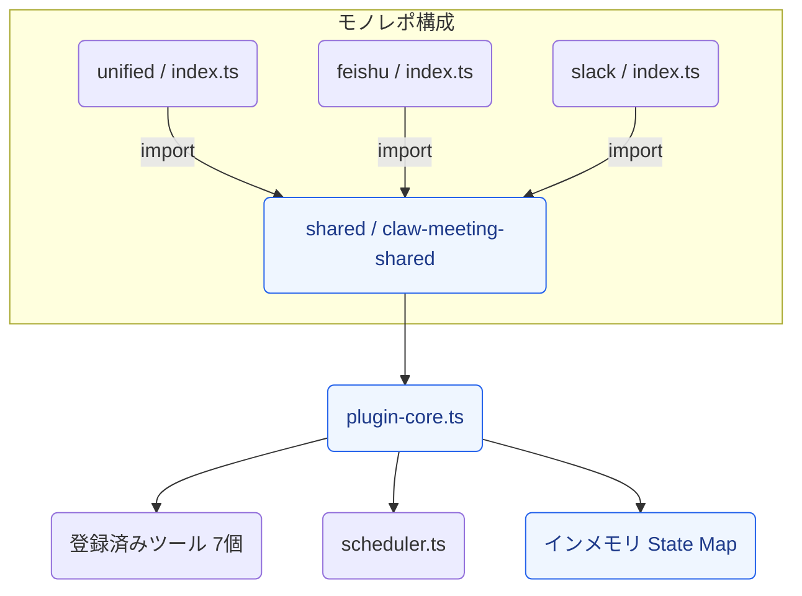

### Plugin エントリーポイント

| エントリー | パス | 用途 |
|---|---|---|
| **unified** | `unified/src/index.ts` | マルチプラットフォーム (Feishu + Slack)。本番デフォルト。 |
| **feishu** | `feishu/src/index.ts` | Feishu 専用デプロイ |
| **slack** | `slack/src/index.ts` | Slack 専用デプロイ |

3つとも `claw-meeting-shared` をインポートし、プラットフォーム固有の設定で `createMeetingPlugin()` を呼び出します。

### Plugin プラットフォームルーティング

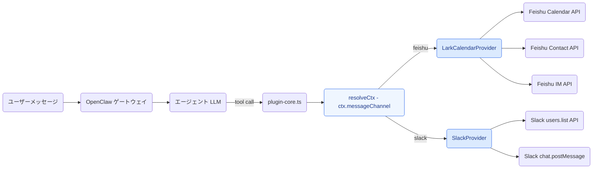

### Plugin 会議フロー

Plugin を通じたステップバイステップのデータフロー:

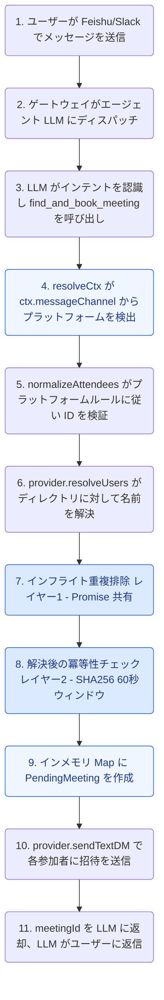

### Plugin 参加者レスポンスフロー

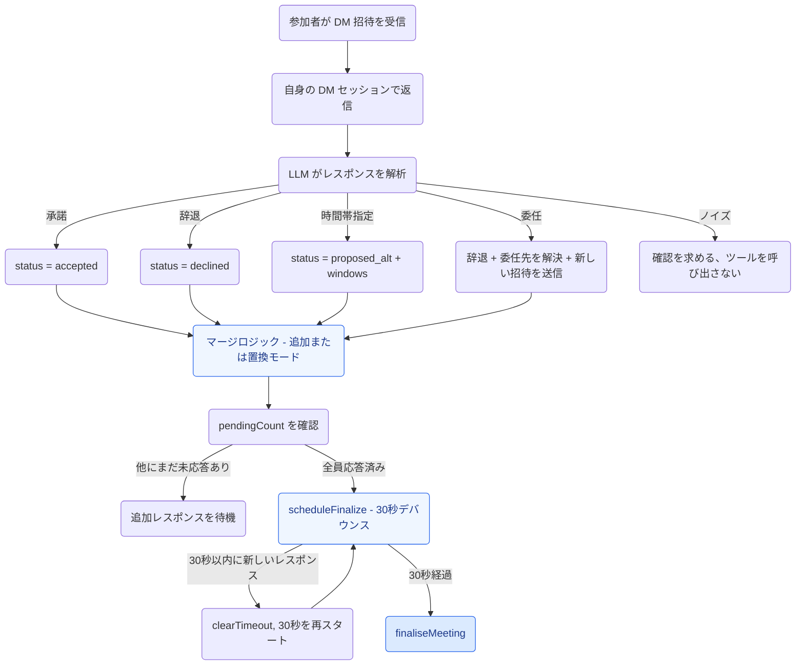

### Plugin ファイナライズステートマシン

```mermaid
stateDiagram-v2
    [*] --> Collecting: find_and_book_meeting が PendingMeeting を作成

    Collecting --> FastPath: 全参加者が承諾
    Collecting --> Scoring: 一部が代替案を提示
    Collecting --> Failed: 全員が辞退
    Collecting --> Expired: 12時間タイムアウト (ticker)

    FastPath --> Committed: commitMeeting がカレンダーイベントを作成

    Scoring --> Confirming: 発起者が confirm_meeting_slot を呼び出し
    note right of Scoring: scoreSlots が参加者カバレッジでスロットをランク付け

    Confirming --> Committed: 参加者が選択されたスロットを確認
    Confirming --> Failed: スロットが拒否された

    Committed --> [*]: 発起者にイベントリンクを DM
    Failed --> [*]: 発起者に失敗理由を DM
    Expired --> [*]: 発起者に自動キャンセルを DM

    style [*] fill:#dbeafe,stroke:#2563eb,color:#1e3a8a
    style 収集中 fill:#eff6ff,stroke:#2563eb,color:#1e3a8a
    style 全承諾 fill:#eff6ff,stroke:#2563eb,color:#1e3a8a
    style 一部代替案提示 fill:#eff6ff,stroke:#2563eb,color:#1e3a8a
    style 確認中 fill:#eff6ff,stroke:#2563eb,color:#1e3a8a
    style committed fill:#eff6ff,stroke:#2563eb,color:#1e3a8a
    style 全員辞退 fill:#eff6ff,stroke:#2563eb,color:#1e3a8a
    style 自動キャンセル fill:#eff6ff,stroke:#2563eb,color:#1e3a8a
```

### Plugin バックグラウンドティッカー

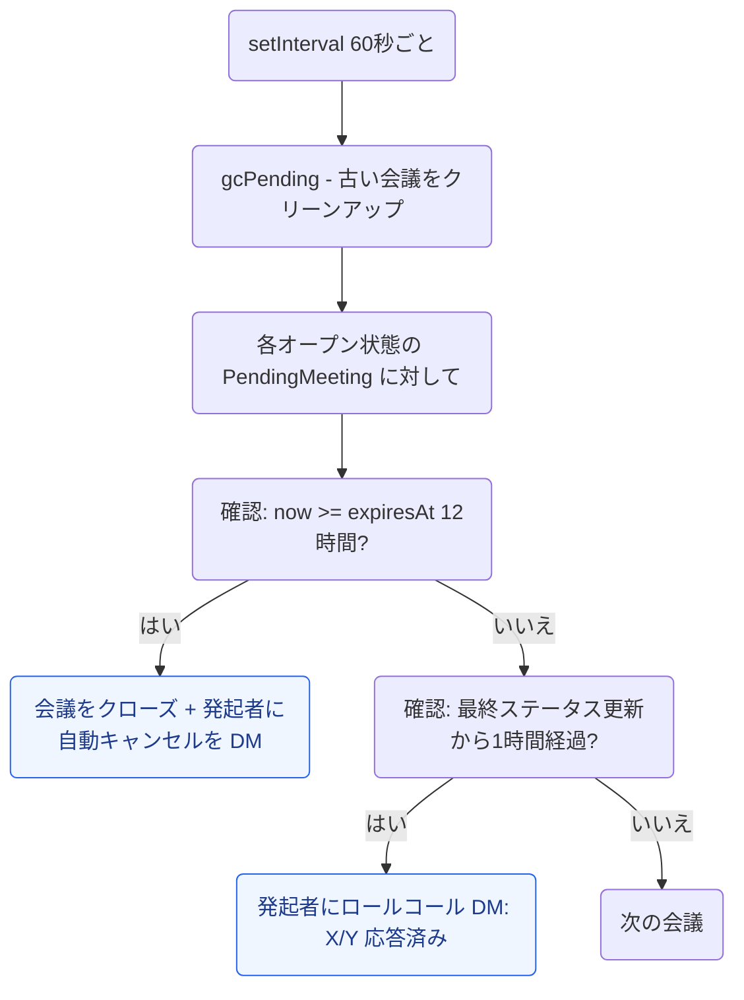

### Plugin ステート管理

全ステートはインメモリです。ゲートウェイの再起動 = 全ペンディング会議が消失します。

```
pendingMeetings: Map<string, PendingMeeting>     ← 進行中の会議
recentFindAndBook: Map<string, {meetingId, at}>   ← 冪等性 (60秒ウィンドウ)
inflightFindAndBook: Map<string, Promise>         ← 同時実行の重複排除
```

### Plugin ファイル構成

```
plugin_version/
├── shared/                          claw-meeting-shared パッケージ
│   ├── src/
│   │   ├── index.ts                 パッケージエクスポート
│   │   ├── plugin-core.ts           コアロジック: ツール7個、ルーティング、ステートマシン (1131行)
│   │   ├── scheduler.ts             スロット検索、スコアリング、交差計算 (257行)
│   │   ├── load-env.ts              .env ローダー
│   │   └── providers/types.ts       CalendarProvider インターフェース
│   ├── package.json                 claw-meeting-shared
│   └── tsconfig.json
├── unified/                         マルチプラットフォームエントリー (Feishu + Slack)
│   ├── src/
│   │   ├── index.ts                 プラットフォーム設定 + createMeetingPlugin()
│   │   └── providers/
│   │       ├── lark.ts              Feishu バックエンド (1020行)
│   │       └── slack.ts             Slack バックエンド (346行)
│   ├── package.json                 claw-meeting-shared に依存
│   └── tsconfig.json
├── feishu/                          Feishu 専用エントリー
│   └── src/
│       ├── index.ts                 単一プラットフォーム設定
│       └── providers/lark.ts
└── slack/                           Slack 専用エントリー
    └── src/
        ├── index.ts                 単一プラットフォーム設定
        └── providers/slack.ts
```

### Plugin クイックスタート

```bash
cd plugin_version/shared && npm install && npm run build
cd ../unified && npm install && npm run build
openclaw plugins install -l .
openclaw gateway --force
```

---

# Part 2: Skill バージョン (v2.0)

## Skill アーキテクチャ

Skill バージョンは自己完結型の再実装です。モノレポなし、外部パッケージ依存なし。全コードが1つのディレクトリに収まります。クローンして、ビルドして、実行するだけです。

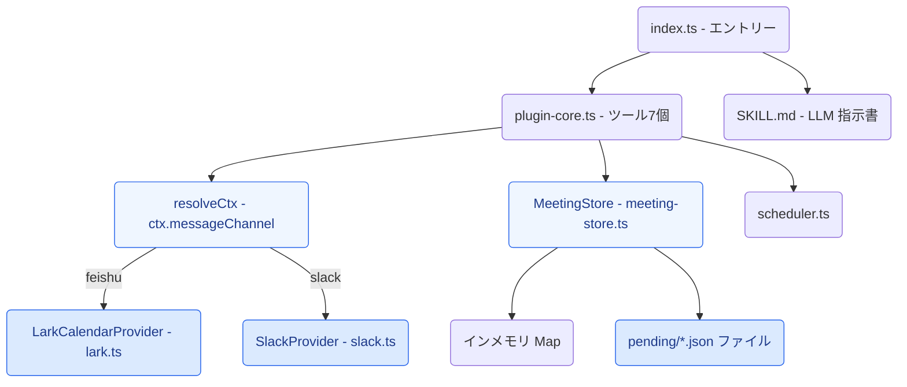

### Plugin からの変更点

| 項目 | Plugin (v1.0) | Skill (v2.0) |
|---|---|---|
| コード構成 | モノレポ (shared + unified + feishu + slack) | 単一ディレクトリ、自己完結型 |
| モジュールシステム | CommonJS | ESM (Node16) |
| 外部依存 | `claw-meeting-shared` パッケージ | なし (全てローカルインポート、`.js` サフィックス付き) |
| ステート層 | インメモリ Map のみ | MeetingStore: Map + ファイル永続化 |
| `__dirname` | CJS ネイティブグローバル | `fileURLToPath(import.meta.url)` |
| エクスポート | `module.exports = plugin` | `export default plugin; export { plugin }` |
| SKILL.md | なし | `openclaw skills add` 用に同梱 |

### Skill プラットフォームルーティング

Plugin と同一。`resolveCtx()` が `ctx.messageChannel` を読み取り、適切なプロバイダーにルーティングします:

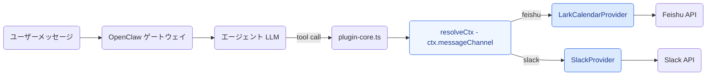

### Skill 会議フロー

Plugin と同じビジネスロジックに永続化を追加:

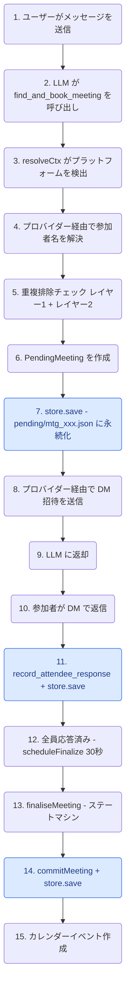

緑色のノード = `store.save()` 永続化ポイント。ゲートウェイがどの時点で再起動しても、ステートは `pending/*.json` から復旧されます。

### Skill ステート管理

ハイブリッド: 速度のためのインメモリ、耐久性のためのファイル。

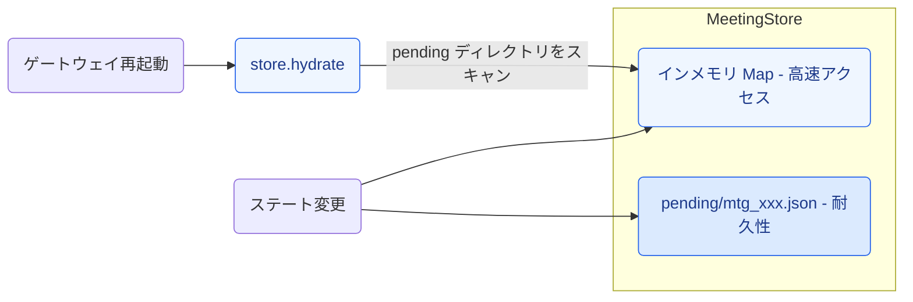

### Skill ファイナライズステートマシン

Plugin と同一:

```mermaid
stateDiagram-v2
    [*] --> Collecting: find_and_book_meeting

    Collecting --> FastPath: 全員承諾
    Collecting --> Scoring: 一部が proposed_alt
    Collecting --> Failed: 全員辞退
    Collecting --> Expired: 12時間タイムアウト

    FastPath --> Committed: commitMeeting + store.save

    Scoring --> Confirming: confirm_meeting_slot
    note right of Scoring: scoreSlots がカバレッジでランク付け + store.save

    Confirming --> Committed: 全員確認 + store.save

    Committed --> [*]: カレンダーイベント作成
    Failed --> [*]: クローズ + store.save
    Expired --> [*]: 自動キャンセル + store.save

    style [*] fill:#dbeafe,stroke:#2563eb,color:#1e3a8a
    style 収集中 fill:#eff6ff,stroke:#2563eb,color:#1e3a8a
    style 全承諾 fill:#eff6ff,stroke:#2563eb,color:#1e3a8a
    style 一部代替案提示 fill:#eff6ff,stroke:#2563eb,color:#1e3a8a
    style 確認中 fill:#eff6ff,stroke:#2563eb,color:#1e3a8a
    style committed fill:#eff6ff,stroke:#2563eb,color:#1e3a8a
    style 全員辞退 fill:#eff6ff,stroke:#2563eb,color:#1e3a8a
    style 自動キャンセル fill:#eff6ff,stroke:#2563eb,color:#1e3a8a
```

### Skill バックグラウンドティッカー

Plugin と同一、全ステート変更時に `store.save()` を実行:

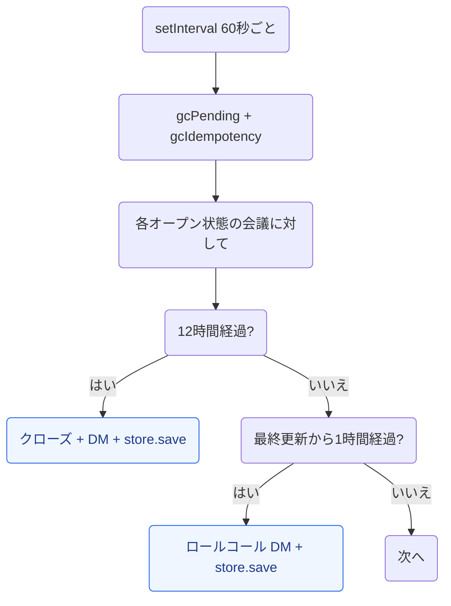

### Skill ファイル構成

```
skill_version/
├── SKILL.md                         LLM 動作指示書
├── src/
│   ├── index.ts                     エントリーポイント - プラットフォーム設定 (70行)
│   ├── plugin-core.ts               コアロジック: ツール7個、ルーティング、ステートマシン (1176行)
│   ├── meeting-store.ts             MeetingStore: Map + ファイル永続化 (222行)
│   ├── scheduler.ts                 スロット検索、スコアリング、交差計算 (243行)
│   ├── load-env.ts                  .env ローダー (ESM 対応)
│   └── providers/
│       ├── types.ts                 CalendarProvider インターフェース
│       ├── lark.ts                  Feishu バックエンド (770行)
│       └── slack.ts                 Slack バックエンド (345行)
├── pending/                         ランタイムステート (JSON ファイル、gitignore 対象)
├── openclaw.plugin.json             Plugin + Skill マニフェスト
├── package.json                     ESM、@slack/web-api + googleapis + luxon
└── .gitignore                       .env、node_modules、dist、pending を除外
```

### Skill クイックスタート

```bash
cd skill_version
npm install
npm run build
openclaw plugins install -l .
openclaw gateway --force
```

---

# Part 3: バージョン比較 (差分)

## 7つのツール (両バージョン共通)

| # | ツール | 説明 |
|---|------|-------------|
| 1 | `find_and_book_meeting` | ペンディング会議を作成、参加者名を解決、DM 招待を送信 |
| 2 | `list_my_pending_invitations` | 現在の送信者のペンディング招待を一覧表示 |
| 3 | `record_attendee_response` | 承諾 / 辞退 / 代替案提示 / 委任を記録 |
| 4 | `confirm_meeting_slot` | スコアリング結果後に発起者がタイムスロットを選択 |
| 5 | `list_upcoming_meetings` | 今後のカレンダーイベントを一覧表示 |
| 6 | `cancel_meeting` | イベント ID で会議をキャンセル |
| 7 | `debug_list_directory` | テナントディレクトリのユーザーを一覧表示 (診断用) |

## 設定 (両バージョン共通)

```env
# Feishu / Lark
LARK_APP_ID=cli_xxxxx
LARK_APP_SECRET=xxxxx
LARK_CALENDAR_ID=xxxxx@group.calendar.feishu.cn

# Slack
SLACK_BOT_TOKEN=xoxb-xxxxx

# スケジュールデフォルト
DEFAULT_TIMEZONE=Asia/Shanghai
WORK_HOURS=09:00-18:00
LUNCH_BREAK=12:00-13:30
BUFFER_MINUTES=15
```

## 全体比較表

| 項目 | Plugin (v1.0) | Skill (v2.0) |
|---|---|---|
| アーキテクチャ | モノレポ (shared + unified + feishu + slack) | 自己完結型 (単一ディレクトリ) |
| モジュールシステム | CommonJS | ESM (Node16) |
| 依存関係 | `claw-meeting-shared` パッケージ | なし (全てローカル) |
| ポータビリティ | モノレポ + パッケージリンクが必要 | クローンして実行 |
| ツール | 7 | 7 (同一) |
| プラットフォーム | Feishu + Slack | Feishu + Slack (同一) |
| プラットフォームルーティング | `ctx.messageChannel` via `resolveCtx()` | 同一 |
| ステートストレージ | インメモリ Map | インメモリ Map + ファイル永続化 |
| 再起動リカバリ | 全ステート消失 | ステート保持 (`pending/*.json`) |
| ネゴシエーション | 3フェーズ (collecting/scoring/confirming) | 同一 |
| スロットスコアリング | `scoreSlots()` がカバレッジでランク付け | 同一 |
| 委任 | あり ("让XXX替我去") | 同一 |
| 30秒デバウンス | `setTimeout` / `clearTimeout` | 同一 |
| 12時間タイムアウト | `setInterval` ティッカー | 同一 |
| 2層重複排除 | インフライト Promise + SHA256 冪等性 | 同一 |
| 名前解決 | 2ステップ (プロバイダー候補 + LLM 選択) | 同一 |
| インストール | `openclaw plugins install` | `openclaw skills add` |
| SKILL.md | なし | あり |

## 変更点と共通点

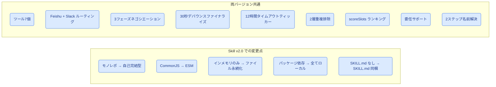

---

## ライセンス

Private - All rights reserved.
