# ClawMeeting - 멀티 플랫폼 회의 스케줄러


[English](./README.md) | [简体中文](./README.zh-CN.md) | [繁體中文](./README.zh-TW.md) | [日本語](./README.ja.md) | **한국어**

---

## 개요

ClawMeeting은 OpenClaw를 위한 AI 기반 회의 스케줄링 시스템입니다. 자연어를 통해 Feishu와 Slack 전반에 걸쳐 다수의 참석자 회의를 조율하며, 지능형 시간대 점수 산정, 3단계 협상, 자동 위임, 디바운스 제어 확정 기능을 제공합니다.

이 저장소에는 두 가지 구현이 포함되어 있습니다:
- **플러그인 (v1.0)** — 최초 프로덕션 버전. `claw-meeting-shared` 패키지를 포함한 CommonJS 모노레포 구조.
- **스킬 (v2.0)** — 파일 기반 영속성을 갖춘 독립형 ESM 재구현 버전.

두 버전 모두 **Feishu + Slack 이중 플랫폼 라우팅**, **7개 도구**, **동일한 비즈니스 로직**을 지원합니다.

---

# 파트 1: 플러그인 버전 (v1.0)

## 플러그인 아키텍처

플러그인은 모노레포 구조를 사용합니다. 핵심 스케줄링 로직은 `shared/` 패키지(`claw-meeting-shared`)에 있으며, 플랫폼별 프로바이더와 엔트리 포인트는 별도 디렉토리에 위치합니다.

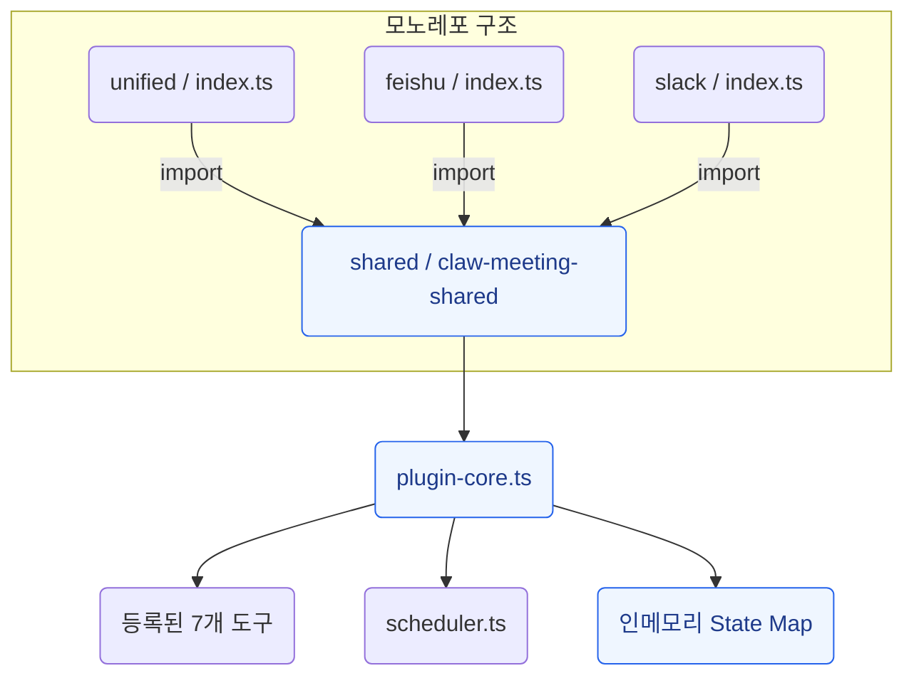

### 플러그인 엔트리 포인트

| 엔트리 | 경로 | 용도 |
|---|---|---|
| **unified** | `unified/src/index.ts` | 멀티 플랫폼 (Feishu + Slack). 프로덕션 기본값. |
| **feishu** | `feishu/src/index.ts` | Feishu 전용 배포 |
| **slack** | `slack/src/index.ts` | Slack 전용 배포 |

세 엔트리 포인트 모두 `claw-meeting-shared`에서 임포트하고 플랫폼별 설정과 함께 `createMeetingPlugin()`을 호출합니다.

### 플러그인 플랫폼 라우팅

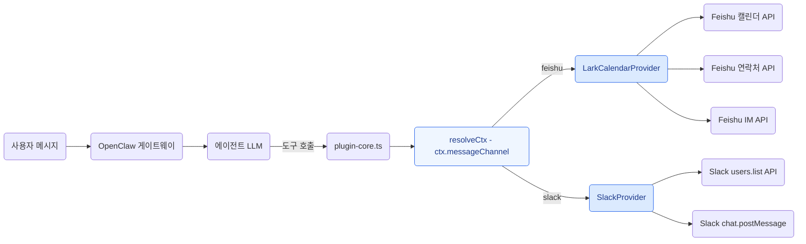

### 플러그인 회의 흐름

플러그인을 통한 단계별 데이터 흐름:

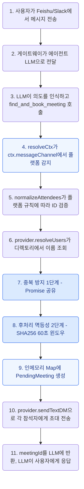

### 플러그인 참석자 응답 흐름

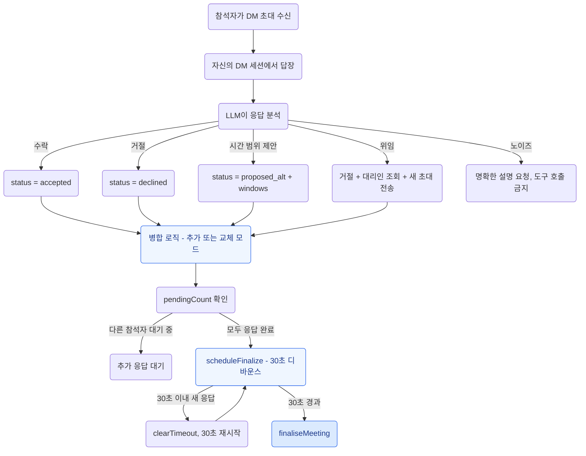

### 플러그인 확정 상태 머신

```mermaid
stateDiagram-v2
    [*] --> Collecting: find_and_book_meeting이 PendingMeeting 생성

    Collecting --> FastPath: 모든 참석자 수락
    Collecting --> Scoring: 일부 대안 시간 제안
    Collecting --> Failed: 모두 거절
    Collecting --> Expired: 12시간 타임아웃 (ticker)

    FastPath --> Committed: commitMeeting이 캘린더 이벤트 생성

    Scoring --> Confirming: 주최자가 confirm_meeting_slot 호출
    note right of Scoring: scoreSlots가 참석자 커버리지로 슬롯 순위 산정

    Confirming --> Committed: 참석자들이 선택된 슬롯 확인
    Confirming --> Failed: 슬롯 거부됨

    Committed --> [*]: 주최자에게 이벤트 링크 DM 전송
    Failed --> [*]: 주최자에게 실패 사유 DM 전송
    Expired --> [*]: 주최자에게 자동 취소 DM 전송

    style [*] fill:#dbeafe,stroke:#2563eb,color:#1e3a8a
    style Collecting fill:#eff6ff,stroke:#2563eb,color:#1e3a8a
    style FastPath fill:#eff6ff,stroke:#2563eb,color:#1e3a8a
    style Scoring fill:#eff6ff,stroke:#2563eb,color:#1e3a8a
    style Confirming fill:#eff6ff,stroke:#2563eb,color:#1e3a8a
    style Committed fill:#eff6ff,stroke:#2563eb,color:#1e3a8a
    style Failed fill:#eff6ff,stroke:#2563eb,color:#1e3a8a
    style Expired fill:#eff6ff,stroke:#2563eb,color:#1e3a8a
```

### 플러그인 백그라운드 티커

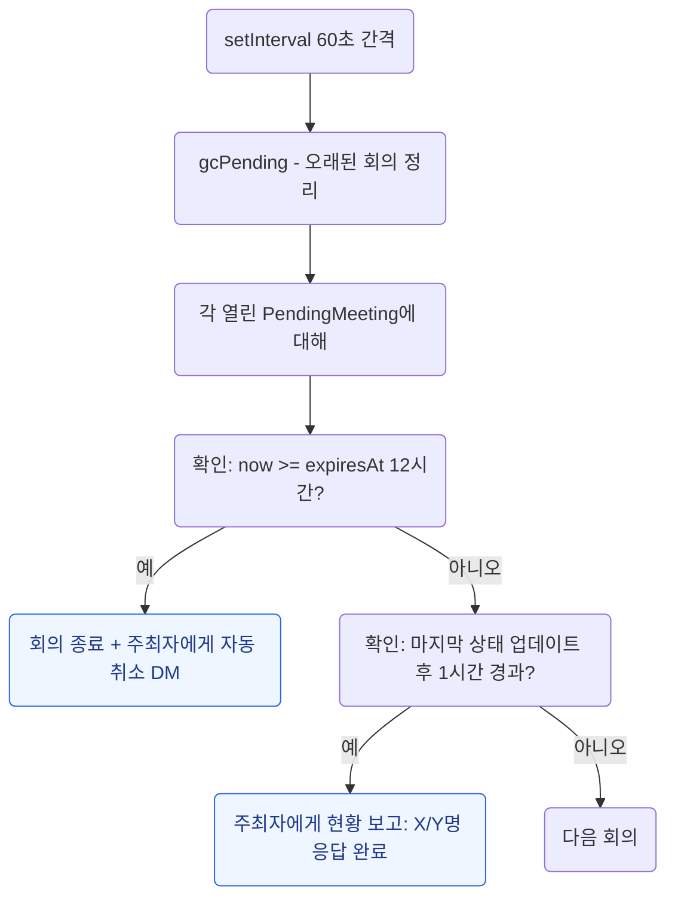

### 플러그인 상태 관리

모든 상태는 인메모리. 게이트웨이 재시작 시 모든 대기 중인 회의 데이터가 손실됩니다.

```
pendingMeetings: Map<string, PendingMeeting>     ← 진행 중인 회의
recentFindAndBook: Map<string, {meetingId, at}>   ← 멱등성 (60초 윈도우)
inflightFindAndBook: Map<string, Promise>         ← 동시 요청 중복 방지
```

### 플러그인 파일 구조

```
plugin_version/
├── shared/                          claw-meeting-shared 패키지
│   ├── src/
│   │   ├── index.ts                 패키지 내보내기
│   │   ├── plugin-core.ts           핵심 로직: 7개 도구, 라우팅, 상태 머신 (1131줄)
│   │   ├── scheduler.ts             슬롯 탐색, 점수 산정, 교집합 (257줄)
│   │   ├── load-env.ts              .env 로더
│   │   └── providers/types.ts       CalendarProvider 인터페이스
│   ├── package.json                 claw-meeting-shared
│   └── tsconfig.json
├── unified/                         멀티 플랫폼 엔트리 (Feishu + Slack)
│   ├── src/
│   │   ├── index.ts                 플랫폼 설정 + createMeetingPlugin()
│   │   └── providers/
│   │       ├── lark.ts              Feishu 백엔드 (1020줄)
│   │       └── slack.ts             Slack 백엔드 (346줄)
│   ├── package.json                 claw-meeting-shared 의존
│   └── tsconfig.json
├── feishu/                          Feishu 전용 엔트리
│   └── src/
│       ├── index.ts                 단일 플랫폼 설정
│       └── providers/lark.ts
└── slack/                           Slack 전용 엔트리
    └── src/
        ├── index.ts                 단일 플랫폼 설정
        └── providers/slack.ts
```

### 플러그인 빠른 시작

```bash
cd plugin_version/shared && npm install && npm run build
cd ../unified && npm install && npm run build
openclaw plugins install -l .
openclaw gateway --force
```

---

# 파트 2: 스킬 버전 (v2.0)

## 스킬 아키텍처

스킬 버전은 독립형 재구현입니다. 모노레포 없이 외부 패키지 의존성도 없습니다. 모든 코드가 하나의 디렉토리에 있습니다. 클론, 빌드, 실행.

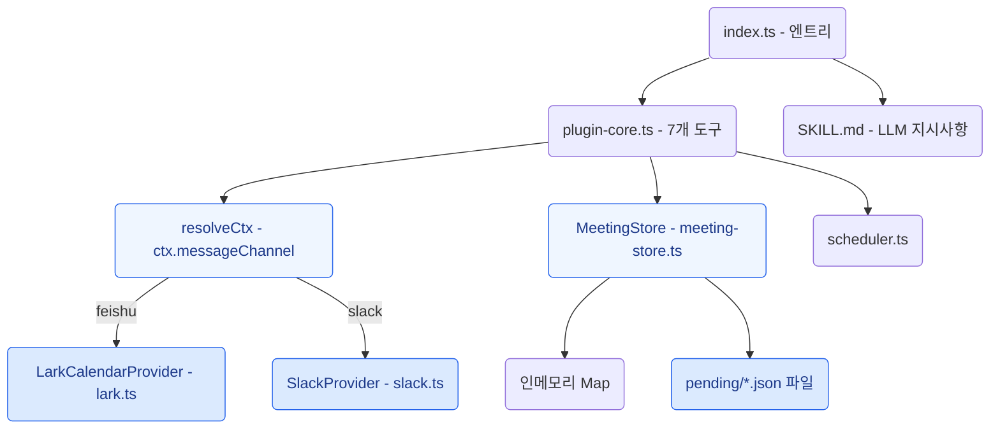

### 플러그인 대비 변경 사항

| 항목 | 플러그인 (v1.0) | 스킬 (v2.0) |
|---|---|---|
| 코드 구조 | 모노레포 (shared + unified + feishu + slack) | 단일 디렉토리, 독립형 |
| 모듈 시스템 | CommonJS | ESM (Node16) |
| 외부 의존성 | `claw-meeting-shared` 패키지 | 없음 (모두 `.js` 접미사 로컬 임포트) |
| 상태 레이어 | 인메모리 Map 전용 | MeetingStore: Map + 파일 영속성 |
| `__dirname` | 네이티브 CJS 전역 변수 | `fileURLToPath(import.meta.url)` |
| 내보내기 | `module.exports = plugin` | `export default plugin; export { plugin }` |
| SKILL.md | 없음 | `openclaw skills add`용으로 포함 |

### 스킬 플랫폼 라우팅

플러그인과 동일. `resolveCtx()`가 `ctx.messageChannel`을 읽고 올바른 프로바이더로 라우팅합니다:

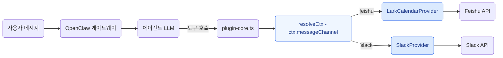

### 스킬 회의 흐름

플러그인과 동일한 비즈니스 로직에 영속성이 추가되었습니다:

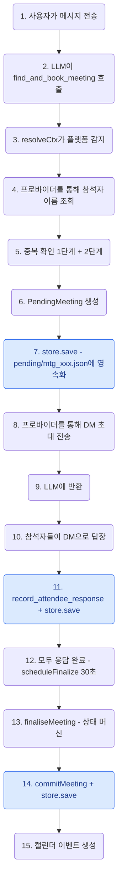

초록색 노드 = `store.save()` 영속화 지점. 게이트웨이가 어느 시점에서든 재시작되면 `pending/*.json`에서 상태가 복구됩니다.

### 스킬 상태 관리

하이브리드: 속도를 위한 인메모리, 내구성을 위한 파일.

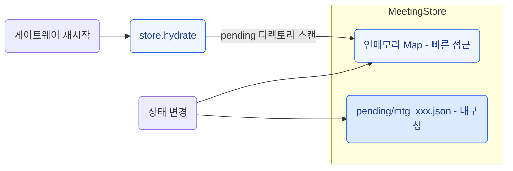

### 스킬 확정 상태 머신

플러그인과 동일:

```mermaid
stateDiagram-v2
    [*] --> Collecting: find_and_book_meeting

    Collecting --> FastPath: 모두 수락
    Collecting --> Scoring: 일부 proposed_alt
    Collecting --> Failed: 모두 거절
    Collecting --> Expired: 12시간 타임아웃

    FastPath --> Committed: commitMeeting + store.save

    Scoring --> Confirming: confirm_meeting_slot
    note right of Scoring: scoreSlots가 커버리지로 순위 산정 + store.save

    Confirming --> Committed: 모두 확인 + store.save

    Committed --> [*]: 캘린더 이벤트 생성
    Failed --> [*]: 종료 + store.save
    Expired --> [*]: 자동 취소 + store.save

    style [*] fill:#dbeafe,stroke:#2563eb,color:#1e3a8a
    style Collecting fill:#eff6ff,stroke:#2563eb,color:#1e3a8a
    style FastPath fill:#eff6ff,stroke:#2563eb,color:#1e3a8a
    style Scoring fill:#eff6ff,stroke:#2563eb,color:#1e3a8a
    style Confirming fill:#eff6ff,stroke:#2563eb,color:#1e3a8a
    style Committed fill:#eff6ff,stroke:#2563eb,color:#1e3a8a
    style Failed fill:#eff6ff,stroke:#2563eb,color:#1e3a8a
    style Expired fill:#eff6ff,stroke:#2563eb,color:#1e3a8a
```

### 스킬 백그라운드 티커

플러그인과 동일하며, 모든 상태 변경 시 `store.save()` 호출:

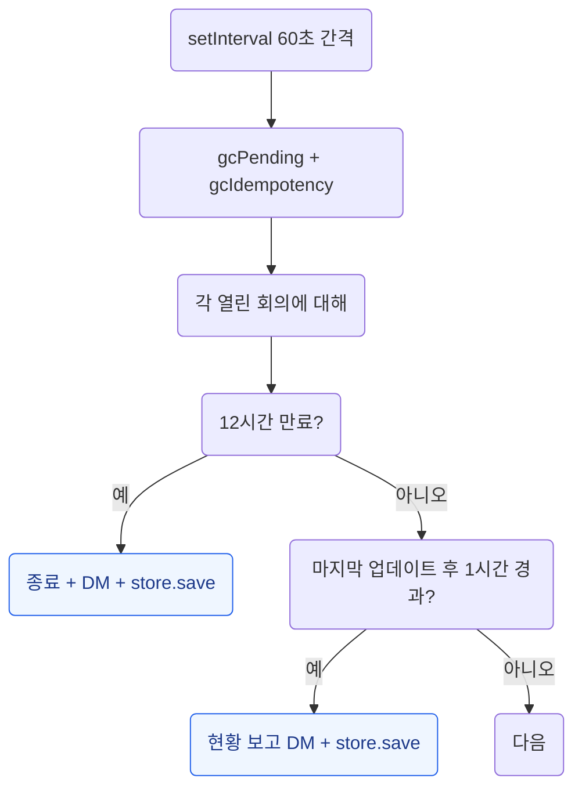

### 스킬 파일 구조

```
skill_version/
├── SKILL.md                         LLM 동작 지시사항
├── src/
│   ├── index.ts                     엔트리 포인트 - 플랫폼 설정 (70줄)
│   ├── plugin-core.ts               핵심 로직: 7개 도구, 라우팅, 상태 머신 (1176줄)
│   ├── meeting-store.ts             MeetingStore: Map + 파일 영속성 (222줄)
│   ├── scheduler.ts                 슬롯 탐색, 점수 산정, 교집합 (243줄)
│   ├── load-env.ts                  .env 로더 (ESM 호환)
│   └── providers/
│       ├── types.ts                 CalendarProvider 인터페이스
│       ├── lark.ts                  Feishu 백엔드 (770줄)
│       └── slack.ts                 Slack 백엔드 (345줄)
├── pending/                         런타임 상태 (JSON 파일, gitignore 대상)
├── openclaw.plugin.json             플러그인 + 스킬 매니페스트
├── package.json                     ESM, @slack/web-api + googleapis + luxon
└── .gitignore                       .env, node_modules, dist, pending 제외
```

### 스킬 빠른 시작

```bash
cd skill_version
npm install
npm run build
openclaw plugins install -l .
openclaw gateway --force
```

---

# 파트 3: 버전 비교 (Diff)

## 7개 도구 (두 버전 공통)

| # | 도구 | 설명 |
|---|------|------|
| 1 | `find_and_book_meeting` | 대기 중 회의 생성, 참석자 이름 조회, DM 초대 전송 |
| 2 | `list_my_pending_invitations` | 현재 발신자의 대기 중 초대 목록 조회 |
| 3 | `record_attendee_response` | 수락 / 거절 / 대안 시간 제안 / 위임 기록 |
| 4 | `confirm_meeting_slot` | 점수 산정 결과 후 주최자가 시간 슬롯 선택 |
| 5 | `list_upcoming_meetings` | 예정된 캘린더 이벤트 목록 조회 |
| 6 | `cancel_meeting` | 이벤트 ID로 회의 취소 |
| 7 | `debug_list_directory` | 테넌트 디렉토리 사용자 목록 조회 (진단용) |

## 설정 (두 버전 공통)

```env
# Feishu / Lark
LARK_APP_ID=cli_xxxxx
LARK_APP_SECRET=xxxxx
LARK_CALENDAR_ID=xxxxx@group.calendar.feishu.cn

# Slack
SLACK_BOT_TOKEN=xoxb-xxxxx

# 스케줄 기본값
DEFAULT_TIMEZONE=Asia/Shanghai
WORK_HOURS=09:00-18:00
LUNCH_BREAK=12:00-13:30
BUFFER_MINUTES=15
```

## 전체 비교 표

| 항목 | 플러그인 (v1.0) | 스킬 (v2.0) |
|---|---|---|
| 아키텍처 | 모노레포 (shared + unified + feishu + slack) | 독립형 (단일 디렉토리) |
| 모듈 시스템 | CommonJS | ESM (Node16) |
| 의존성 | `claw-meeting-shared` 패키지 | 없음 (모두 로컬) |
| 이식성 | 모노레포 + 패키지 링크 필요 | 클론 후 바로 실행 |
| 도구 | 7개 | 7개 (동일) |
| 플랫폼 | Feishu + Slack | Feishu + Slack (동일) |
| 플랫폼 라우팅 | `resolveCtx()`를 통한 `ctx.messageChannel` | 동일 |
| 상태 저장소 | 인메모리 Map | 인메모리 Map + 파일 영속성 |
| 재시작 복구 | 모든 상태 손실 | 상태 보존 (`pending/*.json`) |
| 협상 | 3단계 (수집/점수 산정/확인) | 동일 |
| 슬롯 점수 산정 | `scoreSlots()`가 커버리지로 순위 산정 | 동일 |
| 위임 | 지원 ("让XXX替我去") | 동일 |
| 30초 디바운스 | `setTimeout` / `clearTimeout` | 동일 |
| 12시간 타임아웃 | `setInterval` 티커 | 동일 |
| 2단계 중복 방지 | 인플라이트 Promise + SHA256 멱등성 | 동일 |
| 이름 조회 | 2단계 (프로바이더 후보 + LLM 선택) | 동일 |
| 설치 | `openclaw plugins install` | `openclaw skills add` |
| SKILL.md | 없음 | 있음 |

## 변경된 부분 vs 유지된 부분

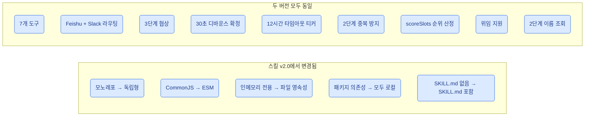

---

## 라이선스

Private - All rights reserved.
