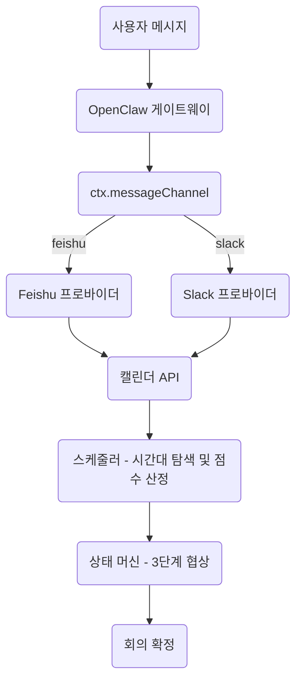
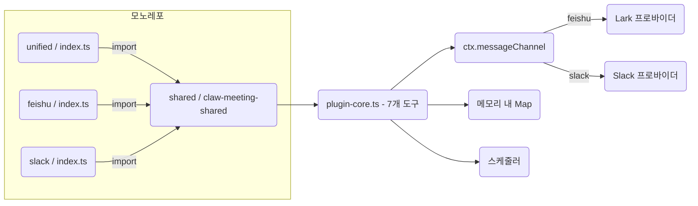
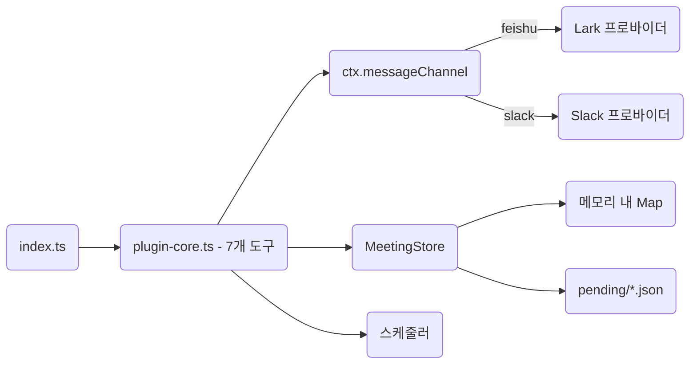
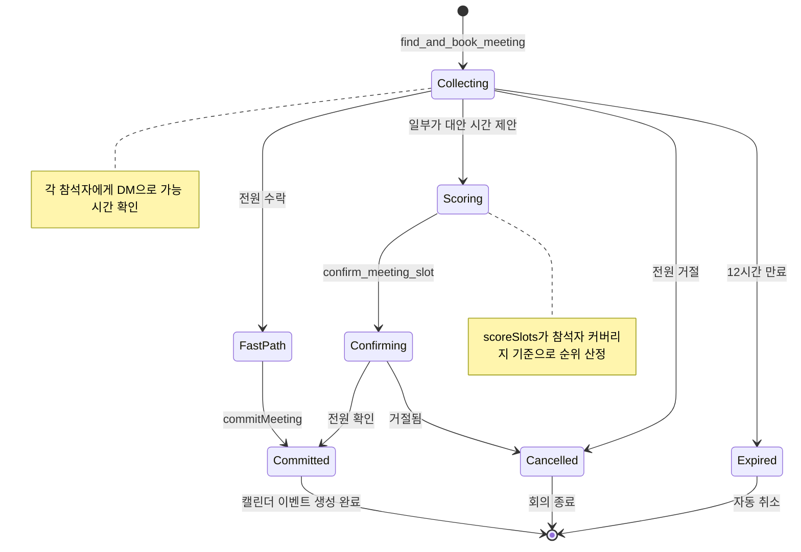
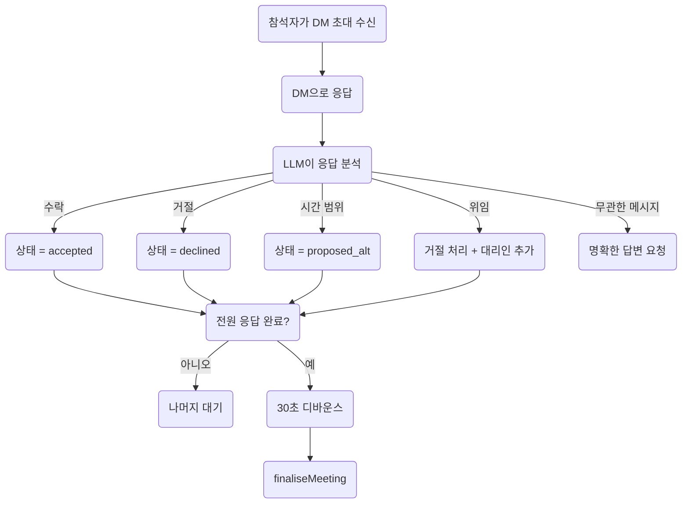
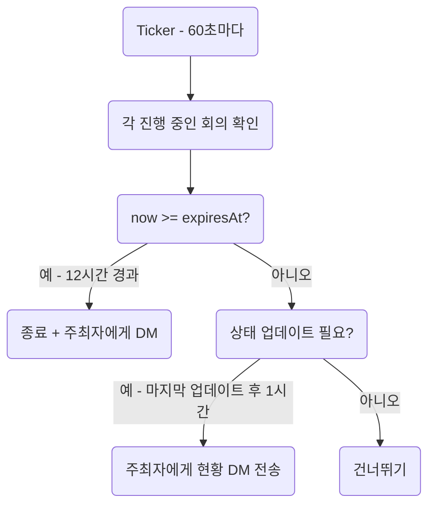
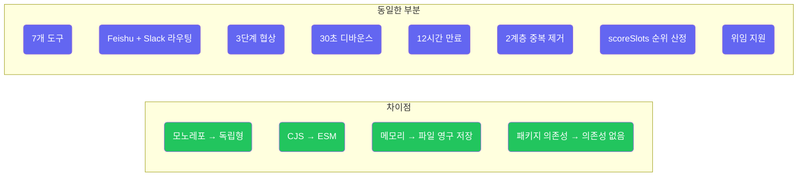

# ClawMeeting - 멀티 플랫폼 회의 스케줄러


[English](./README.md) | [简体中文](./README.zh-CN.md) | [繁體中文](./README.zh-TW.md) | [日本語](./README.ja.md) | **한국어**

---

## 개요

ClawMeeting은 OpenClaw용 AI 기반 회의 스케줄링 시스템입니다. 지능형 시간대 점수 산정, 자동 위임, 디바운스 제어 확정 기능을 갖춘 3단계 협상 프로토콜을 통해 Feishu와 Slack에서 다수 참석자 회의를 조율합니다.

두 가지 프로덕션 버전이 제공됩니다:
- **플러그인 (v1.0)** — `claw-meeting-shared` 패키지에 의존하는 CommonJS 모노레포. 실행하려면 모노레포 구조가 필요합니다.
- **스킬 (v2.0)** — ESM 독립형. 클론하고 바로 실행. 파일 기반 상태 유지. `openclaw skills add`로 간편 설치.

---

## 아키텍처



---

## 플러그인 버전 (v1.0)

최초 프로덕션 구현체입니다. 핵심 스케줄링 로직, 상태 머신, 도구 정의를 포함하는 공유 npm 패키지 `claw-meeting-shared`를 사용하는 모노레포 구조입니다. 각 플랫폼별 진입점이 있으며, 두 플랫폼을 모두 라우팅하는 `unified/` 진입점도 있습니다.

**주요 특징:**
- 모노레포: `shared/` (핵심) + `unified/` (멀티 플랫폼) + `feishu/` + `slack/` (단일 플랫폼)
- `claw-meeting-shared` npm 패키지(`shared/` 디렉토리)에 의존
- 7개 도구, Feishu + Slack 이중 플랫폼 라우팅(`ctx.messageChannel` 사용)
- 메모리 내 상태만 저장 — 게이트웨이 재시작 시 유실
- CommonJS 모듈 시스템

### 플러그인 구조



---

## 스킬 버전 (v2.0)

ESM 모듈을 사용하는 독립형 재구현체입니다. 외부 패키지 의존성 없이 모든 코드가 하나의 디렉토리에 있습니다. 상태는 `pending/*.json` 파일로 저장되어 게이트웨이 재시작에도 유지됩니다. `openclaw skills add`를 통한 간편 설치를 위한 `SKILL.md`가 포함되어 있습니다.

**주요 특징:**
- 독립형: 클론, `npm install`, `npm run build`로 완료
- 모노레포 불필요, `claw-meeting-shared` 의존성 없음
- 7개 도구, Feishu + Slack 이중 플랫폼 라우팅(`ctx.messageChannel` 사용)
- 파일 기반 상태 유지 (`pending/`에 JSON 저장) — 재시작에도 보존
- ESM 모듈 시스템 (Node16)
- LLM 행동 지침을 위한 `SKILL.md`

### 스킬 구조



---

## 회의 생명주기



---

## 참석자 응답 흐름



---

## 백그라운드 프로세스



---

## 도구

| # | 도구 | 설명 |
|---|------|------|
| 1 | `find_and_book_meeting` | 대기 중 회의 생성, 참석자 이름 확인, DM 초대 전송 |
| 2 | `list_my_pending_invitations` | 현재 발신자의 대기 중인 초대 목록 조회 |
| 3 | `record_attendee_response` | 수락 / 거절 / 대안 제안 / 위임 기록 |
| 4 | `confirm_meeting_slot` | 점수 산정 결과를 바탕으로 주최자가 시간대 선택 |
| 5 | `list_upcoming_meetings` | 예정된 캘린더 이벤트 목록 조회 |
| 6 | `cancel_meeting` | 이벤트 ID로 회의 취소 |
| 7 | `debug_list_directory` | 테넌트 디렉토리 사용자 목록 조회 (진단용) |

---

## 파일 구조

```
plugin_version/                      모노레포 (claw-meeting-shared 필요)
├── shared/                          핵심 로직 패키지
│   └── src/
│       ├── plugin-core.ts           7개 도구, 라우팅, 상태 머신 (1131줄)
│       ├── scheduler.ts             시간대 탐색 + 점수 산정
│       ├── load-env.ts              .env 로더
│       └── providers/types.ts       CalendarProvider 인터페이스
├── unified/                         멀티 플랫폼 진입점 (Feishu + Slack)
│   └── src/
│       ├── index.ts                 플랫폼 설정
│       └── providers/
│           ├── lark.ts              Feishu 백엔드
│           └── slack.ts             Slack 백엔드
├── feishu/                          Feishu 전용 진입점
│   └── src/
│       ├── index.ts                 단일 플랫폼 설정
│       └── providers/lark.ts        Feishu 백엔드
└── slack/                           Slack 전용 진입점
    └── src/
        ├── index.ts                 단일 플랫폼 설정
        └── providers/slack.ts       Slack 백엔드

skill_version/                       독립형 (클론하고 바로 실행)
├── SKILL.md                         LLM 지침
├── src/
│   ├── index.ts                     진입점 (플랫폼 설정)
│   ├── plugin-core.ts               7개 도구, 라우팅, 상태 머신 (1176줄)
│   ├── meeting-store.ts             영구 상태 레이어 (222줄)
│   ├── scheduler.ts                 시간대 탐색 + 점수 산정
│   ├── load-env.ts                  .env 로더 (ESM)
│   └── providers/
│       ├── types.ts                 CalendarProvider 인터페이스
│       ├── lark.ts                  Feishu 백엔드
│       └── slack.ts                 Slack 백엔드
└── pending/                         런타임 회의 상태 (JSON 파일)
```

---

## 빠른 시작

### 플러그인 버전 (v1.0)

```bash
cd plugin_version/shared && npm install && npm run build
cd ../unified && npm install && npm run build
openclaw plugins install -l .
openclaw gateway --force
```

### 스킬 버전 (v2.0)

```bash
cd skill_version
npm install
npm run build
openclaw plugins install -l .
openclaw gateway --force
```

---

## 설정

두 버전 모두 `.env`에 플랫폼 인증 정보가 필요합니다:

```env
# Feishu / Lark
LARK_APP_ID=cli_xxxxx
LARK_APP_SECRET=xxxxx
LARK_CALENDAR_ID=xxxxx@group.calendar.feishu.cn

# Slack
SLACK_BOT_TOKEN=xoxb-xxxxx

# 스케줄 기본값
DEFAULT_TIMEZONE=Asia/Shanghai
WORK_HOURS=09:00-18:00
LUNCH_BREAK=12:00-13:30
BUFFER_MINUTES=15
```

---

## 버전 비교

| 항목 | 플러그인 (v1.0) | 스킬 (v2.0) |
|---|---|---|
| 아키텍처 | 모노레포 (shared + unified + feishu + slack) | 독립형 (단일 디렉토리) |
| 모듈 시스템 | CommonJS | ESM (Node16) |
| 의존성 | `claw-meeting-shared` 패키지 | 없음 (모두 로컬) |
| 이식성 | 모노레포 구조 필요 | 클론하고 바로 실행 |
| 도구 | 7개 | 7개 |
| 플랫폼 | Feishu + Slack | Feishu + Slack |
| 플랫폼 라우팅 | `ctx.messageChannel` | `ctx.messageChannel` |
| 상태 저장소 | 메모리 내 Map | 메모리 + 파일 영구 저장 |
| 재시작 복구 | 상태 유실 | 상태 보존 (pending/*.json) |
| 협상 방식 | 3단계 (collecting/scoring/confirming) | 3단계 (동일) |
| 점수 산정 | 있음 (scoreSlots) | 있음 (동일) |
| 위임 | 있음 | 있음 |
| 설치 방법 | `openclaw plugins install` | `openclaw skills add` |
| SKILL.md | 없음 | 있음 |



---

## 라이선스

Private - 모든 권리 보유.
