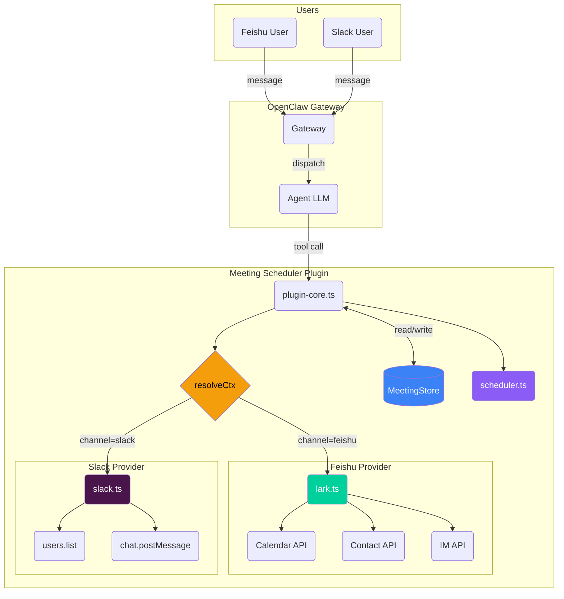
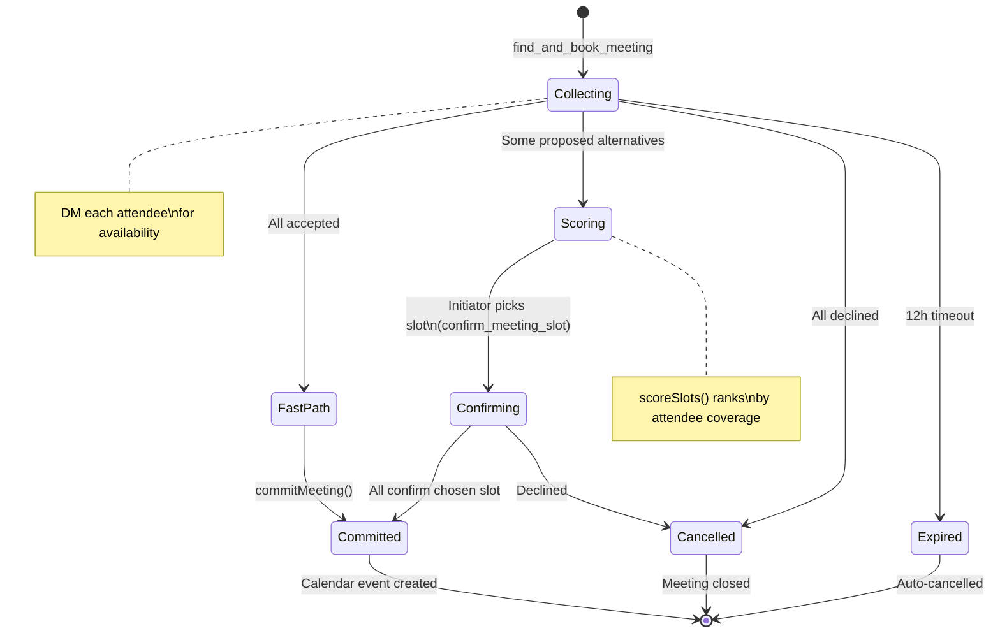
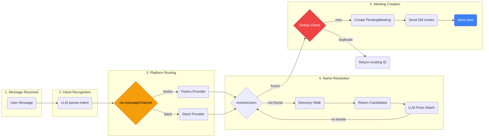
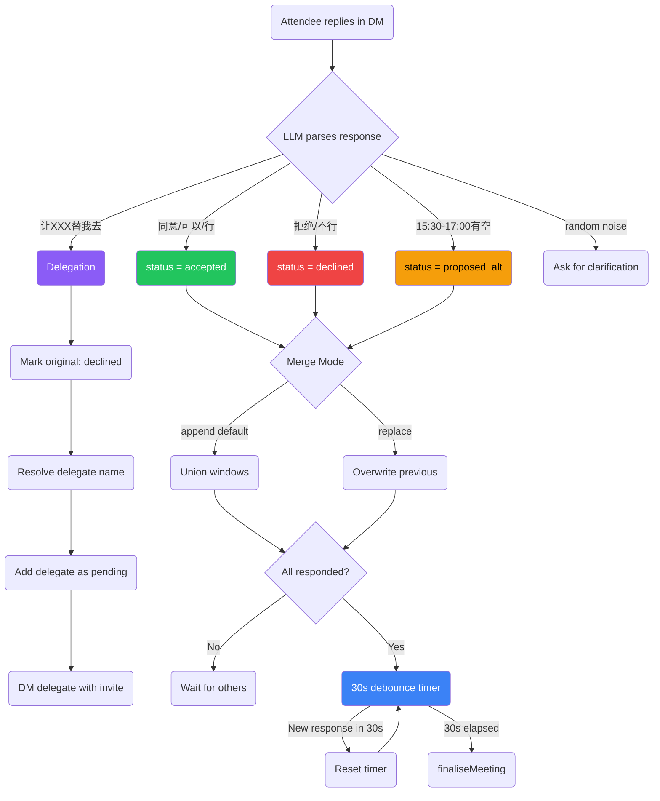
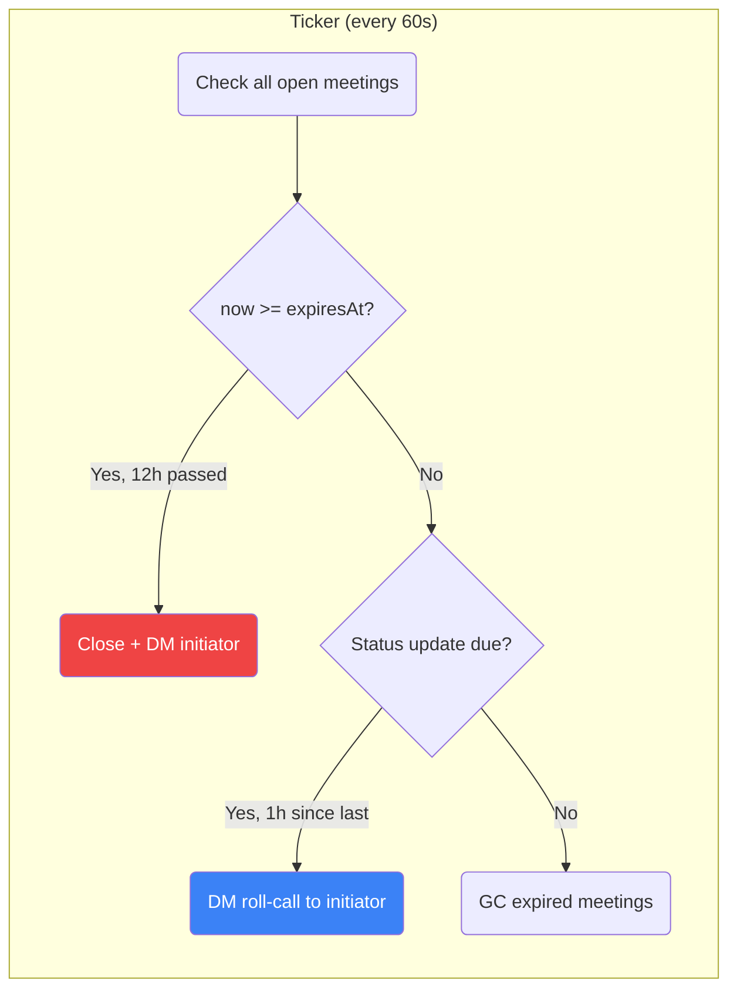

<div align="center">

# OpenClaw Meeting Scheduler

**Multi-platform AI meeting scheduler for OpenClaw**

Schedule meetings via natural language in Feishu and Slack.
The plugin automatically routes by platform, resolves attendee names, collects availability via DM, scores time slots, and creates calendar events.


**English** | [中文](./README.zh-CN.md)

</div>

---

## Overview

This repository contains two versions of the meeting scheduler:

| | `plugin_version/` | `skill_version/` |
|---|---|---|
| **Architecture** | OpenClaw Plugin (CJS) | Skill-packaged Plugin (ESM) |
| **Tools** | 6 | 7 (+slot confirmation) |
| **Platforms** | Feishu only | Feishu + Slack |
| **State** | In-memory (lost on restart) | File-persistent (survives restart) |
| **Negotiation** | Simple accept/decline | 3-phase scoring + confirmation |
| **Installation** | `openclaw plugins install` | `openclaw skills add` |

## Architecture



## Meeting Lifecycle



## Request Processing Pipeline



## Attendee Response Flow



## Background Processes



## Safety Mechanisms

```mermaid
flowchart TD
    subgraph "Concurrent Dedup (Layer 1)"
        L1(60 parallel tool calls)
        L1P(inflightFindAndBook Map)
        L1R(Share single Promise)
        L1 --> L1P --> L1R
    end

    subgraph "Idempotency (Layer 2)"
        L2(Sequential retry)
        L2H(SHA256 fingerprint)
        L2W(60s window check)
        L2 --> L2H --> L2W
    end

    subgraph "Debounce"
        DB1(Last response received)
        DB2(setTimeout 30s)
        DB3{New response?}
        DB4(clearTimeout + restart)
        DB5(finaliseMeeting)
        DB1 --> DB2 --> DB3
        DB3 -->|Yes| DB4 --> DB2
        DB3 -->|No, 30s elapsed| DB5
    end

    subgraph "Persistence"
        PS1(State mutation)
        PS2(store.save to JSON)
        PS3(Gateway restart)
        PS4(store.hydrate from disk)
        PS1 --> PS2
        PS3 --> PS4
    end

    style L1R fill:#22c55e,color:#fff
    style L2W fill:#22c55e,color:#fff
    style DB5 fill:#3b82f6,color:#fff
    style PS4 fill:#3b82f6,color:#fff
```



## File Structure

```
Meeting_new/
├── docs/
│   ├── flow-diagram.md              Mermaid sequence diagrams
│   ├── diff.md                      Plugin vs Skill 6-scenario analysis
│   └── plugin-vs-skill.md           Architecture comparison
│
├── plugin_version/                   Original Plugin (v1.0)
│   ├── src/
│   │   ├── index.ts                  1908 lines, 6 tools, single-file
│   │   ├── scheduler.ts             Time slot algorithm
│   │   └── providers/
│   │       ├── lark.ts              Feishu backend (1020 lines)
│   │       ├── google.ts            Google Calendar backend
│   │       └── mock.ts             Test mock
│   └── openclaw.plugin.json
│
└── skill_version/                    Skill-packaged Plugin (v2.0)
    ├── SKILL.md                      LLM instructions
    ├── src/
    │   ├── index.ts                  Entry point (platform config)
    │   ├── plugin-core.ts            1176 lines, 7 tools, multi-platform
    │   ├── meeting-store.ts          Persistent state layer
    │   ├── scheduler.ts             Slot finding + scoring
    │   └── providers/
    │       ├── lark.ts              Feishu (770 lines)
    │       └── slack.ts             Slack (345 lines)
    ├── pending/                      Runtime meeting state
    └── openclaw.plugin.json         Plugin + Skill manifest
```

## 7 Tools

| Tool | Description | Trigger Phrases |
|---|---|---|
| `find_and_book_meeting` | Create pending meeting, resolve names, send DM invites | 约会议 / 帮我约 / 安排会议 / 开个会 |
| `list_my_pending_invitations` | List sender's pending invitations | (before replying to invite) |
| `record_attendee_response` | Record accept / decline / alternative with merge logic | 同意 / 拒绝 / 我只有...有空 |
| `confirm_meeting_slot` | Initiator picks time slot after scoring | (after receiving scoring report) |
| `list_upcoming_meetings` | List upcoming calendar events | 我有什么会 / 明天有什么会 |
| `cancel_meeting` | Cancel by event ID | 取消会议 |
| `debug_list_directory` | List tenant directory users | 显示通讯录 |

## Quick Start

```bash
cd skill_version
npm install
npm run build
openclaw plugins install -l .
openclaw gateway --force
```

## Configuration (.env)

```env
# Feishu
LARK_APP_ID=cli_xxx
LARK_APP_SECRET=xxx
LARK_CALENDAR_ID=xxx@group.calendar.feishu.cn

# Slack
SLACK_BOT_TOKEN=xoxb-xxx

# Schedule defaults
DEFAULT_TIMEZONE=Asia/Shanghai
WORK_HOURS=09:00-18:00
LUNCH_BREAK=12:00-13:30
BUFFER_MINUTES=15
```

## License

Private
