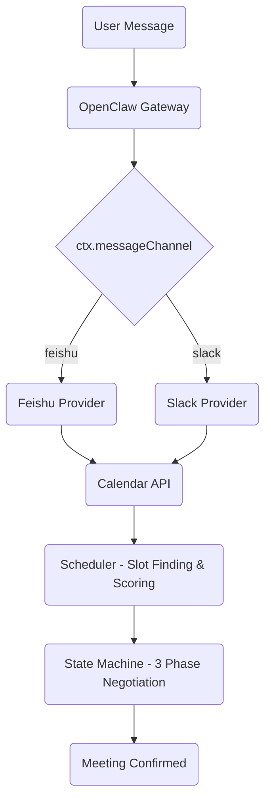
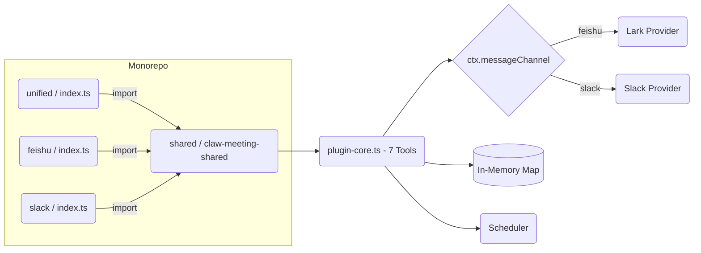
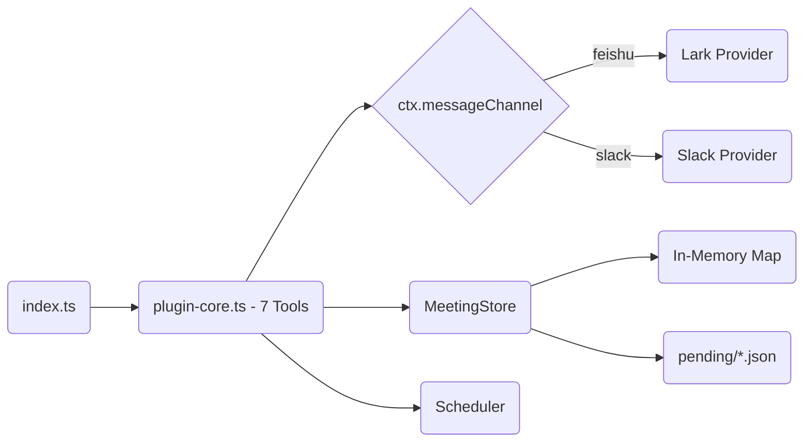
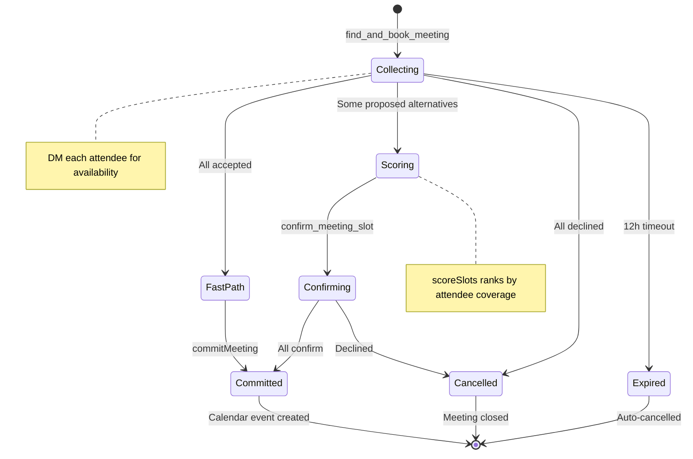
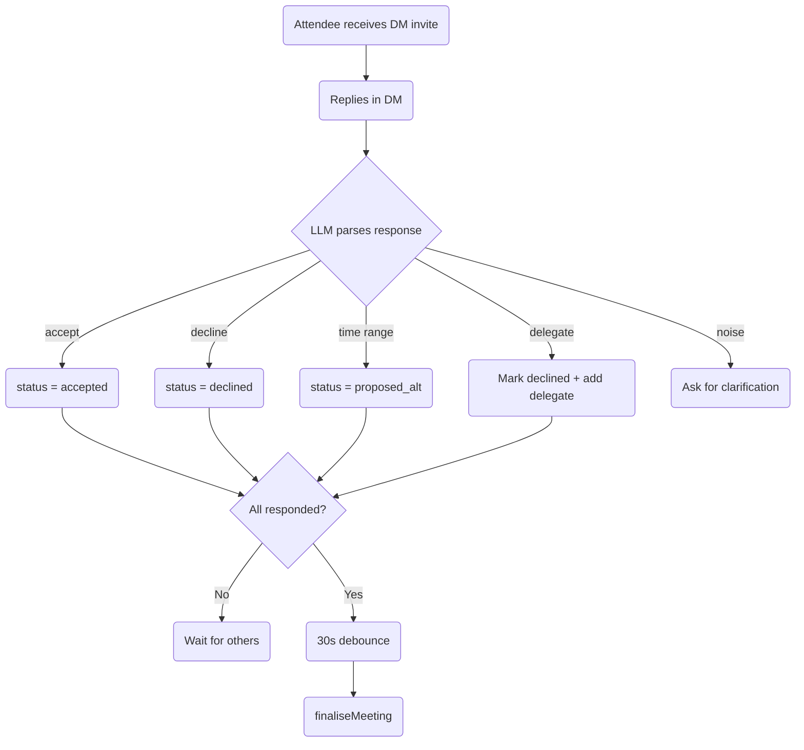
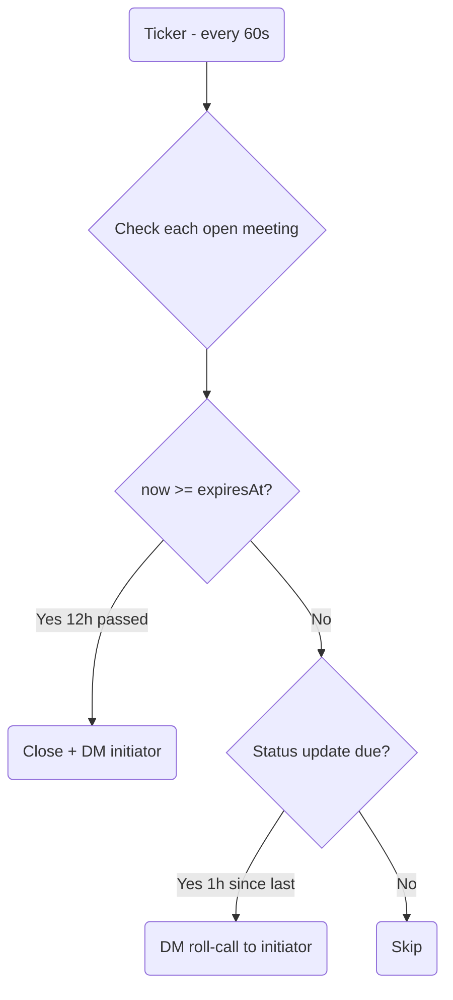
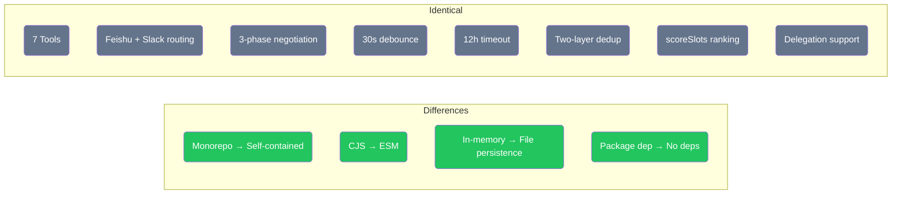

# ClawMeeting - Multi-Platform Meeting Scheduler


**English** | [简体中文](./README.zh-CN.md) | [繁體中文](./README.zh-TW.md) | [日本語](./README.ja.md) | [한국어](./README.ko.md)

---

## Overview

ClawMeeting is an AI-powered meeting scheduling system for OpenClaw. It coordinates multi-participant meetings across Feishu and Slack through a 3-phase negotiation protocol with intelligent time-slot scoring, automatic delegation, and debounce-controlled finalization.

Two production versions are available:
- **Plugin (v1.0)** — CommonJS monorepo with `claw-meeting-shared` package dependency. Requires monorepo structure to run.
- **Skill (v2.0)** — ESM self-contained. Clone and run. File-backed persistence. User-friendly `openclaw skills add` installation.

---

## Architecture



---

## Plugin Version (v1.0)

The original production implementation. Uses a monorepo structure with `claw-meeting-shared` as a shared npm package containing core scheduling logic, state machine, and tool definitions. Each platform has its own entry point, plus a `unified/` entry that routes both platforms.

**Key characteristics:**
- Monorepo: `shared/` (core) + `unified/` (multi-platform) + `feishu/` + `slack/` (single-platform)
- Depends on `claw-meeting-shared` npm package (the `shared/` directory)
- 7 tools, Feishu + Slack dual-platform routing via `ctx.messageChannel`
- In-memory state only — lost on gateway restart
- CommonJS module system

### Plugin Structure



---

## Skill Version (v2.0)

A self-contained reimplementation using ESM modules. No external package dependencies — all code lives in one directory. State is persisted to `pending/*.json` files, surviving gateway restarts. Includes `SKILL.md` for user-friendly installation via `openclaw skills add`.

**Key characteristics:**
- Self-contained: clone, `npm install`, `npm run build`, done
- No monorepo, no `claw-meeting-shared` dependency
- 7 tools, Feishu + Slack dual-platform routing via `ctx.messageChannel`
- File-persistent state (JSON in `pending/`) — survives restarts
- ESM module system (Node16)
- `SKILL.md` for LLM behavioral instructions

### Skill Structure



---

## Meeting Lifecycle



---

## Attendee Response Flow



---

## Background Processes



---

## Tools

| # | Tool | Description |
|---|------|-------------|
| 1 | `find_and_book_meeting` | Create pending meeting, resolve attendee names, send DM invites |
| 2 | `list_my_pending_invitations` | List pending invitations for the current sender |
| 3 | `record_attendee_response` | Record accept / decline / propose alternative / delegate |
| 4 | `confirm_meeting_slot` | Initiator picks a time slot after scoring results |
| 5 | `list_upcoming_meetings` | List upcoming calendar events |
| 6 | `cancel_meeting` | Cancel a meeting by event ID |
| 7 | `debug_list_directory` | List tenant directory users (diagnostic) |

---

## File Structure

```
plugin_version/                      Monorepo (requires claw-meeting-shared)
├── shared/                          Core logic package
│   └── src/
│       ├── plugin-core.ts           7 tools, routing, state machine (1131 lines)
│       ├── scheduler.ts             Slot finding + scoring
│       ├── load-env.ts              .env loader
│       └── providers/types.ts       CalendarProvider interface
├── unified/                         Multi-platform entry (Feishu + Slack)
│   └── src/
│       ├── index.ts                 Platform config
│       └── providers/
│           ├── lark.ts              Feishu backend
│           └── slack.ts             Slack backend
├── feishu/                          Feishu-only entry
│   └── src/
│       ├── index.ts                 Single-platform config
│       └── providers/lark.ts        Feishu backend
└── slack/                           Slack-only entry
    └── src/
        ├── index.ts                 Single-platform config
        └── providers/slack.ts       Slack backend

skill_version/                       Self-contained (clone and run)
├── SKILL.md                         LLM instructions
├── src/
│   ├── index.ts                     Entry point (platform config)
│   ├── plugin-core.ts               7 tools, routing, state machine (1176 lines)
│   ├── meeting-store.ts             Persistent state layer (222 lines)
│   ├── scheduler.ts                 Slot finding + scoring
│   ├── load-env.ts                  .env loader (ESM)
│   └── providers/
│       ├── types.ts                 CalendarProvider interface
│       ├── lark.ts                  Feishu backend
│       └── slack.ts                 Slack backend
└── pending/                         Runtime meeting state (JSON files)
```

---

## Quick Start

### Plugin Version (v1.0)

```bash
cd plugin_version/shared && npm install && npm run build
cd ../unified && npm install && npm run build
openclaw plugins install -l .
openclaw gateway --force
```

### Skill Version (v2.0)

```bash
cd skill_version
npm install
npm run build
openclaw plugins install -l .
openclaw gateway --force
```

---

## Configuration

Both versions require platform credentials in `.env`:

```env
# Feishu / Lark
LARK_APP_ID=cli_xxxxx
LARK_APP_SECRET=xxxxx
LARK_CALENDAR_ID=xxxxx@group.calendar.feishu.cn

# Slack
SLACK_BOT_TOKEN=xoxb-xxxxx

# Schedule defaults
DEFAULT_TIMEZONE=Asia/Shanghai
WORK_HOURS=09:00-18:00
LUNCH_BREAK=12:00-13:30
BUFFER_MINUTES=15
```

---

## Version Comparison

| Dimension | Plugin (v1.0) | Skill (v2.0) |
|---|---|---|
| Architecture | Monorepo (shared + unified + feishu + slack) | Self-contained (single directory) |
| Module System | CommonJS | ESM (Node16) |
| Dependencies | `claw-meeting-shared` package | None (all local) |
| Portability | Requires monorepo structure | Clone and run |
| Tools | 7 | 7 |
| Platforms | Feishu + Slack | Feishu + Slack |
| Platform Routing | `ctx.messageChannel` | `ctx.messageChannel` |
| State Storage | In-memory Map | In-memory + file persistence |
| Restart Recovery | State lost | State preserved (pending/*.json) |
| Negotiation | 3-phase (collecting/scoring/confirming) | 3-phase (identical) |
| Scoring | Yes (scoreSlots) | Yes (identical) |
| Delegation | Yes | Yes |
| Installation | `openclaw plugins install` | `openclaw skills add` |
| SKILL.md | No | Yes |



---

## License

Private - All rights reserved.
