# ClawMeeting - Multi-Platform Meeting Scheduler


**English** | [简体中文](./README.zh-CN.md) | [繁體中文](./README.zh-TW.md) | [日本語](./README.ja.md) | [한국어](./README.ko.md)

---

## Overview

ClawMeeting is an AI-powered meeting scheduling system for OpenClaw. It coordinates multi-participant meetings across Feishu and Slack through natural language, with intelligent time-slot scoring, 3-phase negotiation, automatic delegation, and debounce-controlled finalization.

This repository contains two implementations:
- **Plugin (v1.0)** — The original production version. CommonJS monorepo with `claw-meeting-shared` package.
- **Skill (v2.0)** — A self-contained ESM reimplementation with file-backed persistence.

Both versions support **Feishu + Slack dual-platform routing**, **7 tools**, and **identical business logic**.

---

# Part 1: Plugin Version (v1.0)

## Plugin Architecture

The plugin uses a monorepo structure. Core scheduling logic lives in the `shared/` package (`claw-meeting-shared`), while platform-specific providers and entry points are in separate directories.

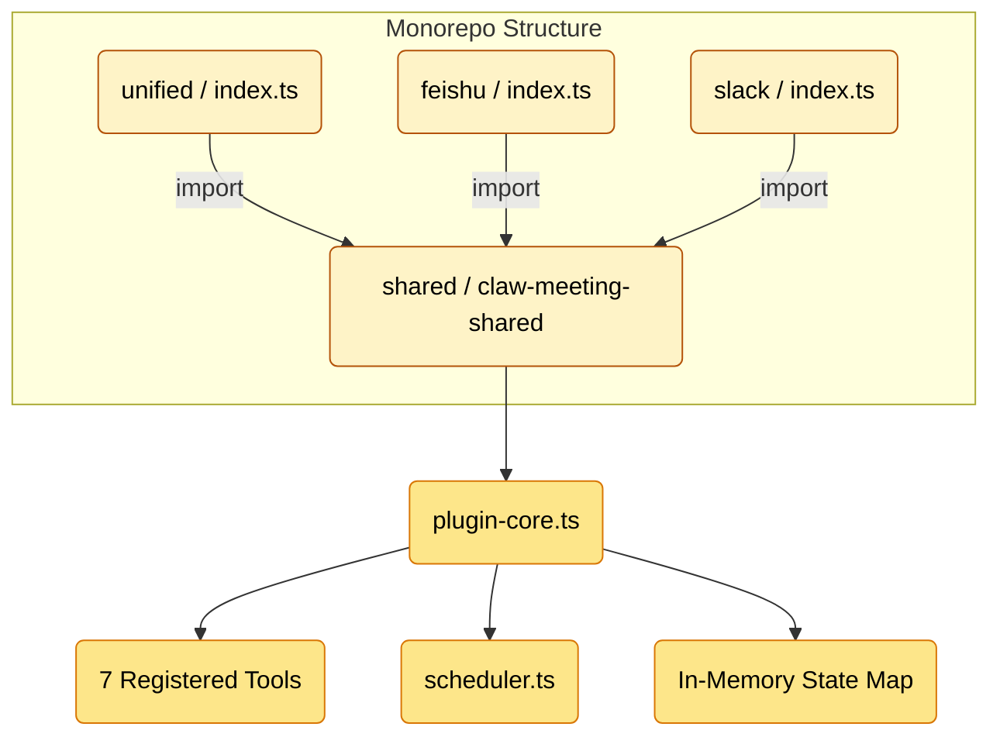

### Plugin Entry Points

| Entry | Path | Usage |
|---|---|---|
| **unified** | `unified/src/index.ts` | Multi-platform (Feishu + Slack). Production default. |
| **feishu** | `feishu/src/index.ts` | Feishu-only deployment |
| **slack** | `slack/src/index.ts` | Slack-only deployment |

All three import from `claw-meeting-shared` and call `createMeetingPlugin()` with platform-specific config.

### Plugin Platform Routing

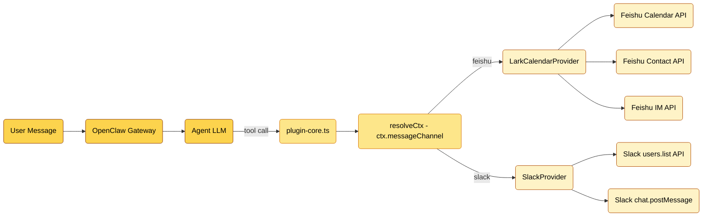

### Plugin Meeting Flow

Step-by-step data flow through the plugin:

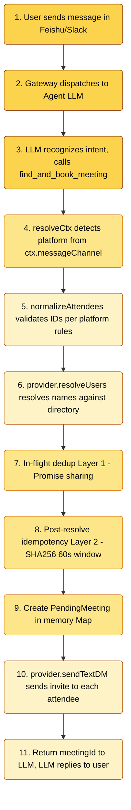

### Plugin Attendee Response Flow

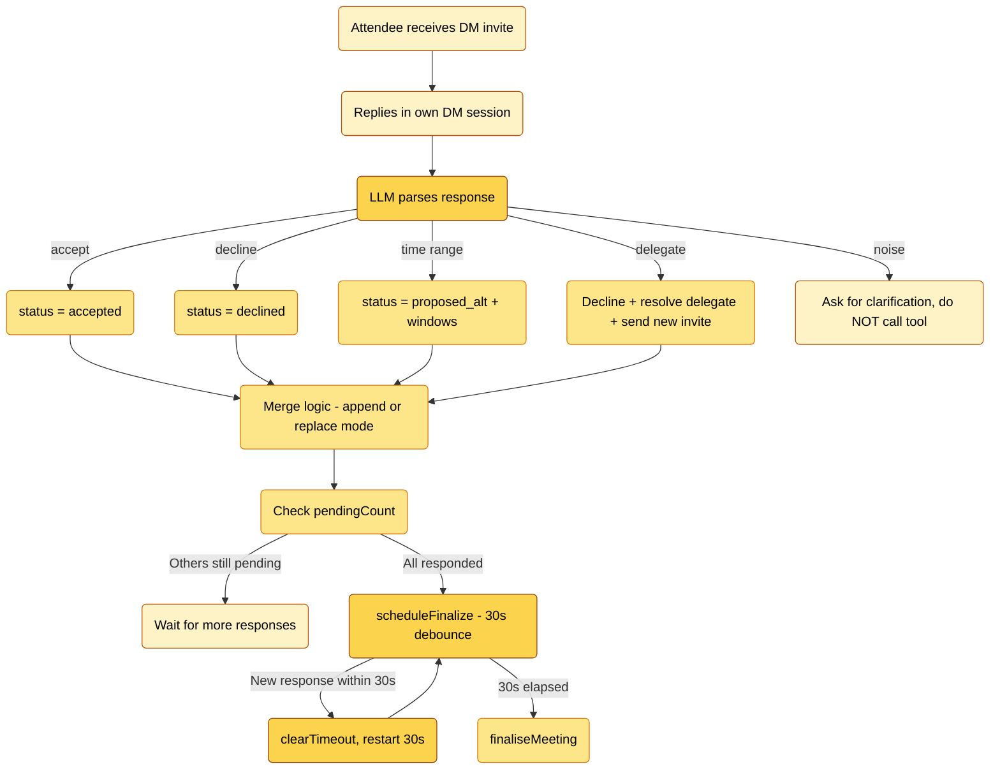

### Plugin Finalization State Machine

```mermaid
stateDiagram-v2
    [*] --> Collecting: find_and_book_meeting creates PendingMeeting

    Collecting --> FastPath: All attendees accepted
    Collecting --> Scoring: Some proposed alternatives
    Collecting --> Failed: All declined
    Collecting --> Expired: 12h timeout (ticker)

    FastPath --> Committed: commitMeeting creates calendar event

    Scoring --> Confirming: Initiator calls confirm_meeting_slot
    note right of Scoring: scoreSlots ranks slots by attendee coverage

    Confirming --> Committed: Attendees confirm chosen slot
    Confirming --> Failed: Slot rejected

    Committed --> [*]: DM initiator with event link
    Failed --> [*]: DM initiator with failure reason
    Expired --> [*]: DM initiator auto-cancelled

    style [*] fill:#fcd34d,stroke:#92400e,color:#000
    style Collecting fill:#fde68a,stroke:#d97706,color:#000
    style FastPath fill:#fef3c7,stroke:#b45309,color:#000
    style Scoring fill:#fef3c7,stroke:#b45309,color:#000
    style Confirming fill:#fef3c7,stroke:#b45309,color:#000
    style Committed fill:#fde68a,stroke:#d97706,color:#000
    style Failed fill:#fde68a,stroke:#d97706,color:#000
    style Expired fill:#fde68a,stroke:#d97706,color:#000
```

### Plugin Background Ticker

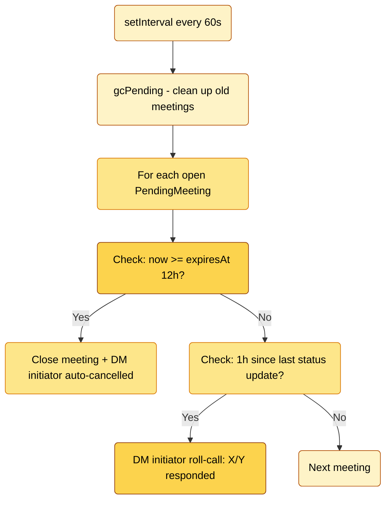

### Plugin State Management

All state is in-memory. Gateway restart = all pending meetings lost.

```
pendingMeetings: Map<string, PendingMeeting>     ← meetings in progress
recentFindAndBook: Map<string, {meetingId, at}>   ← idempotency (60s window)
inflightFindAndBook: Map<string, Promise>         ← concurrent dedup
```

### Plugin File Structure

```
plugin_version/
├── shared/                          claw-meeting-shared package
│   ├── src/
│   │   ├── index.ts                 Package exports
│   │   ├── plugin-core.ts           Core logic: 7 tools, routing, state machine (1131 lines)
│   │   ├── scheduler.ts             Slot finding, scoring, intersection (257 lines)
│   │   ├── load-env.ts              .env loader
│   │   └── providers/types.ts       CalendarProvider interface
│   ├── package.json                 claw-meeting-shared
│   └── tsconfig.json
├── unified/                         Multi-platform entry (Feishu + Slack)
│   ├── src/
│   │   ├── index.ts                 Platform config + createMeetingPlugin()
│   │   └── providers/
│   │       ├── lark.ts              Feishu backend (1020 lines)
│   │       └── slack.ts             Slack backend (346 lines)
│   ├── package.json                 Depends on claw-meeting-shared
│   └── tsconfig.json
├── feishu/                          Feishu-only entry
│   └── src/
│       ├── index.ts                 Single-platform config
│       └── providers/lark.ts
└── slack/                           Slack-only entry
    └── src/
        ├── index.ts                 Single-platform config
        └── providers/slack.ts
```

### Plugin Quick Start

```bash
cd plugin_version/shared && npm install && npm run build
cd ../unified && npm install && npm run build
openclaw plugins install -l .
openclaw gateway --force
```

---

# Part 2: Skill Version (v2.0)

## Skill Architecture

The skill version is a self-contained reimplementation. No monorepo, no external package dependency. All code in one directory. Clone, build, run.

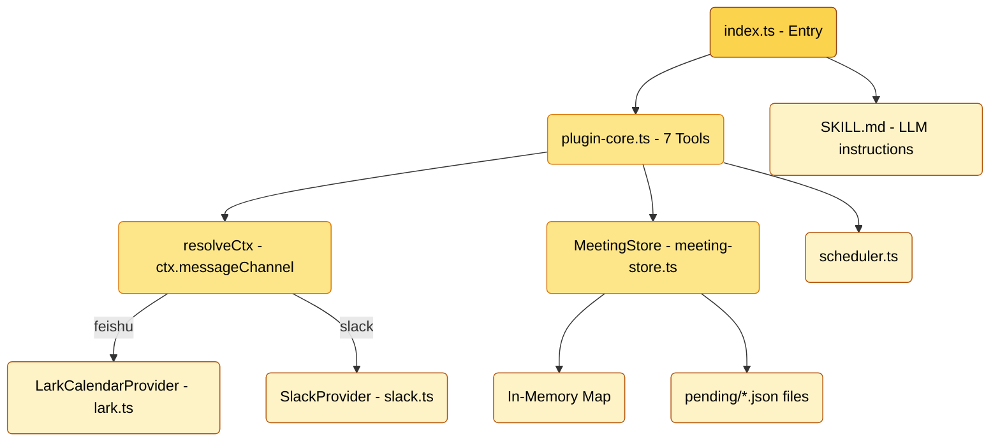

### What Changed from Plugin

| Aspect | Plugin (v1.0) | Skill (v2.0) |
|---|---|---|
| Code structure | Monorepo (shared + unified + feishu + slack) | Single directory, self-contained |
| Module system | CommonJS | ESM (Node16) |
| External deps | `claw-meeting-shared` package | None (all local imports with `.js` suffix) |
| State layer | In-memory Map only | MeetingStore: Map + file persistence |
| `__dirname` | Native CJS global | `fileURLToPath(import.meta.url)` |
| Export | `module.exports = plugin` | `export default plugin; export { plugin }` |
| SKILL.md | None | Included for `openclaw skills add` |

### Skill Platform Routing

Identical to Plugin. `resolveCtx()` reads `ctx.messageChannel` and routes to the correct provider:

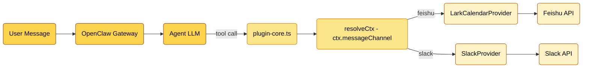

### Skill Meeting Flow

Same business logic as Plugin, with persistence added:

```mermaid
graph TD
    A(1. User sends message) --> B(2. LLM calls find_and_book_meeting)
    B --> C(3. resolveCtx detects platform)
    C --> D(4. Resolve attendee names via provider)
    D --> E(5. Dedup check Layer 1 + Layer 2)
    E --> F(6. Create PendingMeeting)
    F --> G(7. store.save - persist to pending/mtg_xxx.json)
    G --> H(8. Send DM invites via provider)
    H --> I(9. Return to LLM)

    I --> J(10. Attendees reply in DM)
    J --> K(11. record_attendee_response + store.save)
    K --> L(12. All responded - scheduleFinalize 30s)
    L --> M(13. finaliseMeeting - state machine)
    M --> N(14. commitMeeting + store.save)
    N --> O(15. Calendar event created)

style G fill:#fde68a,stroke:#d97706,color:#000
    style K fill:#fde68a,stroke:#d97706,color:#000
    style N fill:#fde68a,stroke:#d97706,color:#000
    style A fill:#fcd34d,stroke:#92400e,color:#000
    style B fill:#fcd34d,stroke:#92400e,color:#000
    style C fill:#fcd34d,stroke:#92400e,color:#000
    style D fill:#fef3c7,stroke:#b45309,color:#000
    style E fill:#fef3c7,stroke:#b45309,color:#000
    style F fill:#fef3c7,stroke:#b45309,color:#000
    style H fill:#fef3c7,stroke:#b45309,color:#000
    style I fill:#fde68a,stroke:#d97706,color:#000
    style J fill:#fcd34d,stroke:#92400e,color:#000
    style L fill:#fde68a,stroke:#d97706,color:#000
    style M fill:#fde68a,stroke:#d97706,color:#000
    style O fill:#fef3c7,stroke:#b45309,color:#000
```

### Skill State Management

Hybrid: in-memory for speed, file for durability.

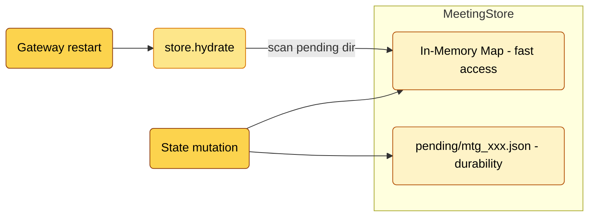

### Skill Finalization State Machine

Identical to Plugin:

```mermaid
stateDiagram-v2
    [*] --> Collecting: find_and_book_meeting

    Collecting --> FastPath: All accepted
    Collecting --> Scoring: Some proposed_alt
    Collecting --> Failed: All declined
    Collecting --> Expired: 12h timeout

    FastPath --> Committed: commitMeeting + store.save

    Scoring --> Confirming: confirm_meeting_slot
    note right of Scoring: scoreSlots ranks by coverage + store.save

    Confirming --> Committed: All confirm + store.save

    Committed --> [*]: Calendar event created
    Failed --> [*]: Closed + store.save
    Expired --> [*]: Auto-cancelled + store.save

    style [*] fill:#fcd34d,stroke:#92400e,color:#000
    style Collecting fill:#fde68a,stroke:#d97706,color:#000
    style FastPath fill:#fef3c7,stroke:#b45309,color:#000
    style Scoring fill:#fef3c7,stroke:#b45309,color:#000
    style Confirming fill:#fef3c7,stroke:#b45309,color:#000
    style Committed fill:#fde68a,stroke:#d97706,color:#000
    style Failed fill:#fde68a,stroke:#d97706,color:#000
    style Expired fill:#fde68a,stroke:#d97706,color:#000
```

### Skill Background Ticker

Identical to Plugin, with `store.save()` on every state change:

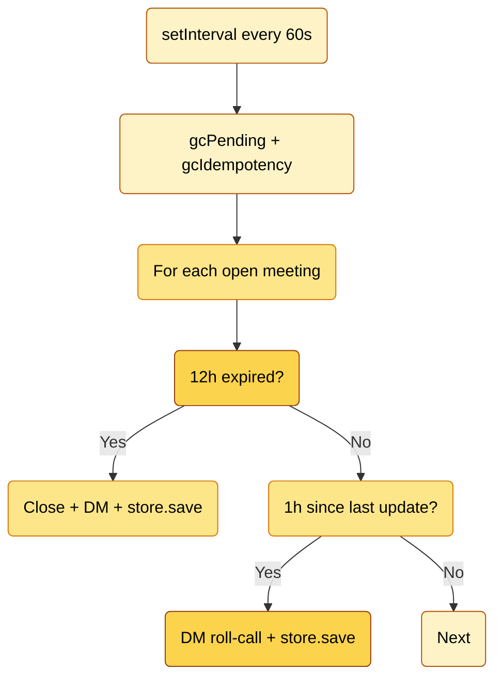

### Skill File Structure

```
skill_version/
├── SKILL.md                         LLM behavioral instructions
├── src/
│   ├── index.ts                     Entry point - platform config (70 lines)
│   ├── plugin-core.ts               Core logic: 7 tools, routing, state machine (1176 lines)
│   ├── meeting-store.ts             MeetingStore: Map + file persistence (222 lines)
│   ├── scheduler.ts                 Slot finding, scoring, intersection (243 lines)
│   ├── load-env.ts                  .env loader (ESM compatible)
│   └── providers/
│       ├── types.ts                 CalendarProvider interface
│       ├── lark.ts                  Feishu backend (770 lines)
│       └── slack.ts                 Slack backend (345 lines)
├── pending/                         Runtime state (JSON files, gitignored)
├── openclaw.plugin.json             Plugin + Skill manifest
├── package.json                     ESM, @slack/web-api + googleapis + luxon
└── .gitignore                       Excludes .env, node_modules, dist, pending
```

### Skill Quick Start

```bash
cd skill_version
npm install
npm run build
openclaw plugins install -l .
openclaw gateway --force
```

---

# Part 3: Version Comparison (Diff)

## 7 Tools (Shared by Both Versions)

| # | Tool | Description |
|---|------|-------------|
| 1 | `find_and_book_meeting` | Create pending meeting, resolve attendee names, send DM invites |
| 2 | `list_my_pending_invitations` | List pending invitations for the current sender |
| 3 | `record_attendee_response` | Record accept / decline / propose alternative / delegate |
| 4 | `confirm_meeting_slot` | Initiator picks a time slot after scoring results |
| 5 | `list_upcoming_meetings` | List upcoming calendar events |
| 6 | `cancel_meeting` | Cancel a meeting by event ID |
| 7 | `debug_list_directory` | List tenant directory users (diagnostic) |

## Configuration (Shared by Both Versions)

```env
# Feishu / Lark
LARK_APP_ID=cli_xxxxx
LARK_APP_SECRET=xxxxx
LARK_CALENDAR_ID=xxxxx@group.calendar.feishu.cn

# Slack
SLACK_BOT_TOKEN=xoxb-xxxxx

# Schedule defaults
DEFAULT_TIMEZONE=Asia/Shanghai
WORK_HOURS=09:00-18:00
LUNCH_BREAK=12:00-13:30
BUFFER_MINUTES=15
```

## Full Comparison Table

| Dimension | Plugin (v1.0) | Skill (v2.0) |
|---|---|---|
| Architecture | Monorepo (shared + unified + feishu + slack) | Self-contained (single directory) |
| Module System | CommonJS | ESM (Node16) |
| Dependencies | `claw-meeting-shared` package | None (all local) |
| Portability | Requires monorepo + package link | Clone and run |
| Tools | 7 | 7 (identical) |
| Platforms | Feishu + Slack | Feishu + Slack (identical) |
| Platform Routing | `ctx.messageChannel` via `resolveCtx()` | Identical |
| State Storage | In-memory Map | In-memory Map + file persistence |
| Restart Recovery | All state lost | State preserved (`pending/*.json`) |
| Negotiation | 3-phase (collecting/scoring/confirming) | Identical |
| Slot Scoring | `scoreSlots()` ranks by coverage | Identical |
| Delegation | Yes ("让XXX替我去") | Identical |
| 30s Debounce | `setTimeout` / `clearTimeout` | Identical |
| 12h Timeout | `setInterval` ticker | Identical |
| Two-layer Dedup | In-flight Promise + SHA256 idempotency | Identical |
| Name Resolution | Two-step (provider candidates + LLM picks) | Identical |
| Installation | `openclaw plugins install` | `openclaw skills add` |
| SKILL.md | No | Yes |

## What Changed vs What Stayed

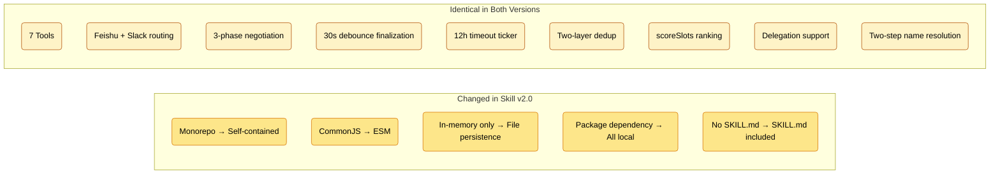

---

## License

Private - All rights reserved.
