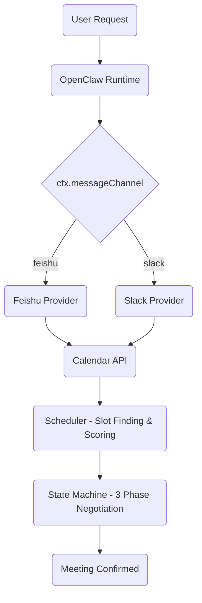
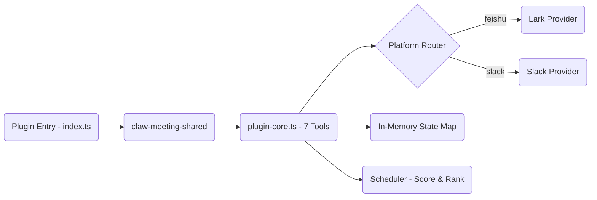
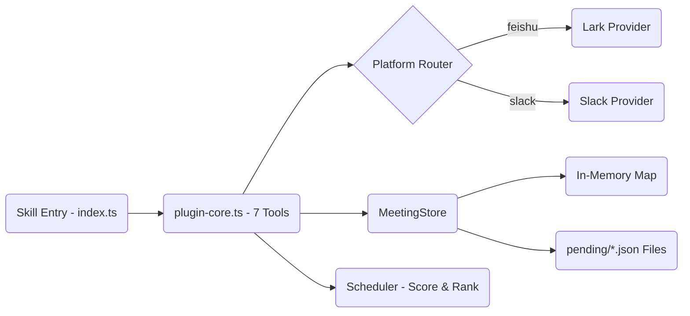
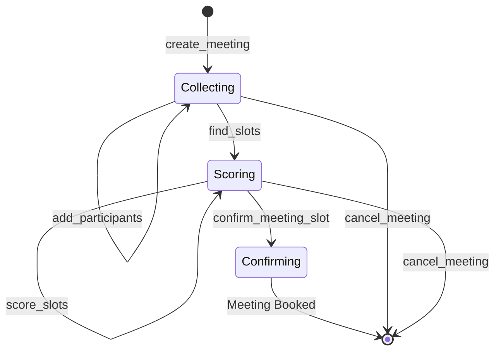
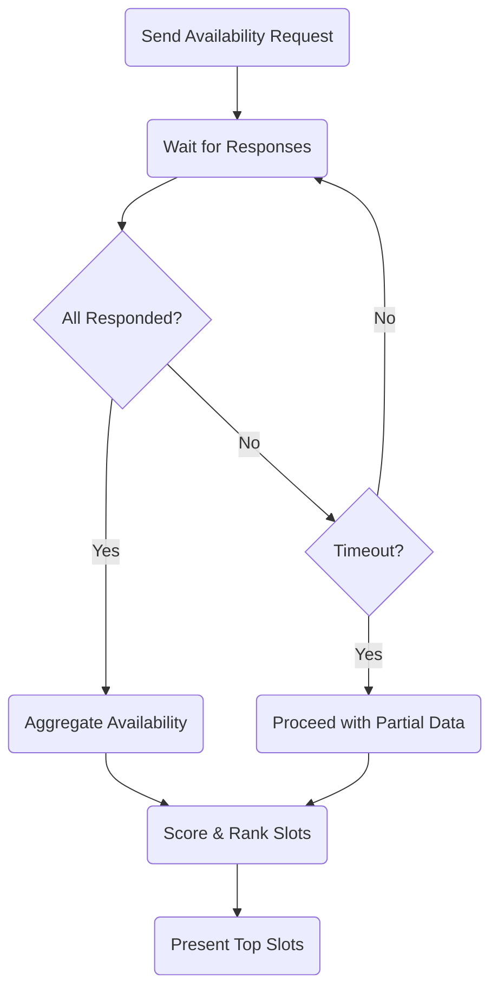
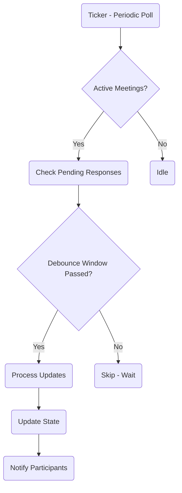

# ClawMeeting - Multi-Platform Meeting Scheduler


**English** | [简体中文](./README.zh-CN.md) | [繁體中文](./README.zh-TW.md) | [日本語](./README.ja.md) | [한국어](./README.ko.md)

---

## Overview

ClawMeeting is an AI-powered meeting scheduling system for OpenClaw. It coordinates multi-participant meetings across Feishu and Slack through a 3-phase negotiation protocol with intelligent time-slot scoring, automatic delegation, and debounce-controlled background polling.

Two production versions are available: **Plugin (v1.0)** using CommonJS with a shared library, and **Skill (v2.0)** using ESM with self-contained code and file-backed persistence.

---

## Architecture



---

## Plugin Version (v1.0)

The plugin version is the original production-tested implementation. It uses CommonJS modules and depends on the `claw-meeting-shared` npm package for core scheduling logic. State is held in-memory only and is lost on restart.

### Plugin Data Flow



---

## Skill Version (v2.0)

The skill version is a reimplementation using ESM modules. All code is self-contained with no external shared library dependency. State is persisted to `pending/*.json` files, surviving restarts. Includes a `SKILL.md` for user-friendly installation.

### Skill Data Flow



---

## Meeting Lifecycle



---

## Attendee Response Flow



---

## Background Processes



---

## Tools

| # | Tool | Description |
|---|------|-------------|
| 1 | `create_meeting` | Initialize a new meeting negotiation session |
| 2 | `add_participants` | Add attendees to an existing meeting |
| 3 | `find_slots` | Query calendar availability and find open slots |
| 4 | `score_slots` | Rank candidate slots by participant preference overlap |
| 5 | `confirm_meeting_slot` | Lock in the chosen time slot and send invites |
| 6 | `cancel_meeting` | Abort a meeting negotiation and clean up state |
| 7 | `get_meeting_status` | Retrieve current state and progress of a meeting |

---

## File Structure

```
plugin_version/
├── src/
│   ├── index.ts              Entry point (platform config)
│   ├── plugin-core.ts        Core logic (7 tools, routing, state machine)
│   ├── scheduler.ts          Slot finding + scoring
│   ├── load-env.ts           .env loader
│   └── providers/
│       ├── types.ts           CalendarProvider interface
│       ├── lark.ts            Feishu backend
│       └── slack.ts           Slack backend

skill_version/
├── SKILL.md                   LLM instructions
├── src/
│   ├── index.ts              Entry point (platform config)
│   ├── plugin-core.ts        Core logic (7 tools, routing, state machine)
│   ├── meeting-store.ts      Persistent state layer
│   ├── scheduler.ts          Slot finding + scoring
│   ├── load-env.ts           .env loader (ESM)
│   └── providers/
│       ├── types.ts           CalendarProvider interface
│       ├── lark.ts            Feishu backend
│       └── slack.ts           Slack backend
├── pending/                   Runtime meeting state
```

---

## Quick Start

### Plugin Version (v1.0)

```bash
cd plugin_version
npm install
npm run build
openclaw plugins install ./
```

### Skill Version (v2.0)

```bash
cd skill_version
npm install
npm run build
openclaw skills add ./
```

---

## Configuration

Both versions require platform credentials via environment variables:

```env
# Feishu / Lark
LARK_APP_ID=cli_xxxxx
LARK_APP_SECRET=xxxxx

# Slack
SLACK_BOT_TOKEN=xoxb-xxxxx
SLACK_SIGNING_SECRET=xxxxx
```

Place a `.env` file in the respective version directory, or set variables in your shell environment.

---

## Version Comparison

| Dimension | Plugin (v1.0) | Skill (v2.0) |
|---|---|---|
| Module System | CommonJS | ESM (Node16) |
| Dependencies | claw-meeting-shared package | Self-contained |
| Tools | 7 | 7 |
| Platforms | Feishu + Slack | Feishu + Slack |
| Platform Routing | ctx.messageChannel | ctx.messageChannel |
| State Storage | In-memory Map | In-memory + file persistence |
| Restart Recovery | State lost | State preserved |
| Negotiation | 3-phase | 3-phase |
| Scoring | Yes | Yes |
| Delegation | Yes | Yes |
| Installation | `openclaw plugins install` | `openclaw skills add` |
| SKILL.md | No | Yes |

---

## License

Private - All rights reserved.
