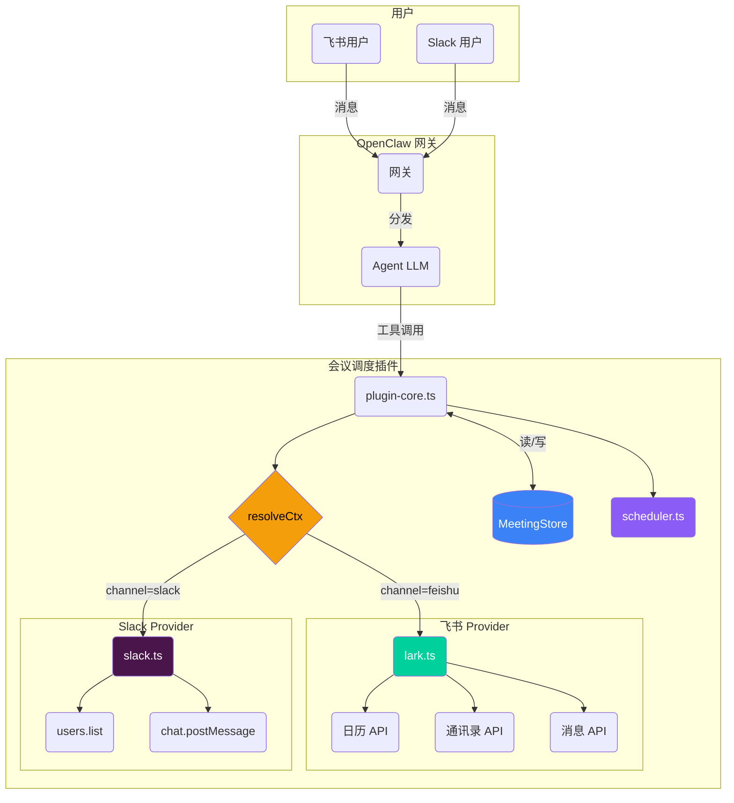
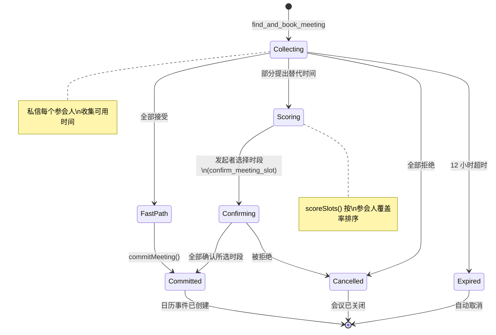
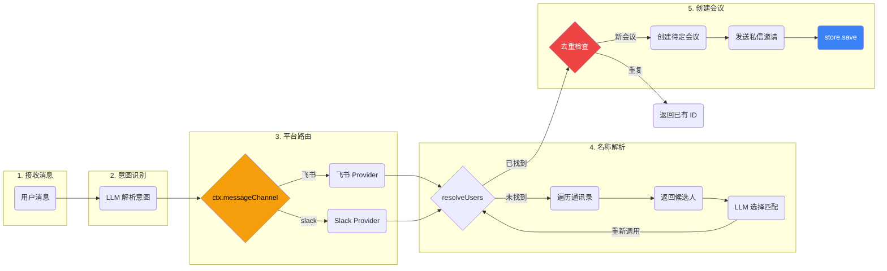
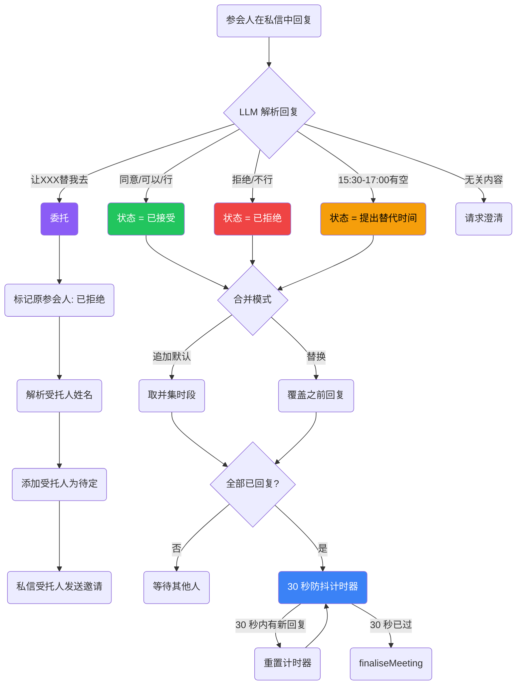
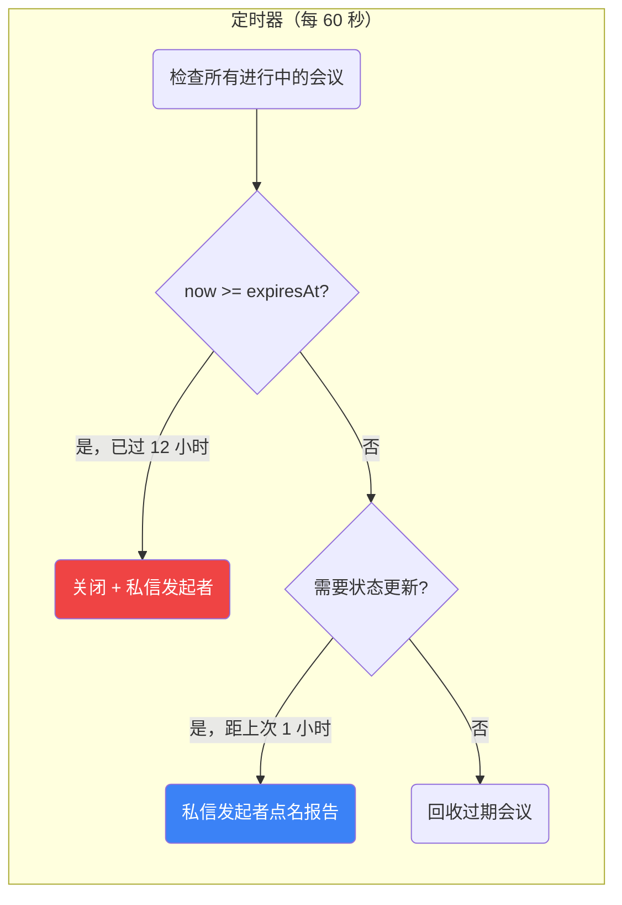

[English](./README.md) | **中文**

<div align="center">

# OpenClaw 会议调度器

**OpenClaw 多平台 AI 会议调度插件**

在飞书和 Slack 中通过自然语言安排会议。
插件自动按平台路由，解析参会人姓名，通过私信收集可用时间，智能评分排序时段，自动创建日历事件。


</div>

---

## 概述

本仓库包含两个版本的会议调度器：

| | `plugin_version/` | `skill_version/` |
|---|---|---|
| **架构** | OpenClaw 插件 (CJS) | 技能封装插件 (ESM) |
| **工具数** | 6 | 7 (+时段确认) |
| **平台** | 仅飞书 | 飞书 + Slack |
| **状态** | 纯内存（重启丢失） | 文件持久化（重启不丢） |
| **协商** | 简单接受/拒绝 | 三阶段打分 + 确认 |
| **安装** | `openclaw plugins install` | `openclaw skills add` |

## 架构



## 会议生命周期



## 请求处理流水线



## 参会人回复流程



## 后台进程



## 安全机制

```mermaid
flowchart TD
    subgraph "并发去重（第 1 层）"
        L1(60 个并行工具调用)
        L1P(inflightFindAndBook Map)
        L1R(共享单个 Promise)
        L1 --> L1P --> L1R
    end

    subgraph "幂等性（第 2 层）"
        L2(顺序重试)
        L2H(SHA256 指纹)
        L2W(60 秒窗口检查)
        L2 --> L2H --> L2W
    end

    subgraph "防抖"
        DB1(收到最后一条回复)
        DB2(setTimeout 30 秒)
        DB3(有新回复?)
        DB4(clearTimeout + 重启)
        DB5(finaliseMeeting)
        DB1 --> DB2 --> DB3
        DB3 -->|是| DB4 --> DB2
        DB3 -->|否，30 秒已过| DB5
    end

    subgraph "持久化"
        PS1(状态变更)
        PS2(store.save 写入 JSON)
        PS3(网关重启)
        PS4(store.hydrate 从磁盘恢复)
        PS1 --> PS2
        PS3 --> PS4
    end

    style L1R fill:#22c55e,color:#fff
    style L2W fill:#22c55e,color:#fff
    style DB5 fill:#3b82f6,color:#fff
    style PS4 fill:#3b82f6,color:#fff
```



## 文件结构

```
Meeting_new/
├── docs/
│   ├── flow-diagram.md              Mermaid 时序图
│   ├── diff.md                      插件 vs 技能 6 场景分析
│   └── plugin-vs-skill.md           架构对比
│
├── plugin_version/                   原始插件版本 (v1.0)
│   ├── src/
│   │   ├── index.ts                  1908 行，6 个工具，单文件
│   │   ├── scheduler.ts             时段算法
│   │   └── providers/
│   │       ├── lark.ts              飞书后端（1020 行）
│   │       ├── google.ts            Google 日历后端
│   │       └── mock.ts             测试模拟
│   └── openclaw.plugin.json
│
└── skill_version/                    技能封装插件 (v2.0)
    ├── SKILL.md                      LLM 指令
    ├── src/
    │   ├── index.ts                  入口（平台配置）
    │   ├── plugin-core.ts            1176 行，7 个工具，多平台
    │   ├── meeting-store.ts          持久化状态层
    │   ├── scheduler.ts             时段查找 + 打分
    │   └── providers/
    │       ├── lark.ts              飞书（770 行）
    │       └── slack.ts             Slack（345 行）
    ├── pending/                      运行时会议状态
    └── openclaw.plugin.json         插件 + 技能清单
```

## 7 个工具

| 工具 | 描述 | 触发短语 |
|---|---|---|
| `find_and_book_meeting` | 创建待定会议，解析姓名，发送私信邀请 | 约会议 / 帮我约 / 安排会议 / 开个会 |
| `list_my_pending_invitations` | 列出发送者的待定邀请 | （回复邀请前使用） |
| `record_attendee_response` | 记录接受/拒绝/替代时间，含合并逻辑 | 同意 / 拒绝 / 我只有...有空 |
| `confirm_meeting_slot` | 发起者在打分后选择时段 | （收到打分报告后使用） |
| `list_upcoming_meetings` | 列出即将到来的日历事件 | 我有什么会 / 明天有什么会 |
| `cancel_meeting` | 按事件 ID 取消会议 | 取消会议 |
| `debug_list_directory` | 列出租户通讯录用户 | 显示通讯录 |

## 快速开始

```bash
cd skill_version
npm install
npm run build
openclaw plugins install -l .
openclaw gateway --force
```

## 配置 (.env)

```env
# 飞书
LARK_APP_ID=cli_xxx
LARK_APP_SECRET=xxx
LARK_CALENDAR_ID=xxx@group.calendar.feishu.cn

# Slack
SLACK_BOT_TOKEN=xoxb-xxx

# 调度默认值
DEFAULT_TIMEZONE=Asia/Shanghai
WORK_HOURS=09:00-18:00
LUNCH_BREAK=12:00-13:30
BUFFER_MINUTES=15
```

## 使用示例

```
"帮我和博泽约个会，明天下午，30分钟"
"我只有15:30-17:00有空"
"让子岩替我去"
"同意"
"我明天有什么会？"
"取消上午的设计评审"
"显示通讯录"
```

## 许可证

私有
