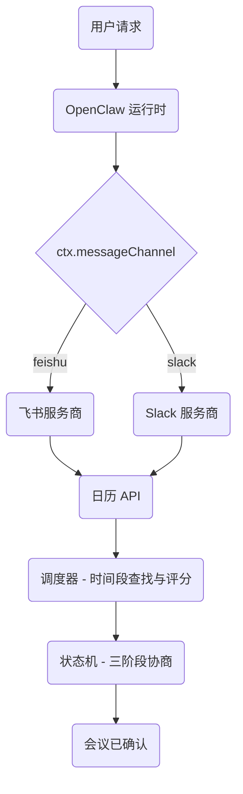
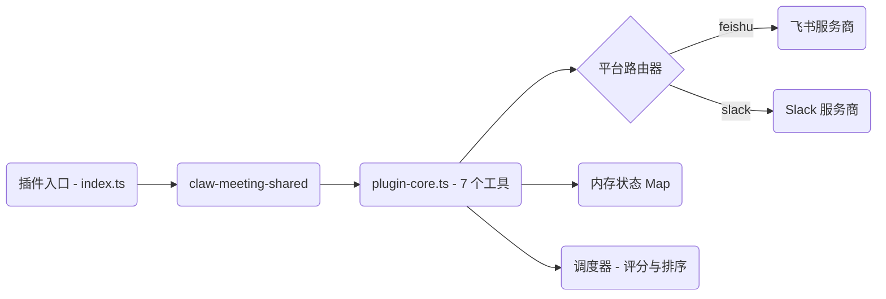
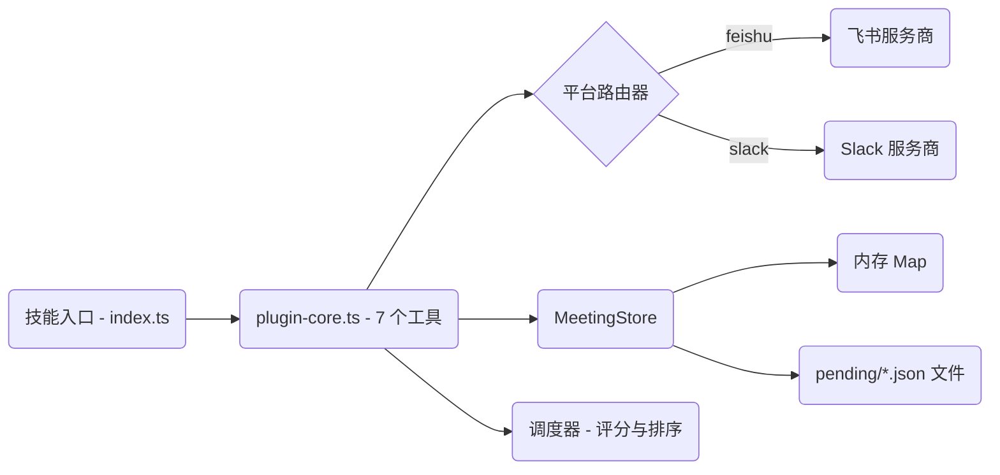
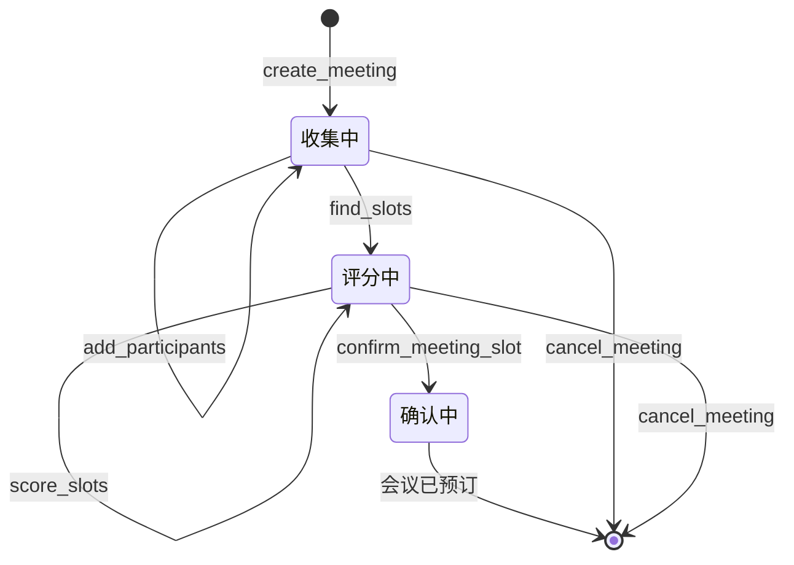
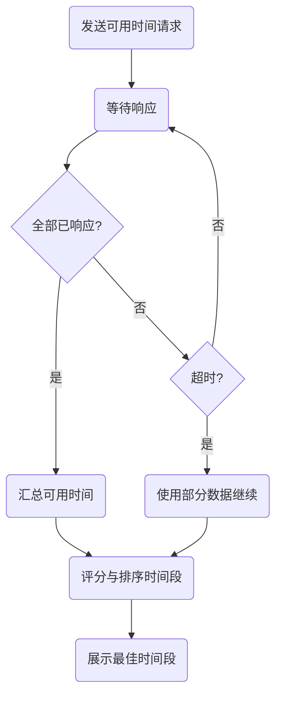
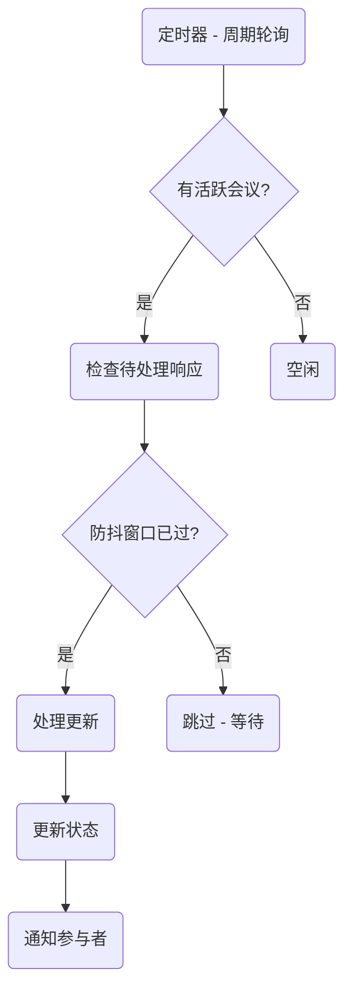

# ClawMeeting - 多平台会议调度器


[English](./README.md) | **简体中文** | [繁體中文](./README.zh-TW.md) | [日本語](./README.ja.md) | [한국어](./README.ko.md)

---

## 概述

ClawMeeting 是基于 OpenClaw 的 AI 驱动会议调度系统。它通过三阶段协商协议在飞书和 Slack 之间协调多参与者会议，具备智能时间段评分、自动委派和防抖控制的后台轮询功能。

提供两个生产版本：**插件版 (v1.0)** 使用 CommonJS 模块和共享库，**技能版 (v2.0)** 使用 ESM 模块、自包含代码和文件持久化。

---

## 系统架构



---

## 插件版 (v1.0)

插件版是经过生产验证的原始实现。它使用 CommonJS 模块系统，依赖 `claw-meeting-shared` npm 包提供核心调度逻辑。状态仅保存在内存中，重启后丢失。

### 插件版数据流



---

## 技能版 (v2.0)

技能版是使用 ESM 模块的重新实现。所有代码自包含，无外部共享库依赖。状态持久化到 `pending/*.json` 文件中，重启后仍可恢复。包含 `SKILL.md` 以便用户友好安装。

### 技能版数据流



---

## 会议生命周期



---

## 参会者响应流程



---

## 后台进程



---

## 工具列表

| # | 工具 | 描述 |
|---|------|------|
| 1 | `create_meeting` | 初始化新的会议协商会话 |
| 2 | `add_participants` | 向现有会议添加参会者 |
| 3 | `find_slots` | 查询日历可用性并查找空闲时间段 |
| 4 | `score_slots` | 按参与者偏好重叠度排序候选时间段 |
| 5 | `confirm_meeting_slot` | 锁定选定时间段并发送邀请 |
| 6 | `cancel_meeting` | 中止会议协商并清理状态 |
| 7 | `get_meeting_status` | 获取会议的当前状态和进度 |

---

## 文件结构

```
plugin_version/
├── src/
│   ├── index.ts              入口文件 (平台配置)
│   ├── plugin-core.ts        核心逻辑 (7 个工具, 路由, 状态机)
│   ├── scheduler.ts          时间段查找 + 评分
│   ├── load-env.ts           .env 加载器
│   └── providers/
│       ├── types.ts           CalendarProvider 接口
│       ├── lark.ts            飞书后端
│       └── slack.ts           Slack 后端

skill_version/
├── SKILL.md                   LLM 指令文件
├── src/
│   ├── index.ts              入口文件 (平台配置)
│   ├── plugin-core.ts        核心逻辑 (7 个工具, 路由, 状态机)
│   ├── meeting-store.ts      持久化状态层
│   ├── scheduler.ts          时间段查找 + 评分
│   ├── load-env.ts           .env 加载器 (ESM)
│   └── providers/
│       ├── types.ts           CalendarProvider 接口
│       ├── lark.ts            飞书后端
│       └── slack.ts           Slack 后端
├── pending/                   运行时会议状态
```

---

## 快速开始

### 插件版 (v1.0)

```bash
cd plugin_version
npm install
npm run build
openclaw plugins install ./
```

### 技能版 (v2.0)

```bash
cd skill_version
npm install
npm run build
openclaw skills add ./
```

---

## 配置

两个版本都需要通过环境变量提供平台凭据：

```env
# 飞书 / Lark
LARK_APP_ID=cli_xxxxx
LARK_APP_SECRET=xxxxx

# Slack
SLACK_BOT_TOKEN=xoxb-xxxxx
SLACK_SIGNING_SECRET=xxxxx
```

将 `.env` 文件放置在对应版本目录中，或在 shell 环境中设置变量。

---

## 版本对比

| 维度 | 插件版 (v1.0) | 技能版 (v2.0) |
|---|---|---|
| 模块系统 | CommonJS | ESM (Node16) |
| 依赖方式 | claw-meeting-shared 包 | 自包含 |
| 工具数量 | 7 | 7 |
| 平台支持 | 飞书 + Slack | 飞书 + Slack |
| 平台路由 | ctx.messageChannel | ctx.messageChannel |
| 状态存储 | 内存 Map | 内存 + 文件持久化 |
| 重启恢复 | 状态丢失 | 状态保留 |
| 协商模式 | 三阶段 | 三阶段 |
| 评分功能 | 支持 | 支持 |
| 委派功能 | 支持 | 支持 |
| 安装方式 | `openclaw plugins install` | `openclaw skills add` |
| SKILL.md | 无 | 有 |

---

## 许可证

私有 - 保留所有权利。
