# ClawMeeting - 多平台会议调度系统


[English](./README.md) | **简体中文** | [繁體中文](./README.zh-TW.md) | [日本語](./README.ja.md) | [한국어](./README.ko.md)

---

## 概述

ClawMeeting 是一个基于 AI 的 OpenClaw 会议调度系统。它通过自然语言在飞书和 Slack 之间协调多参与者会议，具备智能时间段评分、三阶段协商、自动委派和防抖控制的最终确认功能。

本仓库包含两个实现版本：
- **插件版 (v1.0)** — 最初的生产版本。CommonJS 单仓库结构，包含 `claw-meeting-shared` 包。
- **技能版 (v2.0)** — 自包含的 ESM 重新实现，支持文件持久化。

两个版本均支持**飞书 + Slack 双平台路由**、**7 个工具**以及**相同的业务逻辑**。

---

# 第一部分：插件版 (v1.0)

## 插件架构

插件采用单仓库结构。核心调度逻辑位于 `shared/` 包（`claw-meeting-shared`）中，而平台特定的提供者和入口点位于独立目录中。

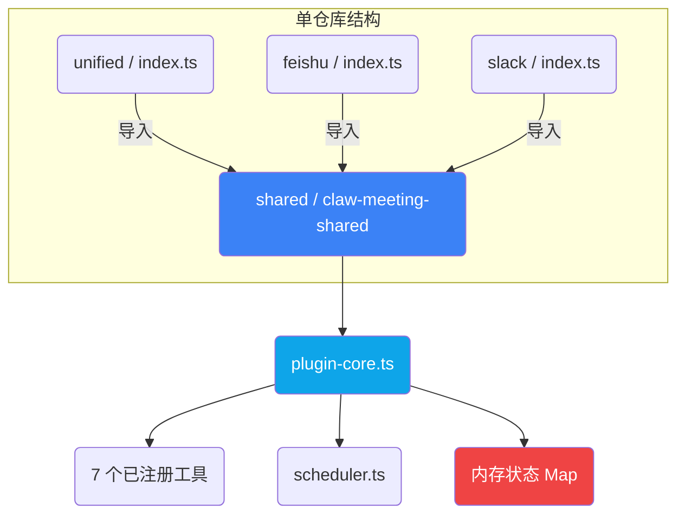

### 插件入口点

| 入口 | 路径 | 用途 |
|---|---|---|
| **unified** | `unified/src/index.ts` | 多平台（飞书 + Slack）。生产环境默认入口。 |
| **feishu** | `feishu/src/index.ts` | 仅飞书部署 |
| **slack** | `slack/src/index.ts` | 仅 Slack 部署 |

三个入口均从 `claw-meeting-shared` 导入，并使用平台特定配置调用 `createMeetingPlugin()`。

### 插件平台路由

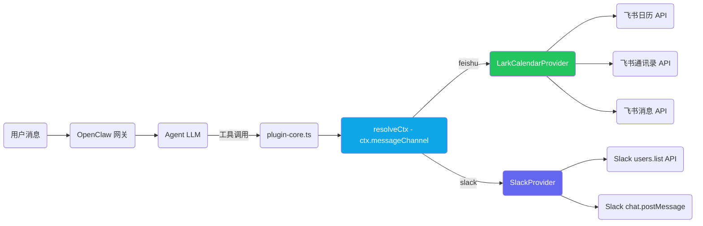

### 插件会议流程

插件中的逐步数据流：

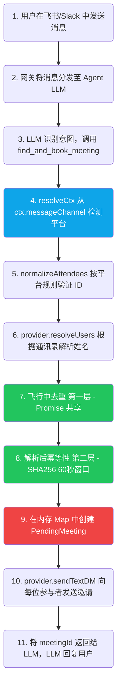

### 插件参与者响应流程

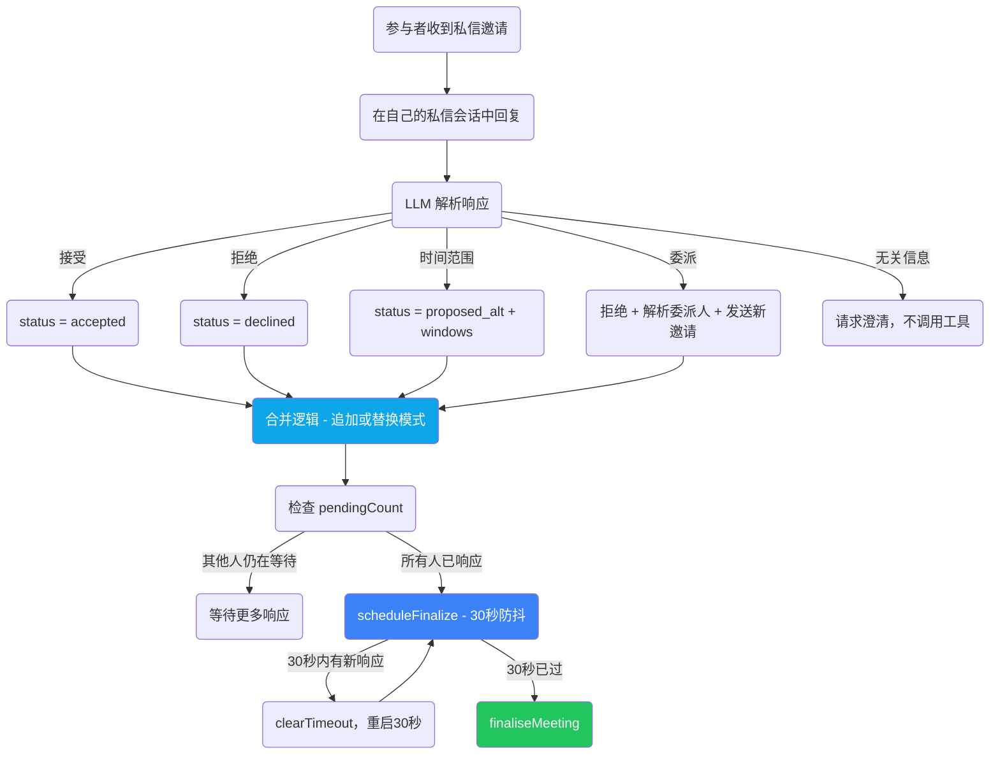

### 插件最终确认状态机

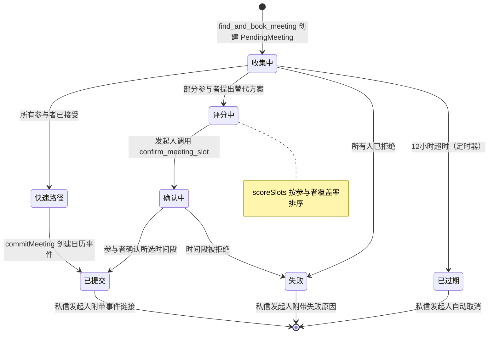

### 插件后台定时器

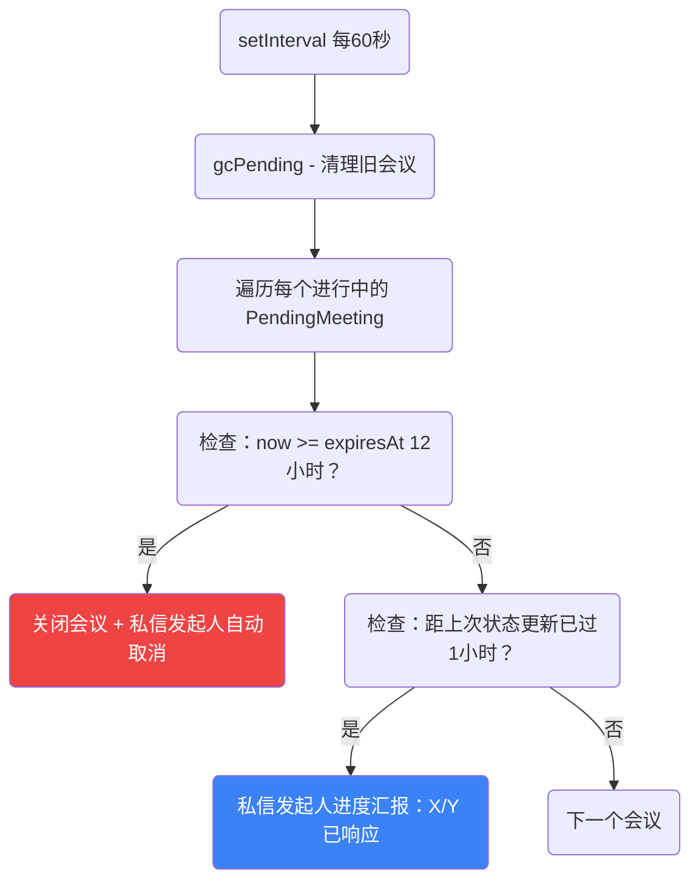

### 插件状态管理

所有状态存储在内存中。网关重启 = 所有进行中的会议丢失。

```
pendingMeetings: Map<string, PendingMeeting>     ← 进行中的会议
recentFindAndBook: Map<string, {meetingId, at}>   ← 幂等性（60秒窗口）
inflightFindAndBook: Map<string, Promise>         ← 并发去重
```

### 插件文件结构

```
plugin_version/
├── shared/                          claw-meeting-shared 包
│   ├── src/
│   │   ├── index.ts                 包导出
│   │   ├── plugin-core.ts           核心逻辑：7 个工具、路由、状态机（1131 行）
│   │   ├── scheduler.ts             时间段查找、评分、交集（257 行）
│   │   ├── load-env.ts              .env 加载器
│   │   └── providers/types.ts       CalendarProvider 接口
│   ├── package.json                 claw-meeting-shared
│   └── tsconfig.json
├── unified/                         多平台入口（飞书 + Slack）
│   ├── src/
│   │   ├── index.ts                 平台配置 + createMeetingPlugin()
│   │   └── providers/
│   │       ├── lark.ts              飞书后端（1020 行）
│   │       └── slack.ts             Slack 后端（346 行）
│   ├── package.json                 依赖 claw-meeting-shared
│   └── tsconfig.json
├── feishu/                          仅飞书入口
│   └── src/
│       ├── index.ts                 单平台配置
│       └── providers/lark.ts
└── slack/                           仅 Slack 入口
    └── src/
        ├── index.ts                 单平台配置
        └── providers/slack.ts
```

### 插件快速开始

```bash
cd plugin_version/shared && npm install && npm run build
cd ../unified && npm install && npm run build
openclaw plugins install -l .
openclaw gateway --force
```

---

# 第二部分：技能版 (v2.0)

## 技能架构

技能版是一个自包含的重新实现。无单仓库，无外部包依赖。所有代码在一个目录中。克隆、构建、运行。

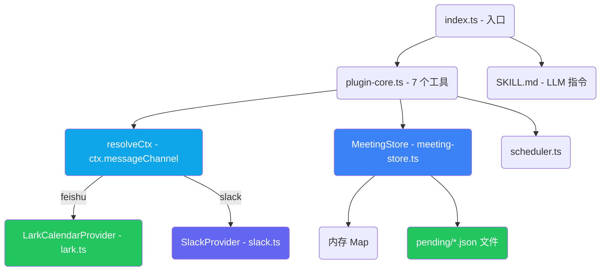

### 与插件版的变更对比

| 方面 | 插件版 (v1.0) | 技能版 (v2.0) |
|---|---|---|
| 代码结构 | 单仓库（shared + unified + feishu + slack） | 单目录，自包含 |
| 模块系统 | CommonJS | ESM (Node16) |
| 外部依赖 | `claw-meeting-shared` 包 | 无（全部本地导入，带 `.js` 后缀） |
| 状态层 | 仅内存 Map | MeetingStore：Map + 文件持久化 |
| `__dirname` | 原生 CJS 全局变量 | `fileURLToPath(import.meta.url)` |
| 导出方式 | `module.exports = plugin` | `export default plugin; export { plugin }` |
| SKILL.md | 无 | 包含，用于 `openclaw skills add` |

### 技能版平台路由

与插件版相同。`resolveCtx()` 读取 `ctx.messageChannel` 并路由到正确的提供者：

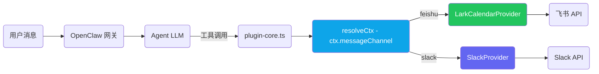

### 技能版会议流程

与插件版相同的业务逻辑，增加了持久化：

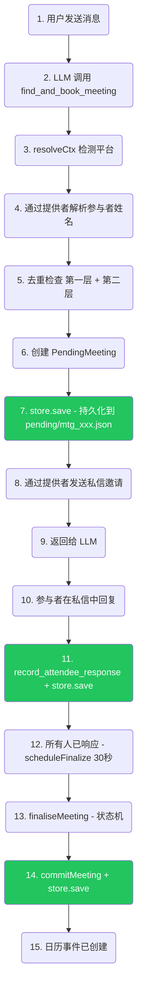

绿色节点 = `store.save()` 持久化点。如果网关在任何时刻重启，状态将从 `pending/*.json` 恢复。

### 技能版状态管理

混合模式：内存用于速度，文件用于持久性。

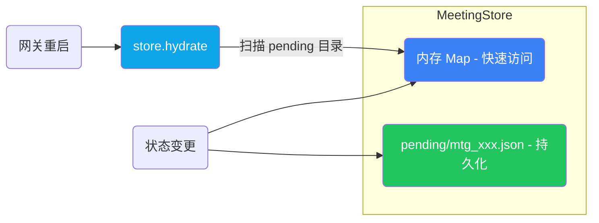

### 技能版最终确认状态机

与插件版相同：

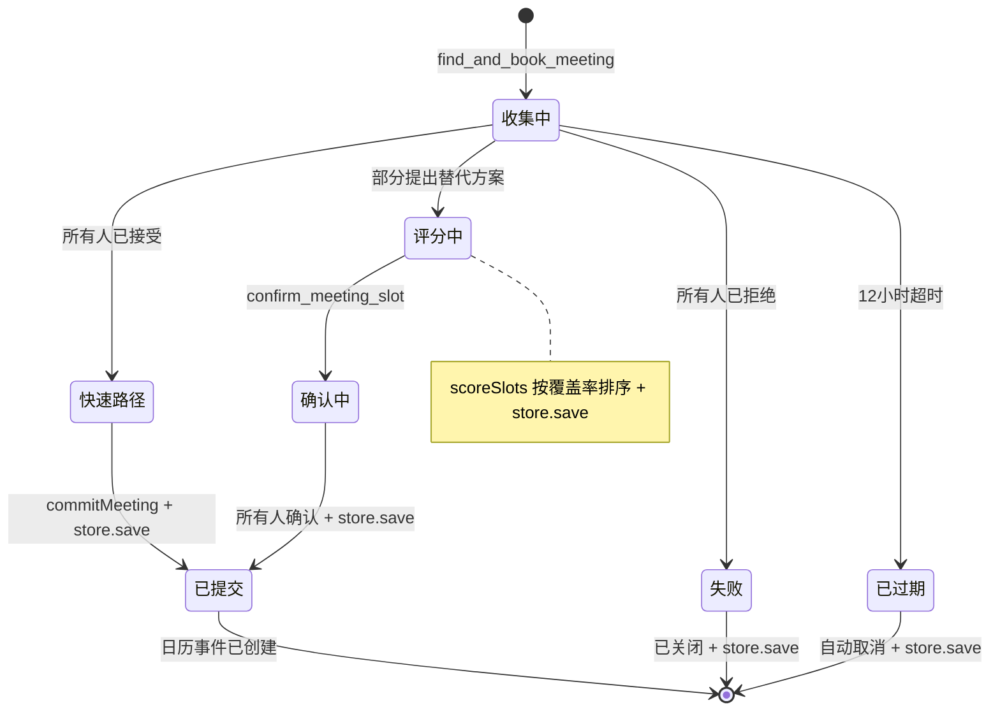

### 技能版后台定时器

与插件版相同，每次状态变更时调用 `store.save()`：

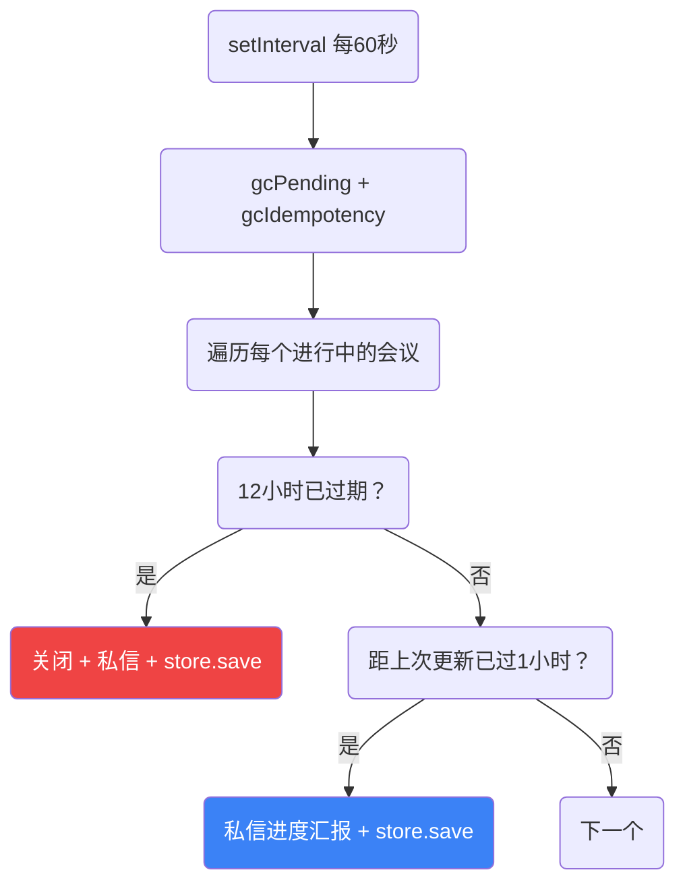

### 技能版文件结构

```
skill_version/
├── SKILL.md                         LLM 行为指令
├── src/
│   ├── index.ts                     入口点 - 平台配置（70 行）
│   ├── plugin-core.ts               核心逻辑：7 个工具、路由、状态机（1176 行）
│   ├── meeting-store.ts             MeetingStore：Map + 文件持久化（222 行）
│   ├── scheduler.ts                 时间段查找、评分、交集（243 行）
│   ├── load-env.ts                  .env 加载器（ESM 兼容）
│   └── providers/
│       ├── types.ts                 CalendarProvider 接口
│       ├── lark.ts                  飞书后端（770 行）
│       └── slack.ts                 Slack 后端（345 行）
├── pending/                         运行时状态（JSON 文件，已 gitignore）
├── openclaw.plugin.json             插件 + 技能清单
├── package.json                     ESM，@slack/web-api + googleapis + luxon
└── .gitignore                       排除 .env、node_modules、dist、pending
```

### 技能版快速开始

```bash
cd skill_version
npm install
npm run build
openclaw plugins install -l .
openclaw gateway --force
```

---

# 第三部分：版本对比（差异）

## 7 个工具（两个版本共享）

| # | 工具 | 描述 |
|---|------|-------------|
| 1 | `find_and_book_meeting` | 创建待处理会议、解析参与者姓名、发送私信邀请 |
| 2 | `list_my_pending_invitations` | 列出当前发送者的待处理邀请 |
| 3 | `record_attendee_response` | 记录接受 / 拒绝 / 提出替代方案 / 委派 |
| 4 | `confirm_meeting_slot` | 发起人在评分结果后选择时间段 |
| 5 | `list_upcoming_meetings` | 列出即将到来的日历事件 |
| 6 | `cancel_meeting` | 按事件 ID 取消会议 |
| 7 | `debug_list_directory` | 列出租户通讯录用户（诊断用） |

## 配置（两个版本共享）

```env
# 飞书 / Lark
LARK_APP_ID=cli_xxxxx
LARK_APP_SECRET=xxxxx
LARK_CALENDAR_ID=xxxxx@group.calendar.feishu.cn

# Slack
SLACK_BOT_TOKEN=xoxb-xxxxx

# 调度默认值
DEFAULT_TIMEZONE=Asia/Shanghai
WORK_HOURS=09:00-18:00
LUNCH_BREAK=12:00-13:30
BUFFER_MINUTES=15
```

## 完整对比表

| 维度 | 插件版 (v1.0) | 技能版 (v2.0) |
|---|---|---|
| 架构 | 单仓库（shared + unified + feishu + slack） | 自包含（单目录） |
| 模块系统 | CommonJS | ESM (Node16) |
| 依赖 | `claw-meeting-shared` 包 | 无（全部本地） |
| 可移植性 | 需要单仓库 + 包链接 | 克隆即可运行 |
| 工具数量 | 7 | 7（相同） |
| 平台 | 飞书 + Slack | 飞书 + Slack（相同） |
| 平台路由 | 通过 `resolveCtx()` 读取 `ctx.messageChannel` | 相同 |
| 状态存储 | 内存 Map | 内存 Map + 文件持久化 |
| 重启恢复 | 所有状态丢失 | 状态保留（`pending/*.json`） |
| 协商机制 | 三阶段（收集/评分/确认） | 相同 |
| 时间段评分 | `scoreSlots()` 按覆盖率排序 | 相同 |
| 委派 | 支持（"让XXX替我去"） | 相同 |
| 30秒防抖 | `setTimeout` / `clearTimeout` | 相同 |
| 12小时超时 | `setInterval` 定时器 | 相同 |
| 两层去重 | 飞行中 Promise + SHA256 幂等性 | 相同 |
| 姓名解析 | 两步（提供者候选 + LLM 选择） | 相同 |
| 安装方式 | `openclaw plugins install` | `openclaw skills add` |
| SKILL.md | 无 | 有 |

## 变更与未变更

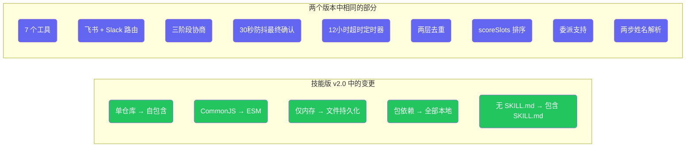

---

## 许可证

私有 - 保留所有权利。
