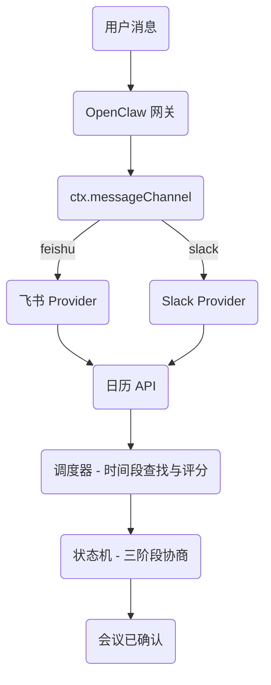
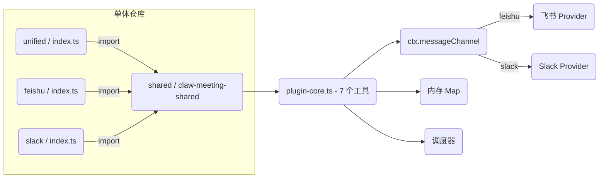
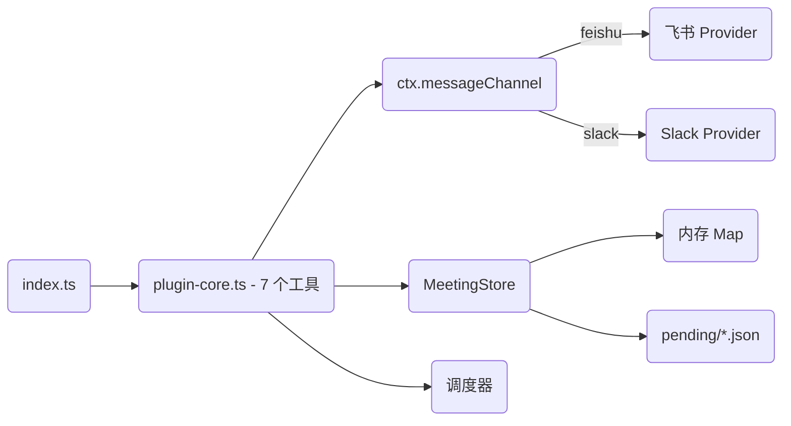
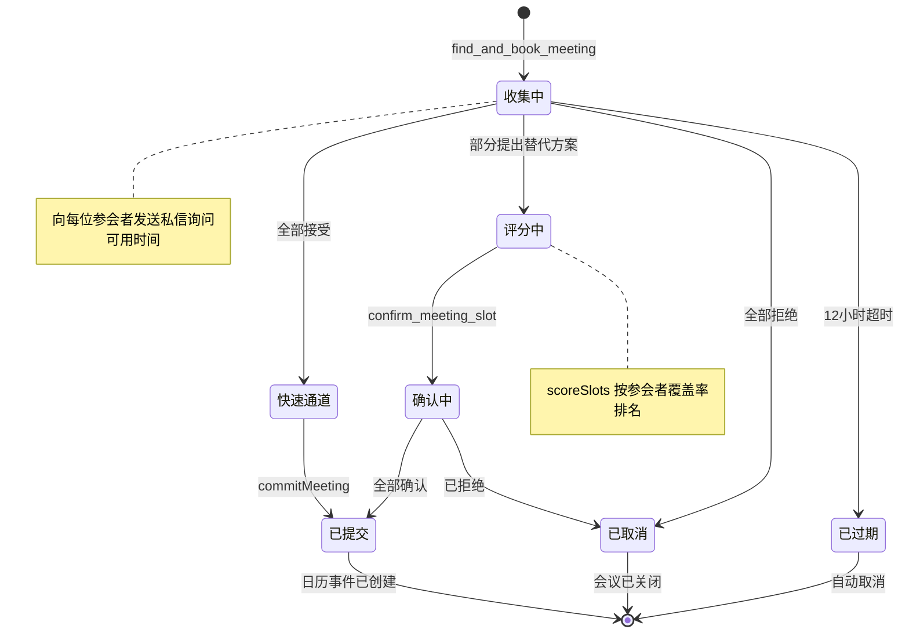
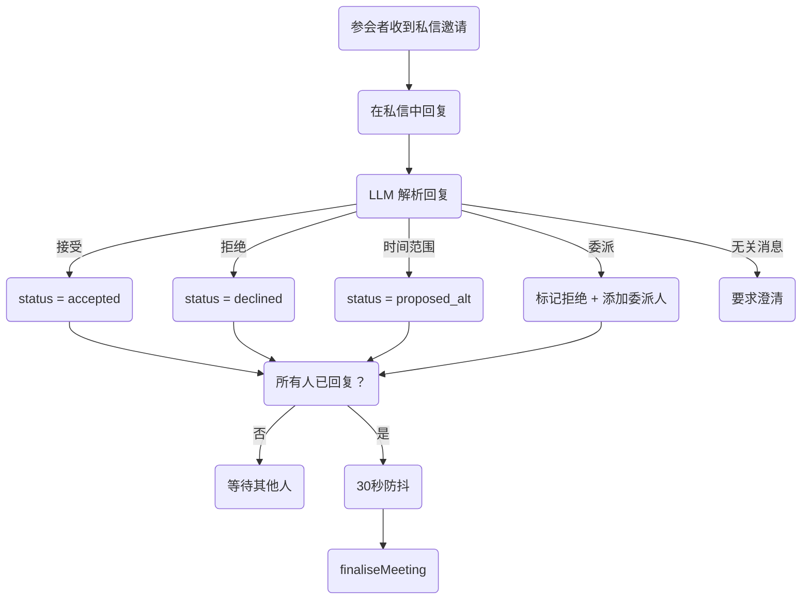
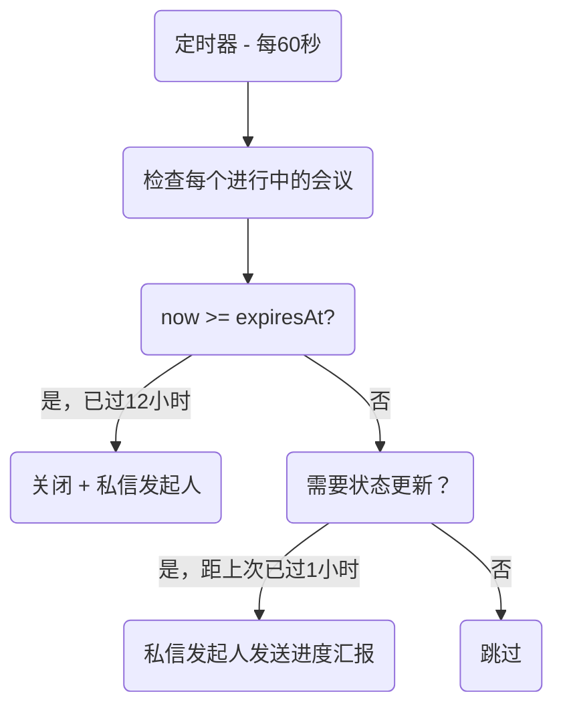
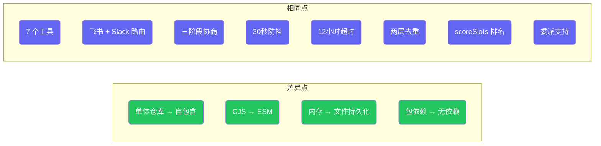

# ClawMeeting - 多平台会议调度器


[English](./README.md) | **简体中文** | [繁體中文](./README.zh-TW.md) | [日本語](./README.ja.md) | [한국어](./README.ko.md)

---

## 概述

ClawMeeting 是一个基于 AI 的 OpenClaw 会议调度系统。它通过三阶段协商协议，结合智能时间段评分、自动委派和防抖控制的最终确认机制，协调飞书和 Slack 上的多参与者会议。

提供两个生产版本：
- **插件版 (v1.0)** — CommonJS 单体仓库，依赖 `claw-meeting-shared` 包。需要单体仓库结构才能运行。
- **技能版 (v2.0)** — ESM 自包含版本。克隆即可运行。文件持久化存储。支持 `openclaw skills add` 用户友好安装。

---

## 架构



---

## 插件版 (v1.0)

最初的生产实现。使用单体仓库结构，`claw-meeting-shared` 作为共享 npm 包，包含核心调度逻辑、状态机和工具定义。每个平台有自己的入口点，另有 `unified/` 入口用于路由两个平台。

**主要特点：**
- 单体仓库：`shared/`（核心）+ `unified/`（多平台）+ `feishu/` + `slack/`（单平台）
- 依赖 `claw-meeting-shared` npm 包（即 `shared/` 目录）
- 7 个工具，飞书 + Slack 双平台路由，基于 `ctx.messageChannel`
- 仅内存状态 — 网关重启后丢失
- CommonJS 模块系统

### 插件版结构



---

## 技能版 (v2.0)

使用 ESM 模块的自包含重新实现。无外部包依赖 — 所有代码位于单一目录中。状态持久化到 `pending/*.json` 文件，可在网关重启后恢复。包含 `SKILL.md` 用于通过 `openclaw skills add` 进行用户友好安装。

**主要特点：**
- 自包含：克隆、`npm install`、`npm run build`，完成
- 无单体仓库，无 `claw-meeting-shared` 依赖
- 7 个工具，飞书 + Slack 双平台路由，基于 `ctx.messageChannel`
- 文件持久化状态（`pending/` 中的 JSON）— 重启后保留
- ESM 模块系统 (Node16)
- `SKILL.md` 用于 LLM 行为指令

### 技能版结构



---

## 会议生命周期



---

## 参会者回复流程



---

## 后台进程



---

## 工具

| # | 工具 | 描述 |
|---|------|------|
| 1 | `find_and_book_meeting` | 创建待处理会议，解析参会者姓名，发送私信邀请 |
| 2 | `list_my_pending_invitations` | 列出当前发送者的待处理邀请 |
| 3 | `record_attendee_response` | 记录接受 / 拒绝 / 提出替代方案 / 委派 |
| 4 | `confirm_meeting_slot` | 发起人在评分结果后选择时间段 |
| 5 | `list_upcoming_meetings` | 列出即将到来的日历事件 |
| 6 | `cancel_meeting` | 通过事件 ID 取消会议 |
| 7 | `debug_list_directory` | 列出租户目录用户（诊断用） |

---

## 文件结构

```
plugin_version/                      单体仓库（需要 claw-meeting-shared）
├── shared/                          核心逻辑包
│   └── src/
│       ├── plugin-core.ts           7 个工具、路由、状态机（1131 行）
│       ├── scheduler.ts             时间段查找 + 评分
│       ├── load-env.ts              .env 加载器
│       └── providers/types.ts       CalendarProvider 接口
├── unified/                         多平台入口（飞书 + Slack）
│   └── src/
│       ├── index.ts                 平台配置
│       └── providers/
│           ├── lark.ts              飞书后端
│           └── slack.ts             Slack 后端
├── feishu/                          仅飞书入口
│   └── src/
│       ├── index.ts                 单平台配置
│       └── providers/lark.ts        飞书后端
└── slack/                           仅 Slack 入口
    └── src/
        ├── index.ts                 单平台配置
        └── providers/slack.ts       Slack 后端

skill_version/                       自包含版本（克隆即可运行）
├── SKILL.md                         LLM 指令
├── src/
│   ├── index.ts                     入口点（平台配置）
│   ├── plugin-core.ts               7 个工具、路由、状态机（1176 行）
│   ├── meeting-store.ts             持久化状态层（222 行）
│   ├── scheduler.ts                 时间段查找 + 评分
│   ├── load-env.ts                  .env 加载器（ESM）
│   └── providers/
│       ├── types.ts                 CalendarProvider 接口
│       ├── lark.ts                  飞书后端
│       └── slack.ts                 Slack 后端
└── pending/                         运行时会议状态（JSON 文件）
```

---

## 快速开始

### 插件版 (v1.0)

```bash
cd plugin_version/shared && npm install && npm run build
cd ../unified && npm install && npm run build
openclaw plugins install -l .
openclaw gateway --force
```

### 技能版 (v2.0)

```bash
cd skill_version
npm install
npm run build
openclaw plugins install -l .
openclaw gateway --force
```

---

## 配置

两个版本都需要在 `.env` 中配置平台凭据：

```env
# 飞书 / Lark
LARK_APP_ID=cli_xxxxx
LARK_APP_SECRET=xxxxx
LARK_CALENDAR_ID=xxxxx@group.calendar.feishu.cn

# Slack
SLACK_BOT_TOKEN=xoxb-xxxxx

# 调度默认值
DEFAULT_TIMEZONE=Asia/Shanghai
WORK_HOURS=09:00-18:00
LUNCH_BREAK=12:00-13:30
BUFFER_MINUTES=15
```

---

## 版本对比

| 维度 | 插件版 (v1.0) | 技能版 (v2.0) |
|---|---|---|
| 架构 | 单体仓库（shared + unified + feishu + slack） | 自包含（单目录） |
| 模块系统 | CommonJS | ESM (Node16) |
| 依赖 | `claw-meeting-shared` 包 | 无（全部本地） |
| 可移植性 | 需要单体仓库结构 | 克隆即可运行 |
| 工具数 | 7 | 7 |
| 平台 | 飞书 + Slack | 飞书 + Slack |
| 平台路由 | `ctx.messageChannel` | `ctx.messageChannel` |
| 状态存储 | 内存 Map | 内存 + 文件持久化 |
| 重启恢复 | 状态丢失 | 状态保留 (pending/*.json) |
| 协商 | 三阶段（收集/评分/确认） | 三阶段（相同） |
| 评分 | 是 (scoreSlots) | 是（相同） |
| 委派 | 是 | 是 |
| 安装方式 | `openclaw plugins install` | `openclaw skills add` |
| SKILL.md | 否 | 是 |



---

## 许可证

私有 - 保留所有权利。
