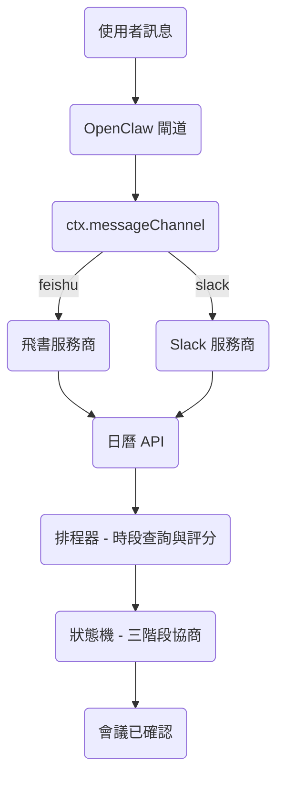
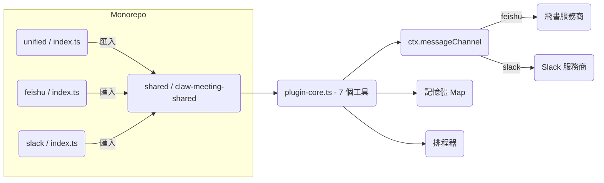
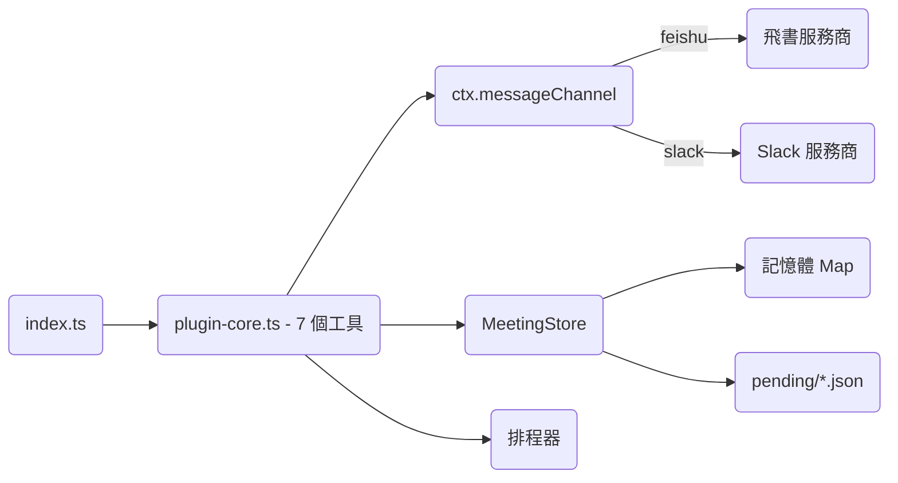
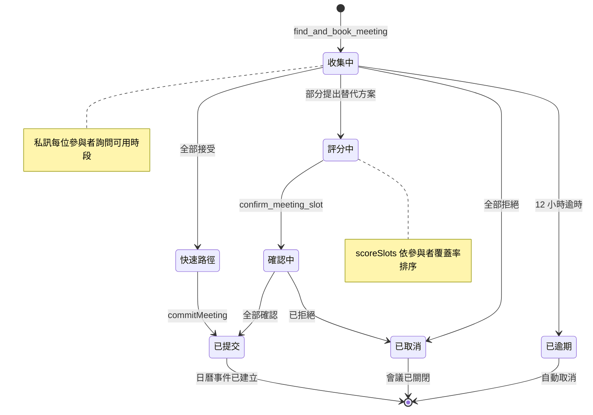
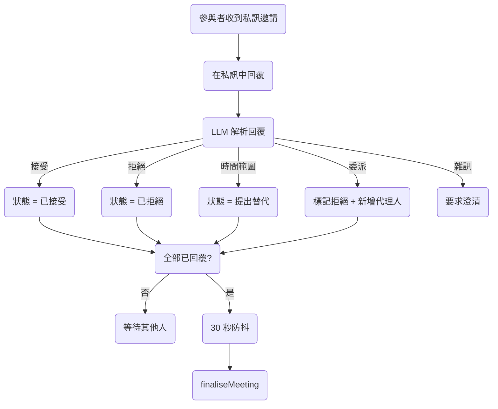
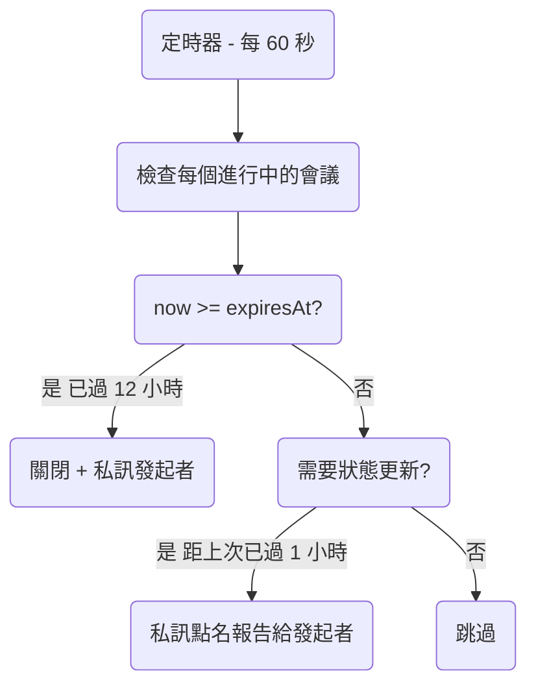
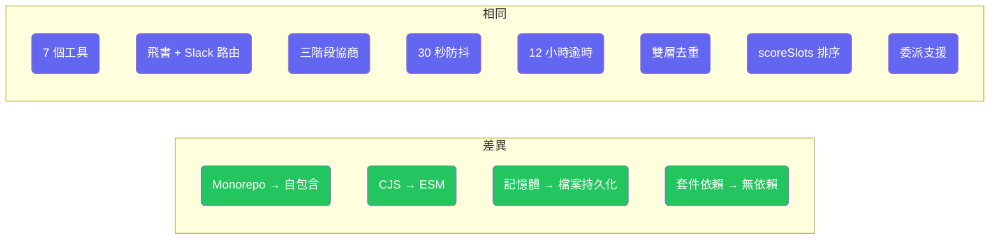

# ClawMeeting - 多平台會議排程器


[English](./README.md) | [简体中文](./README.zh-CN.md) | **繁體中文** | [日本語](./README.ja.md) | [한국어](./README.ko.md)

---

## 概覽

ClawMeeting 是基於 OpenClaw 的 AI 驅動會議排程系統。它透過三階段協商協議在飛書和 Slack 之間協調多參與者會議，具備智慧時段評分、自動委派和防抖控制的最終確認功能。

提供兩個生產版本：
- **外掛版 (v1.0)** — 使用 CommonJS 的 Monorepo 架構，依賴 `claw-meeting-shared` 套件。需要 Monorepo 結構才能執行。
- **技能版 (v2.0)** — ESM 自包含版本。複製即可執行。檔案持久化儲存。支援 `openclaw skills add` 安裝。

---

## 系統架構



---

## 外掛版 (v1.0)

原始生產實作版本。採用 Monorepo 結構，以 `claw-meeting-shared` 作為共用 npm 套件，包含核心排程邏輯、狀態機和工具定義。每個平台有獨立的進入點，另有 `unified/` 進入點可同時路由兩個平台。

**主要特性：**
- Monorepo 架構：`shared/`（核心）+ `unified/`（多平台）+ `feishu/` + `slack/`（單平台）
- 依賴 `claw-meeting-shared` npm 套件（即 `shared/` 目錄）
- 7 個工具，透過 `ctx.messageChannel` 實現飛書 + Slack 雙平台路由
- 僅記憶體狀態 — 閘道重啟後遺失
- CommonJS 模組系統

### 外掛版結構



---

## 技能版 (v2.0)

使用 ESM 模組的自包含重新實作版本。無外部套件依賴 — 所有程式碼位於單一目錄中。狀態持久化至 `pending/*.json` 檔案，閘道重啟後仍可恢復。包含 `SKILL.md` 以支援 `openclaw skills add` 的使用者友好安裝方式。

**主要特性：**
- 自包含：複製、`npm install`、`npm run build`，即可完成
- 無 Monorepo，無 `claw-meeting-shared` 依賴
- 7 個工具，透過 `ctx.messageChannel` 實現飛書 + Slack 雙平台路由
- 檔案持久化狀態（`pending/` 中的 JSON）— 重啟後保留
- ESM 模組系統（Node16）
- `SKILL.md` 提供 LLM 行為指引

### 技能版結構



---

## 會議生命週期



---

## 參與者回覆流程



---

## 背景程序



---

## 工具列表

| # | 工具 | 描述 |
|---|------|------|
| 1 | `find_and_book_meeting` | 建立待處理會議、解析參與者名稱、發送私訊邀請 |
| 2 | `list_my_pending_invitations` | 列出目前發送者的待處理邀請 |
| 3 | `record_attendee_response` | 記錄接受 / 拒絕 / 提出替代方案 / 委派 |
| 4 | `confirm_meeting_slot` | 發起者在評分結果後選擇時段 |
| 5 | `list_upcoming_meetings` | 列出即將到來的日曆事件 |
| 6 | `cancel_meeting` | 透過事件 ID 取消會議 |
| 7 | `debug_list_directory` | 列出租戶目錄使用者（診斷用） |

---

## 檔案結構

```
plugin_version/                      Monorepo（需要 claw-meeting-shared）
├── shared/                          核心邏輯套件
│   └── src/
│       ├── plugin-core.ts           7 個工具、路由、狀態機（1131 行）
│       ├── scheduler.ts             時段查詢 + 評分
│       ├── load-env.ts              .env 載入器
│       └── providers/types.ts       CalendarProvider 介面
├── unified/                         多平台進入點（飛書 + Slack）
│   └── src/
│       ├── index.ts                 平台設定
│       └── providers/
│           ├── lark.ts              飛書後端
│           └── slack.ts             Slack 後端
├── feishu/                          僅飛書進入點
│   └── src/
│       ├── index.ts                 單平台設定
│       └── providers/lark.ts        飛書後端
└── slack/                           僅 Slack 進入點
    └── src/
        ├── index.ts                 單平台設定
        └── providers/slack.ts       Slack 後端

skill_version/                       自包含（複製即可執行）
├── SKILL.md                         LLM 指引
├── src/
│   ├── index.ts                     進入點（平台設定）
│   ├── plugin-core.ts               7 個工具、路由、狀態機（1176 行）
│   ├── meeting-store.ts             持久化狀態層（222 行）
│   ├── scheduler.ts                 時段查詢 + 評分
│   ├── load-env.ts                  .env 載入器（ESM）
│   └── providers/
│       ├── types.ts                 CalendarProvider 介面
│       ├── lark.ts                  飛書後端
│       └── slack.ts                 Slack 後端
└── pending/                         執行時會議狀態（JSON 檔案）
```

---

## 快速開始

### 外掛版 (v1.0)

```bash
cd plugin_version/shared && npm install && npm run build
cd ../unified && npm install && npm run build
openclaw plugins install -l .
openclaw gateway --force
```

### 技能版 (v2.0)

```bash
cd skill_version
npm install
npm run build
openclaw plugins install -l .
openclaw gateway --force
```

---

## 設定

兩個版本都需要在 `.env` 中提供平台憑證：

```env
# 飛書 / Lark
LARK_APP_ID=cli_xxxxx
LARK_APP_SECRET=xxxxx
LARK_CALENDAR_ID=xxxxx@group.calendar.feishu.cn

# Slack
SLACK_BOT_TOKEN=xoxb-xxxxx

# 排程預設值
DEFAULT_TIMEZONE=Asia/Shanghai
WORK_HOURS=09:00-18:00
LUNCH_BREAK=12:00-13:30
BUFFER_MINUTES=15
```

---

## 版本對比

| 面向 | 外掛版 (v1.0) | 技能版 (v2.0) |
|---|---|---|
| 架構 | Monorepo（shared + unified + feishu + slack） | 自包含（單一目錄） |
| 模組系統 | CommonJS | ESM（Node16） |
| 依賴 | `claw-meeting-shared` 套件 | 無（全部本地） |
| 可攜性 | 需要 Monorepo 結構 | 複製即可執行 |
| 工具數量 | 7 | 7 |
| 平台支援 | 飛書 + Slack | 飛書 + Slack |
| 平台路由 | `ctx.messageChannel` | `ctx.messageChannel` |
| 狀態儲存 | 記憶體 Map | 記憶體 + 檔案持久化 |
| 重啟恢復 | 狀態遺失 | 狀態保留（pending/*.json） |
| 協商模式 | 三階段（收集/評分/確認） | 三階段（相同） |
| 評分功能 | 有（scoreSlots） | 有（相同） |
| 委派功能 | 有 | 有 |
| 安裝方式 | `openclaw plugins install` | `openclaw skills add` |
| SKILL.md | 無 | 有 |



---

## 授權條款

私有 - 保留所有權利。
