# ClawMeeting - 多平台會議排程系統


[English](./README.md) | [简体中文](./README.zh-CN.md) | **繁體中文** | [日本語](./README.ja.md) | [한국어](./README.ko.md)

---

## 概覽

ClawMeeting 是一個為 OpenClaw 打造的 AI 驅動會議排程系統。它透過自然語言在飛書和 Slack 之間協調多參與者會議，具備智慧時段評分、三階段協商、自動委派及防抖控制的最終確認機制。

本倉庫包含兩種實作：
- **外掛版（v1.0）** — 原始生產版本。CommonJS 單體倉庫，搭配 `claw-meeting-shared` 套件。
- **技能版（v2.0）** — 獨立的 ESM 重新實作，支援檔案持久化儲存。

兩個版本均支援**飛書 + Slack 雙平台路由**、**7 個工具**及**相同的業務邏輯**。

---

# 第一部分：外掛版（v1.0）

## 外掛架構

外掛採用單體倉庫結構。核心排程邏輯位於 `shared/` 套件（`claw-meeting-shared`），而平台專屬的提供者和進入點位於獨立目錄中。

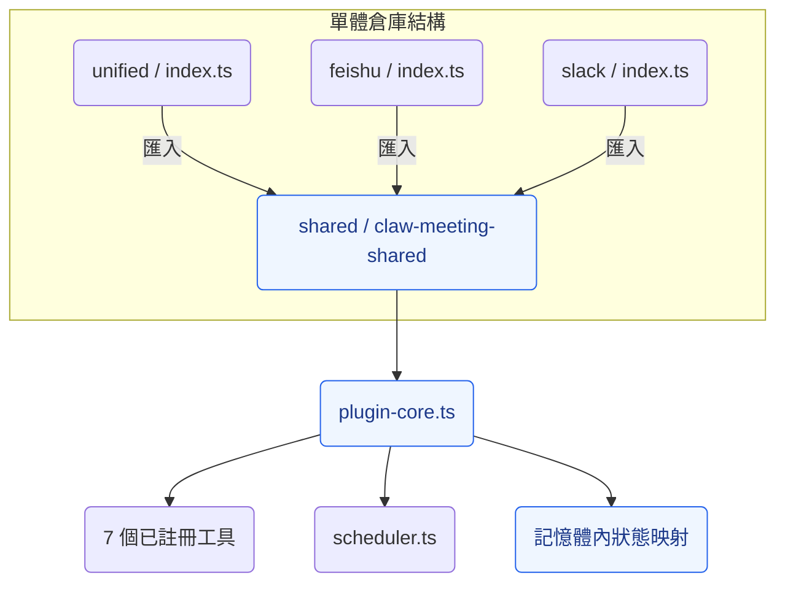

### 外掛進入點

| 進入點 | 路徑 | 用途 |
|---|---|---|
| **unified** | `unified/src/index.ts` | 多平台（飛書 + Slack）。生產環境預設。 |
| **feishu** | `feishu/src/index.ts` | 僅飛書部署 |
| **slack** | `slack/src/index.ts` | 僅 Slack 部署 |

三者皆從 `claw-meeting-shared` 匯入，並以平台專屬設定呼叫 `createMeetingPlugin()`。

### 外掛平台路由

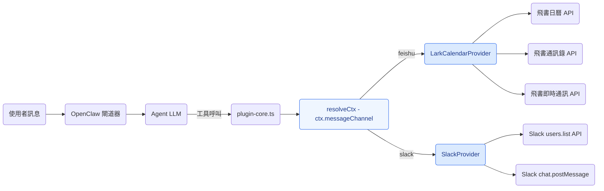

### 外掛會議流程

外掛中逐步的資料流：

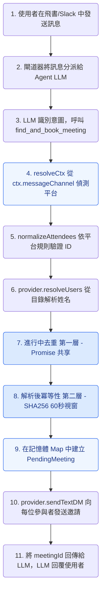

### 外掛參與者回應流程

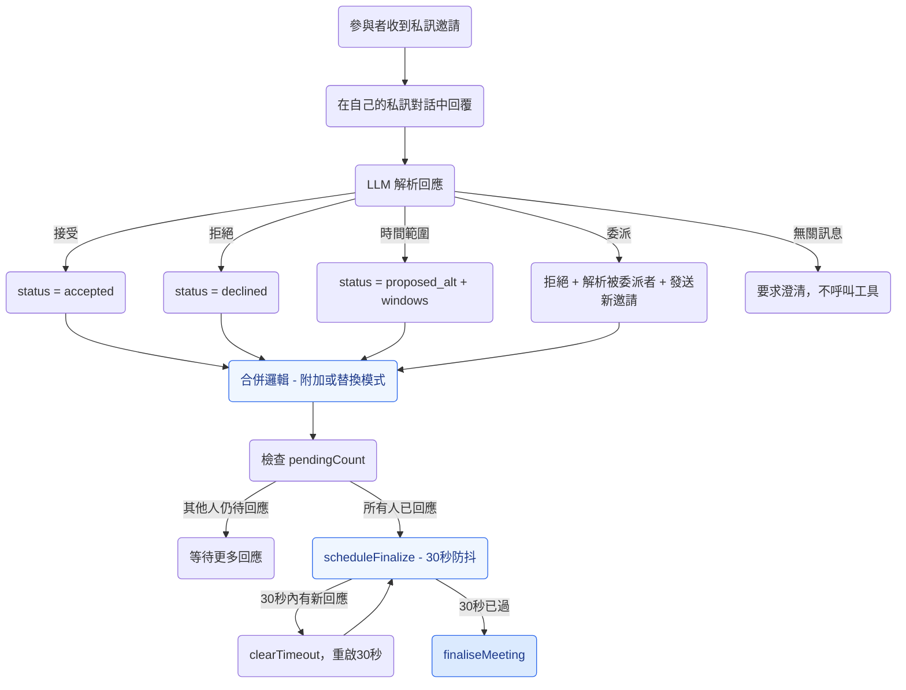

### 外掛最終確認狀態機

```mermaid
stateDiagram-v2
    [*] --> 收集中: find_and_book_meeting 建立 PendingMeeting

    收集中 --> 快速路徑: 所有參與者已接受
    收集中 --> 評分中: 部分提出替代方案
    收集中 --> 失敗: 所有人拒絕
    收集中 --> 已過期: 12小時逾時（定時器）

    快速路徑 --> 已提交: commitMeeting 建立日曆事件

    評分中 --> 確認中: 發起人呼叫 confirm_meeting_slot
    note right of 評分中: scoreSlots 依參與者覆蓋率排名時段

    確認中 --> 已提交: 參與者確認所選時段
    確認中 --> 失敗: 時段被拒絕

    已提交 --> [*]: 私訊發起人附帶事件連結
    失敗 --> [*]: 私訊發起人附帶失敗原因
    已過期 --> [*]: 私訊發起人已自動取消

    style [*] fill:#dbeafe,stroke:#2563eb,color:#1e3a8a
    style Collecting fill:#eff6ff,stroke:#2563eb,color:#1e3a8a
    style FastPath fill:#eff6ff,stroke:#2563eb,color:#1e3a8a
    style Scoring fill:#eff6ff,stroke:#2563eb,color:#1e3a8a
    style Confirming fill:#eff6ff,stroke:#2563eb,color:#1e3a8a
    style Committed fill:#eff6ff,stroke:#2563eb,color:#1e3a8a
    style Failed fill:#eff6ff,stroke:#2563eb,color:#1e3a8a
    style Expired fill:#eff6ff,stroke:#2563eb,color:#1e3a8a
```

### 外掛背景定時器

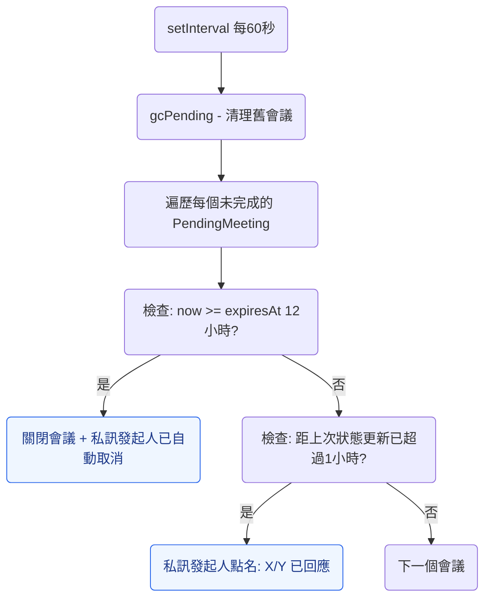

### 外掛狀態管理

所有狀態皆在記憶體中。閘道器重啟 = 所有待處理會議遺失。

```
pendingMeetings: Map<string, PendingMeeting>     ← 進行中的會議
recentFindAndBook: Map<string, {meetingId, at}>   ← 冪等性（60秒視窗）
inflightFindAndBook: Map<string, Promise>         ← 並行去重
```

### 外掛檔案結構

```
plugin_version/
├── shared/                          claw-meeting-shared 套件
│   ├── src/
│   │   ├── index.ts                 套件匯出
│   │   ├── plugin-core.ts           核心邏輯：7 個工具、路由、狀態機（1131 行）
│   │   ├── scheduler.ts             時段查詢、評分、交集（257 行）
│   │   ├── load-env.ts              .env 載入器
│   │   └── providers/types.ts       CalendarProvider 介面
│   ├── package.json                 claw-meeting-shared
│   └── tsconfig.json
├── unified/                         多平台進入點（飛書 + Slack）
│   ├── src/
│   │   ├── index.ts                 平台設定 + createMeetingPlugin()
│   │   └── providers/
│   │       ├── lark.ts              飛書後端（1020 行）
│   │       └── slack.ts             Slack 後端（346 行）
│   ├── package.json                 依賴 claw-meeting-shared
│   └── tsconfig.json
├── feishu/                          僅飛書進入點
│   └── src/
│       ├── index.ts                 單平台設定
│       └── providers/lark.ts
└── slack/                           僅 Slack 進入點
    └── src/
        ├── index.ts                 單平台設定
        └── providers/slack.ts
```

### 外掛快速開始

```bash
cd plugin_version/shared && npm install && npm run build
cd ../unified && npm install && npm run build
openclaw plugins install -l .
openclaw gateway --force
```

---

# 第二部分：技能版（v2.0）

## 技能架構

技能版是獨立的重新實作。無單體倉庫，無外部套件依賴。所有程式碼在一個目錄中。複製、建置、執行。

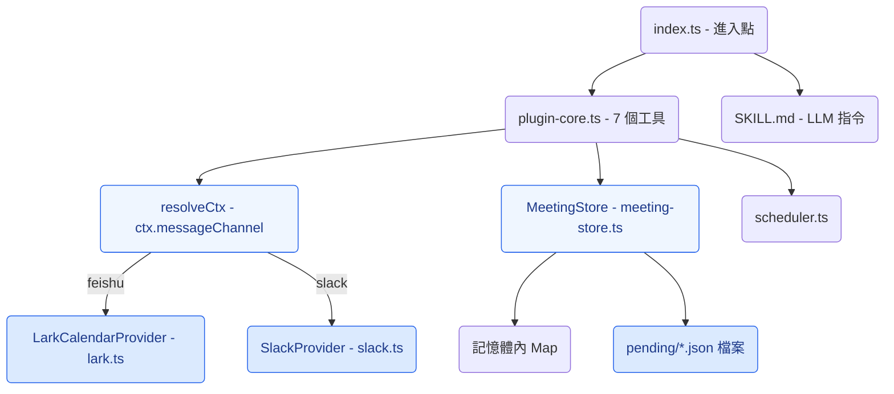

### 與外掛版的差異

| 面向 | 外掛版（v1.0） | 技能版（v2.0） |
|---|---|---|
| 程式碼結構 | 單體倉庫（shared + unified + feishu + slack） | 單一目錄，獨立運作 |
| 模組系統 | CommonJS | ESM（Node16） |
| 外部依賴 | `claw-meeting-shared` 套件 | 無（所有本地匯入帶 `.js` 後綴） |
| 狀態層 | 僅記憶體內 Map | MeetingStore：Map + 檔案持久化 |
| `__dirname` | 原生 CJS 全域變數 | `fileURLToPath(import.meta.url)` |
| 匯出方式 | `module.exports = plugin` | `export default plugin; export { plugin }` |
| SKILL.md | 無 | 包含，用於 `openclaw skills add` |

### 技能版平台路由

與外掛版相同。`resolveCtx()` 讀取 `ctx.messageChannel` 並路由至正確的提供者：

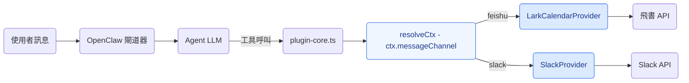

### 技能版會議流程

與外掛版相同的業務邏輯，新增持久化：

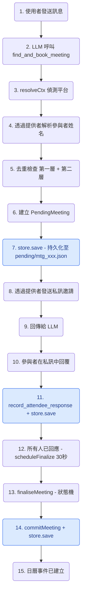

綠色節點 = `store.save()` 持久化點。若閘道器在任何時刻重啟，狀態將從 `pending/*.json` 恢復。

### 技能版狀態管理

混合式：記憶體保障速度，檔案保障持久性。

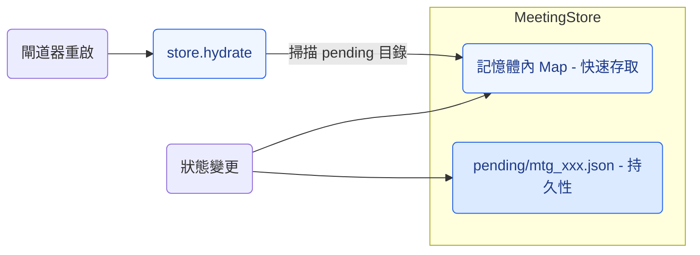

### 技能版最終確認狀態機

與外掛版相同：

```mermaid
stateDiagram-v2
    [*] --> 收集中: find_and_book_meeting

    收集中 --> 快速路徑: 所有人已接受
    收集中 --> 評分中: 部分提出 proposed_alt
    收集中 --> 失敗: 所有人拒絕
    收集中 --> 已過期: 12小時逾時

    快速路徑 --> 已提交: commitMeeting + store.save

    評分中 --> 確認中: confirm_meeting_slot
    note right of 評分中: scoreSlots 依覆蓋率排名 + store.save

    確認中 --> 已提交: 所有人確認 + store.save

    已提交 --> [*]: 日曆事件已建立
    失敗 --> [*]: 已關閉 + store.save
    已過期 --> [*]: 已自動取消 + store.save

    style [*] fill:#dbeafe,stroke:#2563eb,color:#1e3a8a
    style Collecting fill:#eff6ff,stroke:#2563eb,color:#1e3a8a
    style FastPath fill:#eff6ff,stroke:#2563eb,color:#1e3a8a
    style Scoring fill:#eff6ff,stroke:#2563eb,color:#1e3a8a
    style Confirming fill:#eff6ff,stroke:#2563eb,color:#1e3a8a
    style Committed fill:#eff6ff,stroke:#2563eb,color:#1e3a8a
    style Failed fill:#eff6ff,stroke:#2563eb,color:#1e3a8a
    style Expired fill:#eff6ff,stroke:#2563eb,color:#1e3a8a
```

### 技能版背景定時器

與外掛版相同，每次狀態變更皆執行 `store.save()`：

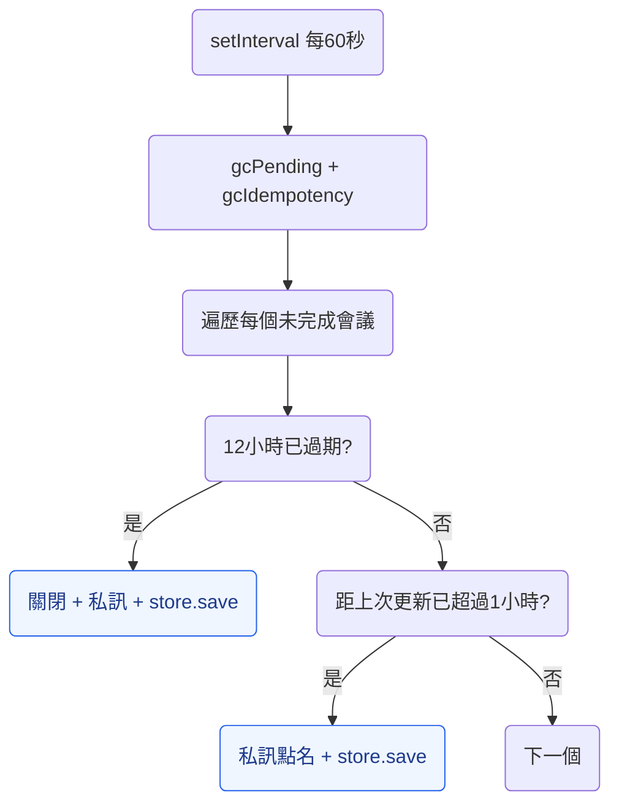

### 技能版檔案結構

```
skill_version/
├── SKILL.md                         LLM 行為指令
├── src/
│   ├── index.ts                     進入點 - 平台設定（70 行）
│   ├── plugin-core.ts               核心邏輯：7 個工具、路由、狀態機（1176 行）
│   ├── meeting-store.ts             MeetingStore：Map + 檔案持久化（222 行）
│   ├── scheduler.ts                 時段查詢、評分、交集（243 行）
│   ├── load-env.ts                  .env 載入器（ESM 相容）
│   └── providers/
│       ├── types.ts                 CalendarProvider 介面
│       ├── lark.ts                  飛書後端（770 行）
│       └── slack.ts                 Slack 後端（345 行）
├── pending/                         執行時狀態（JSON 檔案，已加入 gitignore）
├── openclaw.plugin.json             外掛 + 技能清單
├── package.json                     ESM，@slack/web-api + googleapis + luxon
└── .gitignore                       排除 .env、node_modules、dist、pending
```

### 技能版快速開始

```bash
cd skill_version
npm install
npm run build
openclaw plugins install -l .
openclaw gateway --force
```

---

# 第三部分：版本比較（差異）

## 7 個工具（兩個版本共用）

| # | 工具 | 說明 |
|---|------|-------------|
| 1 | `find_and_book_meeting` | 建立待處理會議、解析參與者姓名、發送私訊邀請 |
| 2 | `list_my_pending_invitations` | 列出當前發送者的待處理邀請 |
| 3 | `record_attendee_response` | 記錄接受 / 拒絕 / 提出替代方案 / 委派 |
| 4 | `confirm_meeting_slot` | 發起人在評分結果後選擇時段 |
| 5 | `list_upcoming_meetings` | 列出即將到來的日曆事件 |
| 6 | `cancel_meeting` | 依事件 ID 取消會議 |
| 7 | `debug_list_directory` | 列出租戶目錄使用者（診斷用） |

## 設定（兩個版本共用）

```env
# 飛書 / Lark
LARK_APP_ID=cli_xxxxx
LARK_APP_SECRET=xxxxx
LARK_CALENDAR_ID=xxxxx@group.calendar.feishu.cn

# Slack
SLACK_BOT_TOKEN=xoxb-xxxxx

# 排程預設值
DEFAULT_TIMEZONE=Asia/Shanghai
WORK_HOURS=09:00-18:00
LUNCH_BREAK=12:00-13:30
BUFFER_MINUTES=15
```

## 完整比較表

| 維度 | 外掛版（v1.0） | 技能版（v2.0） |
|---|---|---|
| 架構 | 單體倉庫（shared + unified + feishu + slack） | 獨立運作（單一目錄） |
| 模組系統 | CommonJS | ESM（Node16） |
| 依賴 | `claw-meeting-shared` 套件 | 無（全部本地） |
| 可移植性 | 需要單體倉庫 + 套件連結 | 複製即可執行 |
| 工具數 | 7 | 7（相同） |
| 平台 | 飛書 + Slack | 飛書 + Slack（相同） |
| 平台路由 | 透過 `resolveCtx()` 的 `ctx.messageChannel` | 相同 |
| 狀態儲存 | 記憶體內 Map | 記憶體內 Map + 檔案持久化 |
| 重啟恢復 | 所有狀態遺失 | 狀態已保留（`pending/*.json`） |
| 協商機制 | 三階段（收集中/評分中/確認中） | 相同 |
| 時段評分 | `scoreSlots()` 依覆蓋率排名 | 相同 |
| 委派 | 是（「讓XXX替我去」） | 相同 |
| 30秒防抖 | `setTimeout` / `clearTimeout` | 相同 |
| 12小時逾時 | `setInterval` 定時器 | 相同 |
| 兩層去重 | 進行中 Promise + SHA256 冪等性 | 相同 |
| 姓名解析 | 兩步驟（提供者候選 + LLM 選取） | 相同 |
| 安裝方式 | `openclaw plugins install` | `openclaw skills add` |
| SKILL.md | 否 | 是 |

## 變更項目與未變更項目

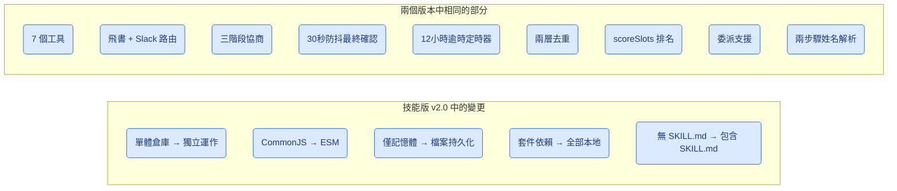

---

## 授權條款

私有 - 保留所有權利。
