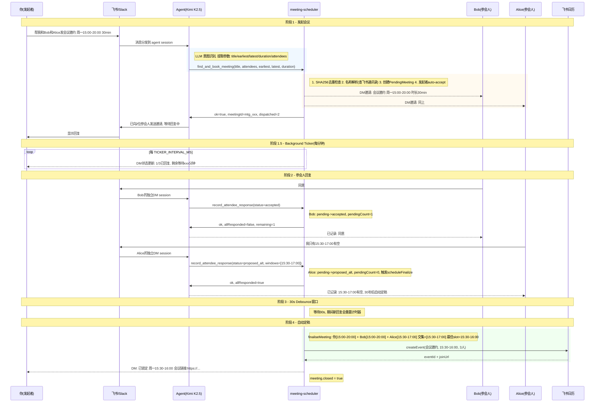
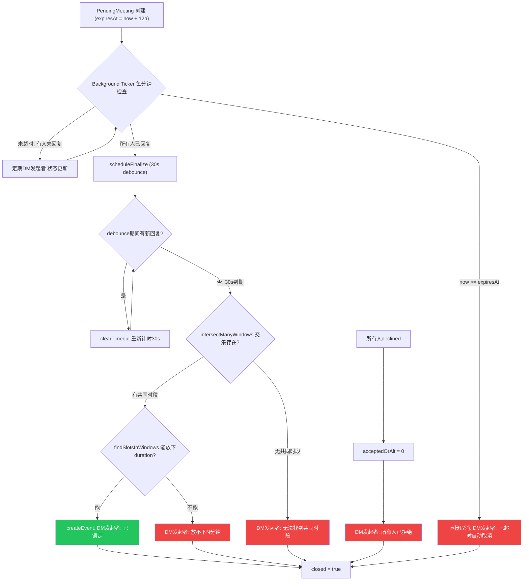

# Meeting Scheduler Flow Diagram

## 场景

> 你（发起者）发送: "帮我和Bob和Alice发一个会议邀约，大概在下周周一下午15:00-20:00，大概30min"

## 异常流程

## 关键机制

| 机制 | 代码位置 | 说明 |
|---|---|---|
| **In-flight 去重** | `inflightFindAndBook` Map | 并发相同请求共享同一个 Promise，防止 LLM 批量重复调用 |
| **Post-resolve 幂等** | `recentFindAndBook` Map | SHA256 指纹 + 60s 窗口，resolve 后的第二层去重 |
| **30s Debounce** | `scheduleFinalize()` | 最后一个回复后等 30s 再定稿，每次新回复 clearTimeout + 重新计时 |
| **12h TTL** | `PENDING_TTL_MS` | 超时直接取消（不尝试用已回复的人定稿），发起者需重新发起 |
| **Background Ticker** | `setInterval(TICKER_INTERVAL_MS)` | 每分钟检查超时 + 定期给发起者发状态更新 DM |
| **Auto-accept** | `find_and_book_meeting` | 发起者自动标记为 accepted，不需要自己回复 |
| **名称两步解析** | tool description | 插件查通讯录返回候选列表 → 若 unresolved，LLM 从 candidates 中语义匹配后重试 |
| **Append/Replace** | `record_attendee_response` | append(默认): union 时间窗口; replace: 仅当用户明确更正时使用 |
| **Append 合并规则** | `mergeOverlappingWindows()` | proposed_alt + proposed_alt → union 后合并重叠区间; accepted + proposed_alt → 保持 accepted |
