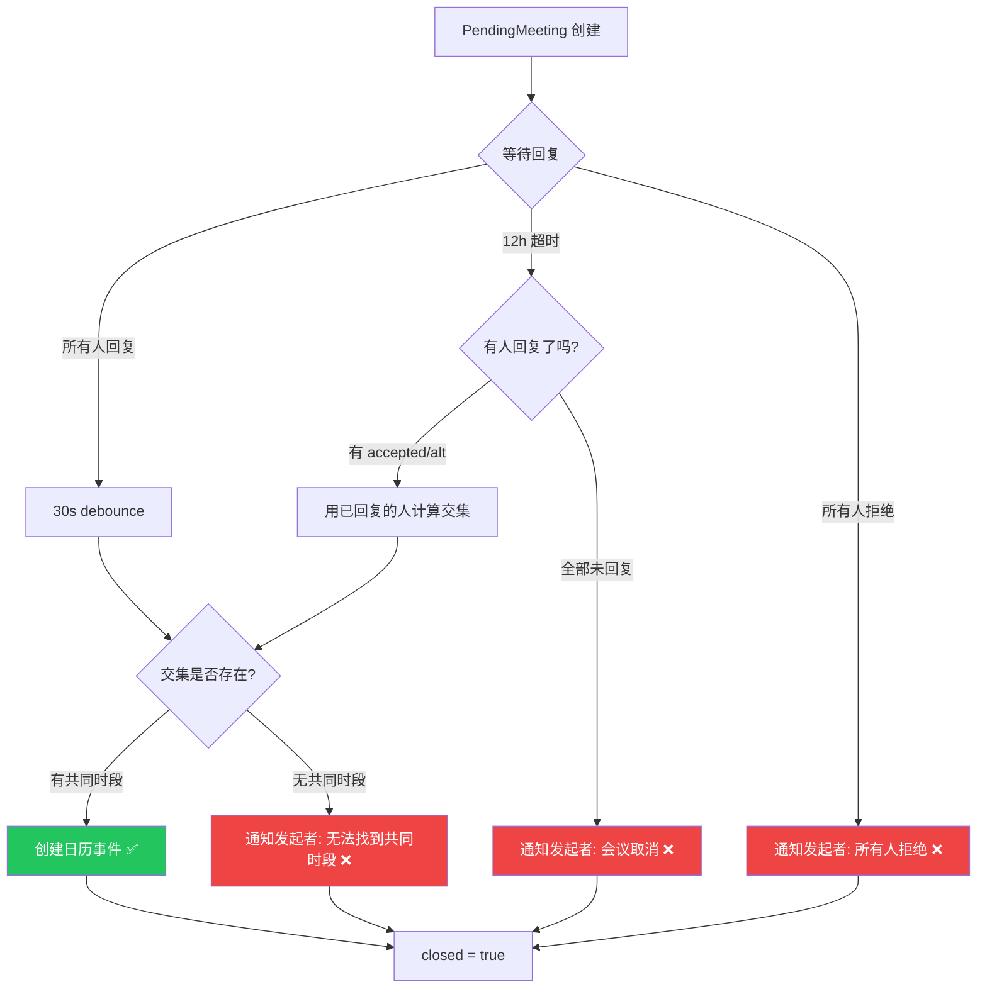

# Meeting Scheduler Flow Diagram

## 场景

> 你（发起者）发送: "帮我和Bob和Alice发一个会议邀约，大概在下周周一下午15:00-20:00，大概30min"

```mermaid
sequenceDiagram
    participant You as 你 (发起者)
    participant IM as 飞书/Slack
    participant LLM as Agent (Kimi K2.5)
    participant Plugin as meeting-scheduler
    participant Bob as Bob (参会人)
    participant Alice as Alice (参会人)
    participant Cal as 飞书日历

    Note over You,Cal: === 阶段 1: 发起会议 ===

    You->>IM: "帮我和Bob和Alice发一个会议邀约,<br/>下周周一15:00-20:00, 30min"
    IM->>LLM: 消息分发到 agent session

    Note right of LLM: 意图识别 → 调用工具<br/>title: "会议邀约"<br/>earliest: 周一 15:00<br/>latest: 周一 20:00<br/>duration_minutes: 30<br/>required_attendees: ["Bob","Alice"]

    LLM->>Plugin: find_and_book_meeting(params)

    Note right of Plugin: 1. 幂等性检查 (SHA256 去重)<br/>2. 名称解析: "Bob" → open_id<br/>&nbsp;&nbsp;&nbsp;"Alice" → open_id<br/>3. 创建 PendingMeeting<br/>&nbsp;&nbsp;&nbsp;你 → status: accepted (自动)<br/>&nbsp;&nbsp;&nbsp;Bob → status: pending<br/>&nbsp;&nbsp;&nbsp;Alice → status: pending<br/>4. 设置 12h 超时

    Plugin-->>Bob: DM: "您收到一个会议邀请:《会议邀约》<br/>初步时间范围: 周一 15:00-20:00<br/>时长: 30 分钟<br/>请回复: 同意/时间段/拒绝"

    Plugin-->>Alice: DM: (同上)

    Plugin->>LLM: 返回 {ok: true, meetingId: "mtg_xxx",<br/>dispatched: 2}
    LLM->>IM: "已向 2 位参会人发送邀请DM,<br/>等待回复中"
    IM->>You: 显示回复

    Note over You,Cal: === 阶段 2: 参会人回复 ===

    Bob->>IM: "同意"
    IM->>LLM: Bob 的 DM session
    Note right of LLM: 意图: 接受邀请<br/>→ status: "accepted"
    LLM->>Plugin: record_attendee_response(<br/>status="accepted")
    Note right of Plugin: auto-resolve meetingId<br/>Bob: pending → accepted<br/>还剩 Alice 未回复
    Plugin->>LLM: {ok, allResponded: false,<br/>pendingCount: 1}
    LLM-->>Bob: "已记录您的回复: 同意"

    Alice->>IM: "我只有15:30-17:00有空"
    IM->>LLM: Alice 的 DM session
    Note right of LLM: 意图: 提出替代时段<br/>→ status: "proposed_alt"<br/>→ windows: [15:30-17:00]
    LLM->>Plugin: record_attendee_response(<br/>status="proposed_alt",<br/>proposed_windows=[{15:30-17:00}])
    Note right of Plugin: Alice: pending → proposed_alt<br/>所有人已回复!<br/>→ scheduleFinalize(30s 缓冲)
    Plugin->>LLM: {ok, allResponded: true}
    LLM-->>Alice: "已记录: 您在15:30-17:00有空"

    Note over You,Cal: === 阶段 3: 自动定稿 (30s 后) ===

    Note right of Plugin: 30s debounce 计时器到期<br/><br/>1. 收集可用窗口:<br/>&nbsp;&nbsp;&nbsp;你: 15:00-20:00 (accepted=全窗口)<br/>&nbsp;&nbsp;&nbsp;Bob: 15:00-20:00 (accepted=全窗口)<br/>&nbsp;&nbsp;&nbsp;Alice: 15:30-17:00 (proposed_alt)<br/><br/>2. 交集计算:<br/>&nbsp;&nbsp;&nbsp;[15:00-20:00] ∩ [15:00-20:00] ∩ [15:30-17:00]<br/>&nbsp;&nbsp;&nbsp;= [15:30-17:00]<br/><br/>3. 在交集中找 30min slot:<br/>&nbsp;&nbsp;&nbsp;→ 15:30-16:00 (最早可用)

    Plugin->>Cal: createEvent(<br/>title="会议邀约",<br/>start=15:30, end=16:00,<br/>attendees=[你,Bob,Alice])
    Cal-->>Plugin: {eventId, joinUrl}

    Plugin-->>You: DM: "已为《会议邀约》锁定时间:<br/>周一 15:30-16:00<br/>最终参会人 (3): 已通过飞书日历发送邀请<br/>会议链接: https://..."

    Note over You,Cal: === 完成 ===
```

## 异常流程



## 关键机制

| 机制 | 说明 |
|---|---|
| **幂等性** | SHA256 指纹去重，防止 LLM 重复调用产生多个 PendingMeeting |
| **In-flight 去重** | 并发相同请求共享同一个 Promise，避免批量 DM |
| **30s Debounce** | 最后一个回复后等待 30s 再定稿，给参会人纠正的窗口 |
| **12h TTL** | 超时自动关闭，防止 pending 状态无限挂起 |
| **Auto-accept** | 发起者自动标记为 accepted，无需自己回复 |
| **名称解析** | 插件查通讯录返回候选，LLM 做语义匹配选人 |
| **Append/Replace** | 参会人可追加时段(append)或更正(replace) |
