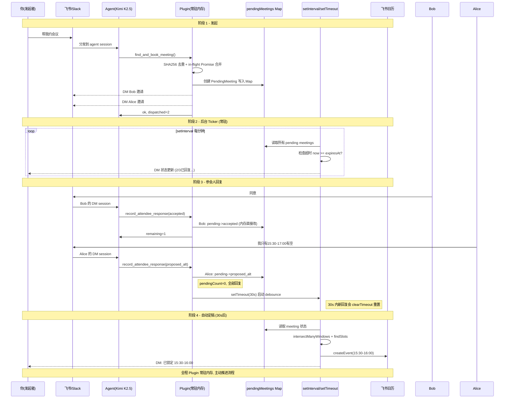
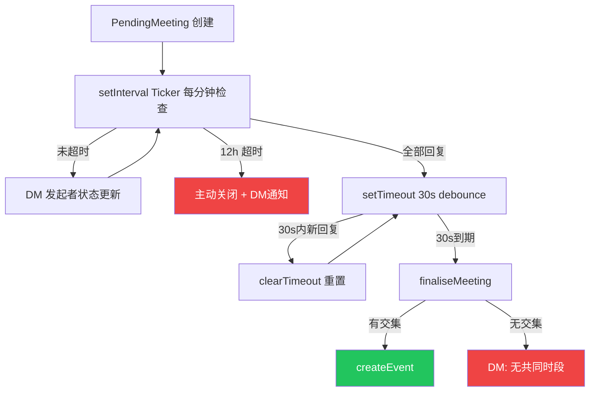
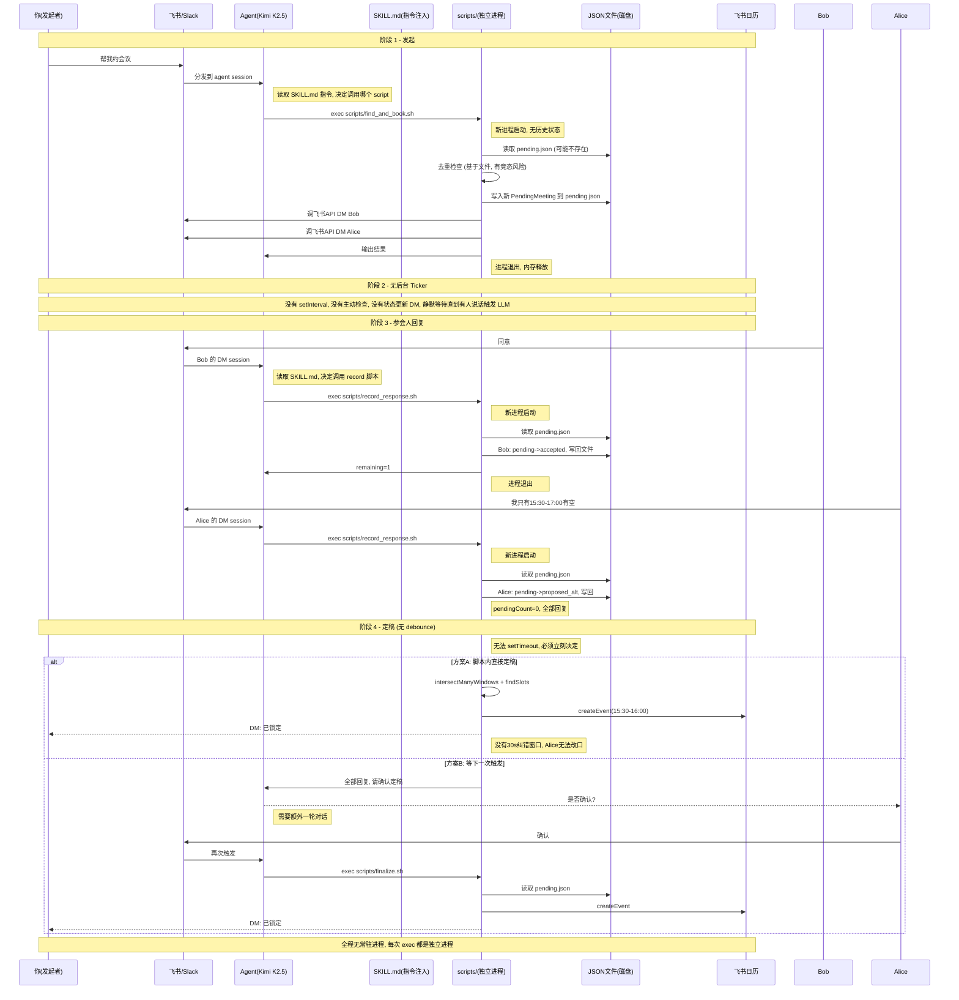
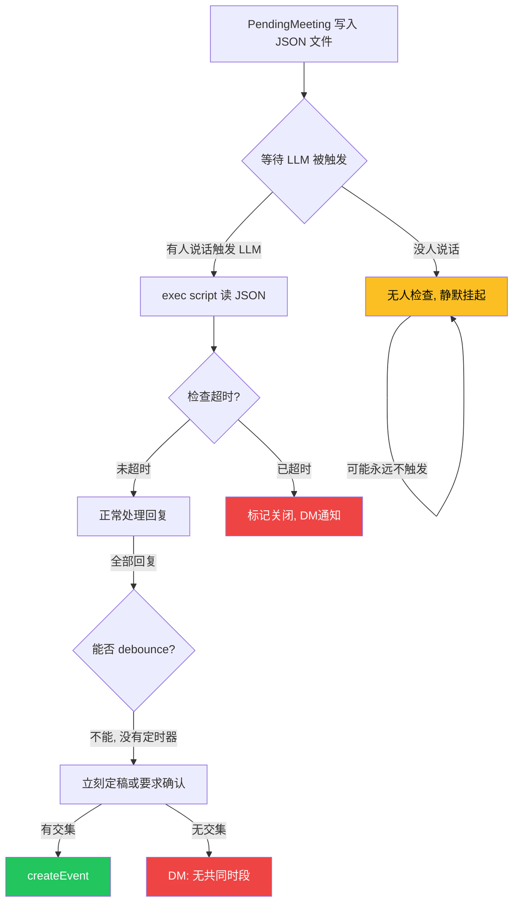
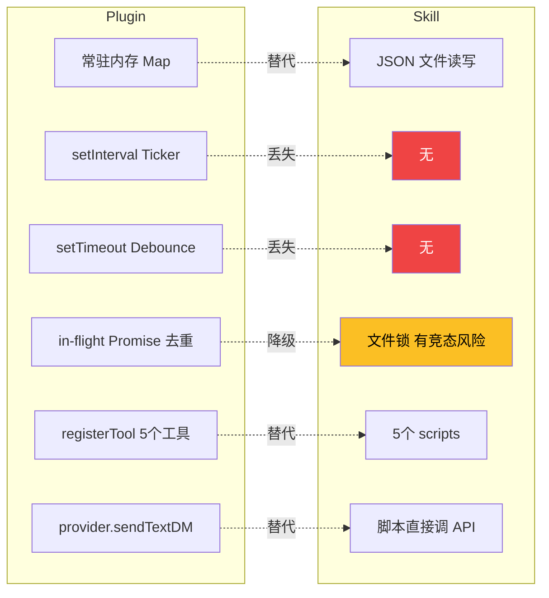

# Plugin vs Skill 架构对比

## 场景

> "帮我和Bob和Alice发一个会议邀约，下周周一15:00-20:00，30min"

---

## 当前 Plugin 架构流程

## Plugin 架构 - 异常处理

---

## Skill 架构流程

## Skill 架构 - 异常处理

---

## 逐项对比

## 差异总结表

| 维度 | Plugin | Skill | 差异 |
|---|---|---|---|
| **状态存储** | 内存 Map, 进程内直接读写 | JSON 文件, 每次 exec 读写 | Skill 有磁盘IO开销 + 并发竞态风险 |
| **后台 Ticker** | setInterval 每分钟主动检查 | 无 | Skill 丢失主动超时检查和状态更新推送 |
| **Debounce** | setTimeout 30s 缓冲 | 无 | Skill 丢失纠错窗口, 要么立刻定稿要么多一轮对话 |
| **并发去重** | in-flight Promise 合并 | 无法实现 (独立进程) | Skill 下 Kimi 批量重复调用问题会重现 |
| **幂等性** | 内存 Map 60s 窗口 | 文件锁 | 可替代但有竞态风险 |
| **工具注册** | registerTool, LLM 直接看到工具 schema | SKILL.md 文字描述 + scripts | Skill 依赖 LLM 理解自然语言指令来调用 |
| **超时处理** | 主动: ticker 发现超时立即关闭 + DM | 被动: 下次有人触发时才检查 | Skill 可能 12h 后无人触发导致永远挂起 |
| **DM 发送** | 通过 OpenClaw provider 体系 | 脚本直接调飞书/Slack API | Skill 需自行管理 token 和重试 |
| **多 session** | 各 session 共享同一个 Plugin 实例 | 各 session 独立 exec, 通过文件共享 | 可行但需要文件锁协调 |
| **持久化** | 无 (重启丢失) | 有 (文件天然持久) | Skill 反而更好, 重启不丢数据 |
